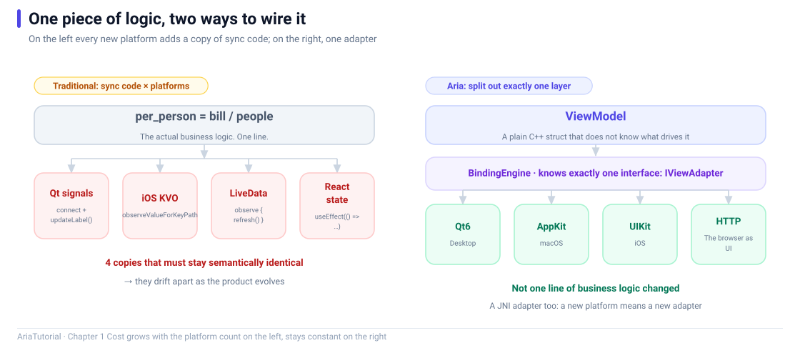

<div align="center">

# AriaTutorial

**Aria from Beginner to Expert · 20 chapters with runnable demos**

Every chapter ships a demo you can compile and run. The code in the articles and the code in the repository are the same code.

[](https://github.com/dqsjqian/Aria)
[](#requirements)
[](LICENSE)



[简体中文](README.md) | English

</div>

---

## What this is

[Aria](https://github.com/dqsjqian/Aria) is a C++ MVVM library that lifts the reactive engine and the binding layer out of any UI framework. A ViewModel is a plain C++ class — no framework base class, no macros, no code generator — and switching UI toolkits never touches business logic.

This tutorial series runs through five stages — fundamentals, reactive core, collections and forms, architecture and adapters, mastery — in 20 chapters. Each chapter comes with a minimal demo that compiles, runs, and prints something. Every output block you see in the articles is real stdout from those programs.

## Quick start

### 1. Get Aria

Pick either route.

**Option A — source tree** (no install needed)

```bash
git clone https://github.com/dqsjqian/Aria.git
```

**Option B — install the SDK** (recommended for production)

```bash
cmake -S Aria -B Aria/build/release -DCMAKE_BUILD_TYPE=Release -DCMAKE_INSTALL_PREFIX=/usr/local
cmake --build Aria/build/release -j
cmake --install Aria/build/release
```

### 2. Build the demos

```bash
git clone https://github.com/dqsjqian/AriaTutorial.git
cd AriaTutorial

# Option A: point at a source tree
cmake -S . -B build -DCMAKE_BUILD_TYPE=Release -DARIA_ROOT=../Aria
cmake --build build -j

# Option B: Aria already installed
cmake -S . -B build -DCMAKE_BUILD_TYPE=Release
cmake --build build -j
```

Or use the convenience script:

```powershell
# Windows
.\scripts\run-all.ps1 -AriaRoot ..\Aria
```

```bash
# macOS / Linux
./scripts/run-all.sh --aria-root ../Aria
```

### 3. Run

All executables land in `build/bin/`.

```bash
./build/bin/ch01_bill
./build/bin/ch02_hello
./build/bin/ch03_property
./build/bin/ch04_computed
```

## Chapters

All articles are available in Chinese and English.

| # | Chapter | demo | Text |
|---|---|------|------|
| 01 | Why another C++ MVVM framework | `ch01_bill` | [中文](docs/01-为什么再造一个C++MVVM框架.md) · [English](docs/01-why-another-cpp-mvvm-framework.en.md) |
| 02 | First reactive program in ten minutes | `ch02_hello` | [中文](docs/02-十分钟跑起第一个响应式程序.md) · [English](docs/02-first-reactive-program-in-ten-minutes.en.md) |
| 03 | Property in depth: reading, tracking, the equality gate | `ch03_property` | [中文](docs/03-Property精讲-读写追踪与等值门.md) · [English](docs/03-property-in-depth.en.md) |
| 04 | The magic of Computed: automatic dependency tracking | `ch04_computed` | [中文](docs/04-Computed的魔法-自动依赖追踪.md) · [English](docs/04-computed-dependency-tracking.en.md) |
| 05 | batch / untracked / Effect: controlling notification scope | `ch05_batch` | [中文](docs/05-batch-untracked-Effect.md) · [English](docs/05-batch-untracked-effect.en.md) |
| 06 | Subscription: expressing lifetime with scope | `ch06_subscription` | [中文](docs/06-Subscription-生命周期与RAII.md) · [English](docs/06-subscription-lifetime-and-raii.en.md) |
| 07 | Two pitfalls: phantom and circular dependencies | `ch07_pitfalls` | [中文](docs/07-幽灵依赖与循环依赖.md) · [English](docs/07-phantom-and-circular-dependencies.en.md) |
| 08 | Command and AsyncCommand: actions have state too | `ch08_command` | [中文](docs/08-Command与AsyncCommand.md) · [English](docs/08-command-and-async-command.en.md) |
| 09 | ObservableList: a list that announces its changes | `ch09_list` | [中文](docs/09-ObservableList.md) · [English](docs/09-observable-list.en.md) |
| 10 | Derived views: filtering, sorting, deduplication, paging | `ch10_derived` | [中文](docs/10-派生视图.md) · [English](docs/10-derived-views.en.md) |
| 11 | reconcile: refreshing a list from fresh data | `ch11_reconcile` | [中文](docs/11-reconcile增量更新.md) · [English](docs/11-reconcile.en.md) |
| 12 | Validator: validation is reactive too | `ch12_validation` | [中文](docs/12-Validator表单校验.md) · [English](docs/12-validator.en.md) |
| 13 | ViewModel lifecycle: activation, parent-child, destroy hooks | `ch13_viewmodel` | [中文](docs/13-ViewModel生命周期.md) · [English](docs/13-viewmodel-lifecycle.en.md) |
| 14 | BindingEngine: wiring Properties to a UI | `ch14_binding` | [中文](docs/14-BindingEngine.md) · [English](docs/14-binding-engine.en.md) |
| 15 | The adapter layer: one ViewModel, five UIs | `ch15_qt6` `ch15_http` | [中文](docs/15-适配器体系.md) · [English](docs/15-adapter-layer.en.md) |
| 16 | Writing your own IViewAdapter | `ch16_adapter` | [中文](docs/16-自己写适配器.md) · [English](docs/16-writing-an-adapter.en.md) |
| 17 | Coroutines, concurrency, and cancellation | `ch17_async` | [中文](docs/17-协程与取消.md) · [English](docs/17-coroutines-and-cancellation.en.md) |
| 18 | Diagnostics: exporting the reactive graph | `ch18_diagnostics` | [中文](docs/18-诊断.md) · [English](docs/18-diagnostics.en.md) |
| 19 | Testing: how to know your reactive code is correct | `ch19_testing` | [中文](docs/19-测试.md) · [English](docs/19-testing.en.md) |
| 20 | Putting it together: a todo list built with Aria | `ch20_ecosystem` | [中文](docs/20-综合实战.md) · [English](docs/20-putting-it-together.en.md) |

## Requirements

| Item | Requirement |
|---|---|
| CMake | >= 3.20 |
| Compiler | MSVC v143+ (VS 2022/2026) / GCC 12+ / Clang 15+ |
| C++ standard | C++20 minimum; `-DCMAKE_CXX_STANDARD=23` for C++23 |
| Other dependencies | None. The demos need only `aria::core`, with no UI toolkit involved |

> Chapter 15 covers the Qt6 and HTTP adapters. Its two demos are excluded from the default build and require `-DARIA_TUTORIAL_QT6=ON` / `-DARIA_TUTORIAL_HTTP=ON`. The chapter explains this in detail.

### Windows notes

The `.ps1` scripts require a ready compiler environment: open **Developer PowerShell for VS**, or make sure `cmake` and `cl.exe` are on `PATH`.

## Repository layout

```
AriaTutorial/
├── CMakeLists.txt              # top-level build: locate Aria, collect demos
├── demos/
│   ├── CMakeLists.txt          # one target per chapter; ch15's two are gated
│   ├── common/                 # shared helpers (tutorial in-memory adapter)
│   ├── ch01_bill/main.cpp
│   ├── ch02_hello/main.cpp
│   ├── ...                     # ch03 - ch20, 20 executable targets in total
│   ├── ch15_qt6/main.cpp       # needs Qt6
│   ├── ch15_http/main.cpp      # needs Aria's HTTP module
│   └── ch20_ecosystem/main.cpp
├── docs/                       # articles, Chinese and English versions (40 files)
│   ├── 01-为什么再造一个C++MVVM框架.md
│   ├── 01-why-another-cpp-mvvm-framework.en.md
│   └── ...                     # Chinese docs keep Chinese names; English docs are ASCII + .en.md
├── images/                     # one SVG figure per chapter, one per language
│   ├── ch01-why-aria.zh.svg
│   ├── ch01-why-aria.en.svg
│   └── ...
└── scripts/
    ├── run-all.ps1
    └── run-all.sh
```

## The figures

Every chapter opens with one figure that draws the single idea that chapter is about -- a data flow, a dependency graph, a state machine, or a timeline.

The figures follow the same rule as the text: **every number in a figure comes from that chapter's actual demo run**. The recompute counters in chapter 4 (1 to 2 to 3), the edit-operation counts in chapter 11, the measured concurrency time in chapter 17 (62 ms) -- all of them can be reproduced by running `build/bin/chNN_xxx`.

Each figure is an SVG under `images/`, so you can change the wording or the palette; GitHub renders vector figures natively, no PNG export needed.

## How articles and demos stay in sync

The articles were not written first and illustrated afterwards. They were **derived from the runnable demos**. Three checks run automatically; none of them relies on a human eye:

| Check | Rule |
|---|---|
| Code | Every ```cpp block in an article is **character-for-character identical** to `demos/chNN_xxx/main.cpp` |
| Output | Every ```text block is a **verbatim copy of real stdout** from that demo |
| Figures | Each article references exactly one figure; the file exists and the article references the SVG source itself |

Every behavioural claim in the text can therefore be reproduced by running `build/bin/chNN_xxx` yourself.

> Chapter 15's two demos need Qt6 and Aria's HTTP module and were not run here, so that chapter is checked for code provenance and figures, but not for runtime output. This is also stated in `ABOUT.en.md` under "What this tutorial does not cover".

## Related repositories

| Repository | Description |
|---|---|
| [Aria](https://github.com/dqsjqian/Aria) | The framework: reactive core, binding layer, five adapters |
| [AriaTools](https://github.com/dqsjqian/AriaTools) | Flagship example: one ViewModel driving Qt / iOS / Android / Web |
| [AriaAgent](https://github.com/dqsjqian/AriaAgent) | Provider-agnostic LLM agent GUI |
| [OpenRead](https://github.com/dqsjqian/OpenRead) | Cross-platform book-source engine with an HTTP-adapter web UI |

## License

[MIT](LICENSE) © 2026 aria contributors
