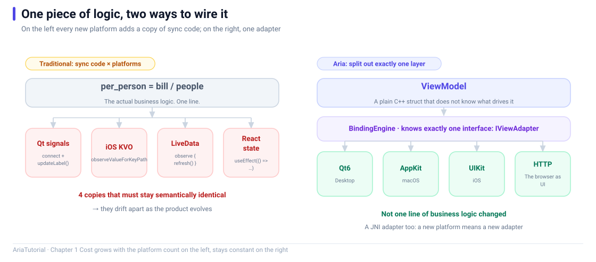

<div align="center">

# AriaTutorial

[Complete dependency update guide](docs/dependency-updates.en.md) — Version pins, selective updates, offline use, rollback and commit steps.

**Aria from Beginner to Expert · 20 chapters with runnable demos**

Every chapter ships a demo you can compile and run. The code in the articles and the code in the repository are the same code.

[](https://github.com/dqsjqian/AriaTutorial/releases/tag/v0.2.0)
[](https://github.com/dqsjqian/Aria)
[](#requirements)
[](LICENSE)



[简体中文](README.md) | English

</div>

---

## What this is

[Aria](https://github.com/dqsjqian/Aria) is a modern C++ MVVM framework for industrial-grade cross-platform software, unifying reactive state, asynchronous coroutines, and binding independently of UI toolkits. A ViewModel is a plain C++ class, with no required framework base class, macros, or code generator. One business core drives native UIs across platforms.

This tutorial puts that architectural elegance and engineering discipline into practice: from state updates to asynchronous cancellation, incremental collections, and platform adapters, you build maintainable cross-platform software in code.

This tutorial series runs through five stages — fundamentals, reactive core, collections and forms, architecture and adapters, mastery — in 20 chapters. Each chapter comes with a minimal demo that compiles, runs, and prints something. Every output block you see in the articles is real stdout from those programs.

## Quick start

### 1. Get Aria

Pick either route.

**Option A — source tree** (no install needed)

```bash
git clone https://github.com/dqsjqian/Aria.git
```

**Option B — install the SDK** (recommended for production)

```bash
cmake -S Aria -B Aria/build/release -DCMAKE_BUILD_TYPE=Release -DCMAKE_INSTALL_PREFIX=/usr/local
cmake --build Aria/build/release -j
cmake --install Aria/build/release
```

### 2. Build the demos

Recommended: `python scripts/build.py --test` reuses the locked Aria source,
configures, builds and runs CTest. Use `--aria-root` for a local source,
`--offline` for cached dependencies and `--dry-run` to inspect the plan.
`--platform qt|web` enables the corresponding adapter chapter. Direct CMake
and installed-SDK workflows remain supported.

Run `python scripts/build.py --all-demos --test` to build and test all 21 demos,
including both Qt6 and HTTP; install Qt6 first. The default builds 19 non-UI
demos. `--all-demos` uses a separate default build directory. With `--aria-prefix`,
the selected SDK must provide both Qt6 and HTTP components; missing components fail explicitly.

For an installed SDK, run `python scripts/build.py --aria-prefix /path/to/aria-sdk --test`.
It requires the exact Aria version locked in `dependencies.json` within that
prefix and does not fetch sources. A wrong version or prefix fails explicitly.
`--aria-prefix` and `--aria-root` are mutually exclusive; SDK builds have a
separate default directory. Add `--qt-prefix` to select Qt independently.

On macOS, `--arch x86_64` / `--arch arm64` selects the actual target architecture.
Visual Studio accepts `--generator-platform x64` (or `ARM64`). Extra definitions
use `--cmake-arg=-DNAME[:TYPE]=VALUE` and cannot override the selected configuration,
source or platform. Existing compiler, toolchain, architecture and source/SDK
path cache conflicts are rejected before fetching; existing files are preserved.

```bash
git clone https://github.com/dqsjqian/AriaTutorial.git
cd AriaTutorial

# Option A: point at a source tree (19 demos by default)
cmake -S . -B build/source -DCMAKE_BUILD_TYPE=Release -DARIA_ROOT=../Aria
cmake --build build/source -j

# Option B: use a separate directory and the actual installed SDK prefix
# Replace the example prefix below.
cmake -S . -B build/sdk -DCMAKE_BUILD_TYPE=Release -DARIA_ROOT= -DARIA_SDK_PREFIX=/path/to/aria-sdk
cmake --build build/sdk -j
```

Keep separate build directories: a cached `ARIA_ROOT` would otherwise keep the
second configuration on the source route. To enable all 21 demos with direct
CMake, also pass `-DARIA_TUTORIAL_QT6=ON -DARIA_TUTORIAL_HTTP=ON` and provide the
corresponding components.

For the source route, you can also run `python scripts/ci/fetch_aria.py` and pass `-DARIA_ROOT=build/deps/aria`. Explicit `ARIA_ROOT` uses the selected source tree directly; embedded Aria shares this tutorial's root dependency requests and lock.

The single root `dependencies.json` contains version requests and each dependency’s `resolved` result. Without an explicit version or a matching lock, the first resolution selects the latest stable release and records its version, commit, and SHA256. Existing locks are reused, so ordinary builds do not follow new releases. Explicit versions take priority: for example, `python scripts/ci/fetch_aria.py --version 3.1.1` overrides `ARIA_DEP_ARIA_VERSION`. Run `python scripts/ci/fetch_aria.py --update` to upgrade Aria deliberately.

Override C++ libraries with options such as `-DARIA_DEP_JSON_VERSION=3.12.0`, `-DARIA_DEP_MIRA_VERSION=1.0.0`, and `-DARIA_DEP_OPENSSL_VERSION=4.0.3`. CMake records temporary overrides in a build-directory resolution cache without changing the source `dependencies.json`. To update the shared library lock, run `python scripts/ci/update_dependencies.py`, review the changes, and commit this dependency file. Explicit source overrides and dependency targets supplied by a parent project retain priority.

Qt uses installed SDKs and never downloads or installs them automatically. The default prefers the latest discoverable version; `-DARIA_DEP_QT_VERSION=6.8.3` requires that exact version. Use `Qt6_DIR` / `CMAKE_PREFIX_PATH` to select an SDK location.

The installed SDK route does not fetch or rebuild the SDK's third-party libraries. `scripts/build.py --aria-prefix` requires the locked version; direct CMake discovery without an explicit version selects the latest discoverable compatible Aria 3.x SDK. Use `-DARIA_DEP_ARIA_VERSION=3.1.1` for an exact SDK version, and `aria_DIR` / `CMAKE_PREFIX_PATH` for its location. Explicit source selection takes precedence over SDK discovery.

Or use the convenience script:

```powershell
# Windows
.\scripts\run-all.ps1 -AriaRoot ..\Aria
```

```bash
# macOS / Linux
./scripts/run-all.sh --aria-root ../Aria
```

### 3. Run

Single-configuration generators place executables in the selected build directory's
`bin/`; Visual Studio and other multi-configuration generators add a configuration
subdirectory such as `Release/`. The commands below match the source example above.
The SDK route uses `build/sdk/bin/`; the Python entry prints its selected build directory.

```bash
./build/source/bin/ch01_bill
./build/source/bin/ch02_hello
./build/source/bin/ch03_property
./build/source/bin/ch04_computed
```

## Chapters

All articles are available in Chinese and English.

| # | Chapter | demo | Text |
|---|---|------|------|
| 01 | Why another C++ MVVM framework | `ch01_bill` | [中文](docs/01-为什么再造一个C++MVVM框架.md) · [English](docs/01-why-another-cpp-mvvm-framework.en.md) |
| 02 | First reactive program in ten minutes | `ch02_hello` | [中文](docs/02-十分钟跑起第一个响应式程序.md) · [English](docs/02-first-reactive-program-in-ten-minutes.en.md) |
| 03 | Property in depth: reading, tracking, the equality gate | `ch03_property` | [中文](docs/03-Property精讲-读写追踪与等值门.md) · [English](docs/03-property-in-depth.en.md) |
| 04 | The magic of Computed: automatic dependency tracking | `ch04_computed` | [中文](docs/04-Computed的魔法-自动依赖追踪.md) · [English](docs/04-computed-dependency-tracking.en.md) |
| 05 | batch / untracked / Effect: controlling notification scope | `ch05_batch` | [中文](docs/05-batch-untracked-Effect.md) · [English](docs/05-batch-untracked-effect.en.md) |
| 06 | Subscription: expressing lifetime with scope | `ch06_subscription` | [中文](docs/06-Subscription-生命周期与RAII.md) · [English](docs/06-subscription-lifetime-and-raii.en.md) |
| 07 | Two pitfalls: phantom and circular dependencies | `ch07_pitfalls` | [中文](docs/07-幽灵依赖与循环依赖.md) · [English](docs/07-phantom-and-circular-dependencies.en.md) |
| 08 | Command and AsyncCommand: actions have state too | `ch08_command` | [中文](docs/08-Command与AsyncCommand.md) · [English](docs/08-command-and-async-command.en.md) |
| 09 | ObservableList: a list that announces its changes | `ch09_list` | [中文](docs/09-ObservableList.md) · [English](docs/09-observable-list.en.md) |
| 10 | Derived views: filtering, sorting, deduplication, paging | `ch10_derived` | [中文](docs/10-派生视图.md) · [English](docs/10-derived-views.en.md) |
| 11 | reconcile: refreshing a list from fresh data | `ch11_reconcile` | [中文](docs/11-reconcile增量更新.md) · [English](docs/11-reconcile.en.md) |
| 12 | Validator: validation is reactive too | `ch12_validation` | [中文](docs/12-Validator表单校验.md) · [English](docs/12-validator.en.md) |
| 13 | ViewModel lifecycle: activation, parent-child, destroy hooks | `ch13_viewmodel` | [中文](docs/13-ViewModel生命周期.md) · [English](docs/13-viewmodel-lifecycle.en.md) |
| 14 | BindingEngine: wiring Properties to a UI | `ch14_binding` | [中文](docs/14-BindingEngine.md) · [English](docs/14-binding-engine.en.md) |
| 15 | The adapter layer: one ViewModel, five UIs | `ch15_qt6` `ch15_http` | [中文](docs/15-适配器体系.md) · [English](docs/15-adapter-layer.en.md) |
| 16 | Writing your own IViewAdapter | `ch16_adapter` | [中文](docs/16-自己写适配器.md) · [English](docs/16-writing-an-adapter.en.md) |
| 17 | Coroutines, concurrency, and cancellation | `ch17_async` | [中文](docs/17-协程与取消.md) · [English](docs/17-coroutines-and-cancellation.en.md) |
| 18 | Diagnostics: exporting the reactive graph | `ch18_diagnostics` | [中文](docs/18-诊断.md) · [English](docs/18-diagnostics.en.md) |
| 19 | Testing: how to know your reactive code is correct | `ch19_testing` | [中文](docs/19-测试.md) · [English](docs/19-testing.en.md) |
| 20 | Putting it together: a todo list built with Aria | `ch20_ecosystem` | [中文](docs/20-综合实战.md) · [English](docs/20-putting-it-together.en.md) |

## Requirements

| Item | Requirement |
|---|---|
| CMake | >= 3.21 |
| Compiler | MSVC v143+ (VS 2022/2026) / GCC 14+ / Clang 19+ / AppleClang 21+ |
| C++ standard | C++23 baseline (required by the Aria framework) |
| Other dependencies | Default chapters use Aria core, async, runtime and binding; no UI toolkit is required |

> Chapter 15 covers the Qt6 and HTTP adapters. Its two demos are excluded from the default build and require `-DARIA_TUTORIAL_QT6=ON` / `-DARIA_TUTORIAL_HTTP=ON`. The chapter explains this in detail.

### Windows notes

The `.ps1` scripts require a ready compiler environment: open **Developer PowerShell for VS**, or make sure `cmake` and `cl.exe` are on `PATH`.

## Repository layout

```
AriaTutorial/
├── CMakeLists.txt              # top-level build: locate Aria, collect demos
├── demos/
│   ├── CMakeLists.txt          # one target per chapter; ch15's two are gated
│   ├── common/                 # shared helpers (tutorial in-memory adapter)
│   ├── ch01_bill/main.cpp
│   ├── ch02_hello/main.cpp
│   ├── ...                     # ch03 - ch20, 19 default targets, 21 with optional Qt6/HTTP demos
│   ├── ch15_qt6/main.cpp       # needs Qt6
│   ├── ch15_http/main.cpp      # needs Aria's HTTP module
│   └── ch20_ecosystem/main.cpp
├── docs/                       # articles, Chinese and English versions (40 files)
│   ├── 01-为什么再造一个C++MVVM框架.md
│   ├── 01-why-another-cpp-mvvm-framework.en.md
│   └── ...                     # Chinese docs keep Chinese names; English docs are ASCII + .en.md
├── images/                     # one SVG figure per chapter, one per language
│   ├── ch01-why-aria.zh.svg
│   ├── ch01-why-aria.en.svg
│   └── ...
└── scripts/
    ├── run-all.ps1
    └── run-all.sh
```

## The figures

Every chapter opens with one figure that draws the single idea that chapter is about -- a data flow, a dependency graph, a state machine, or a timeline.

The figures follow the same rule as the text: **every number in a figure comes from that chapter's actual demo run**. The recompute counters in chapter 4 (1 to 2 to 3), the edit-operation counts in chapter 11, the measured concurrency time in chapter 17 (62 ms) -- all of them can be reproduced by running `build/bin/chNN_xxx`.

Each figure is an SVG under `images/`, so you can change the wording or the palette; GitHub renders vector figures natively, no PNG export needed.

## How articles and demos stay in sync

Article snippets follow the implementations under `demos/`. Changes to examples require checking the corresponding snippets, output and figures. Current CI builds and runs demos; it does not compare every article and SVG character for character.

Run `ctest --test-dir build --output-on-failure` to check enabled demos, each with a 30-second timeout. Chapter 15 uses `--smoke`: Qt checks labels, buttons and state propagation; HTTP checks startup on a temporary port, state updates and shutdown. These do not replace full GUI or browser interaction tests.

On 2026-09-30, all 21 demo tests passed against Aria `27fda0e03571` on macOS / AppleClang 21, including Qt6 and HTTP. Historical timings in the articles are not expected output on every machine.

## Related repositories

| Repository | Description |
|---|---|
| [Aria](https://github.com/dqsjqian/Aria) | The framework: reactive core, binding layer, five adapters |
| [AriaTools](https://github.com/dqsjqian/AriaTools) | Flagship example: one ViewModel driving Qt / iOS / Android / Web |
| [AriaAgent](https://github.com/dqsjqian/AriaAgent) | Provider-agnostic LLM agent GUI |
| [AriaRead](https://github.com/dqsjqian/AriaRead) | Cross-platform book-source engine with an HTTP-adapter web UI |

## License

[MIT](LICENSE) © 2026 aria contributors

Own code is MIT-licensed; third-party components retain their licenses. See [Third-Party Notices](THIRD_PARTY_NOTICES.md) for distribution requirements.
