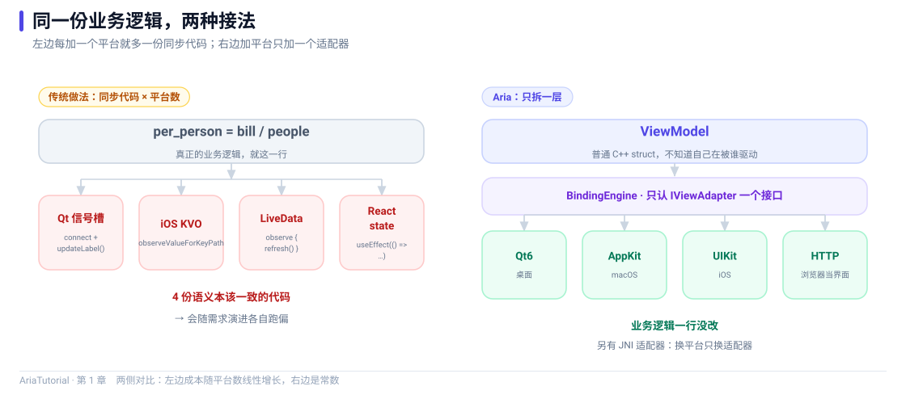

<div align="center">

# AriaTutorial

**Aria 从入门到精通 · 20 篇中文教程 + 可运行 demo**

每章一个独立可跑的 demo，正文代码与仓库代码同源，照着敲就能跑通。

[](https://github.com/dqsjqian/Aria)
[](#环境要求)
[](LICENSE)



</div>

---

## 这是什么

[Aria](https://github.com/dqsjqian/Aria) 是一个把响应式引擎和绑定层从 UI 框架里拆出来的 C++ MVVM 库：ViewModel 是纯 C++ 类，不继承框架基类、不需要宏、不需要代码生成器，换 UI 工具包不用改业务逻辑。

这套教程按「入门 → 响应式核心 → 集合与表单 → 架构与适配 → 精通」五个阶段展开，共 20 章。每一章都配一个可以编译、可以运行、可以看到输出的最小 demo —— 教程里贴的每一段输出都是这些程序真实打印出来的。

## 快速开始

### 1. 准备 Aria

两种方式任选其一。

**方式 A：用源码树**（无需提前安装）

```bash
git clone https://github.com/dqsjqian/Aria.git
```

**方式 B：安装 SDK**（生产环境推荐）

```bash
cmake -S Aria -B Aria/build/release -DCMAKE_BUILD_TYPE=Release -DCMAKE_INSTALL_PREFIX=/usr/local
cmake --build Aria/build/release -j
cmake --install Aria/build/release
```

### 2. 构建全部 demo

```bash
git clone https://github.com/dqsjqian/AriaTutorial.git
cd AriaTutorial

# 方式 A：指定 Aria 源码树
cmake -S . -B build -DCMAKE_BUILD_TYPE=Release -DARIA_ROOT=../Aria
cmake --build build -j

# 方式 B：Aria 已安装，直接配置即可
cmake -S . -B build -DCMAKE_BUILD_TYPE=Release
cmake --build build -j
```

也可以直接用一键脚本：

```powershell
# Windows
.\scripts\run-all.ps1 -AriaRoot ..\Aria
```

```bash
# macOS / Linux
./scripts/run-all.sh --aria-root ../Aria
```

### 3. 运行

所有可执行文件统一输出到 `build/bin/`。

```bash
./build/bin/ch01_bill
./build/bin/ch02_hello
./build/bin/ch03_property
```

## 章节目录

| # | 章节 | demo | 正文 |
|---|---|------|------|
| 01 | 为什么再造一个 C++ MVVM 框架 | `ch01_bill` | [中文](docs/01-为什么再造一个C++MVVM框架.md) · [English](docs/01-why-another-cpp-mvvm-framework.en.md) |
| 02 | 十分钟跑起第一个响应式程序 | `ch02_hello` | [中文](docs/02-十分钟跑起第一个响应式程序.md) · [English](docs/02-first-reactive-program-in-ten-minutes.en.md) |
| 03 | Property 精讲：读写、追踪与等值门 | `ch03_property` | [中文](docs/03-Property精讲-读写追踪与等值门.md) · [English](docs/03-property-in-depth.en.md) |
| 04 | Computed 的魔法：自动依赖追踪 | `ch04_computed` | [中文](docs/04-Computed的魔法-自动依赖追踪.md) · [English](docs/04-computed-dependency-tracking.en.md) |
| 05 | batch / untracked / Effect：精确控制通知范围 | `ch05_batch` | [中文](docs/05-batch-untracked-Effect.md) · [English](docs/05-batch-untracked-effect.en.md) |
| 06 | Subscription：用作用域表达订阅的生命周期 | `ch06_subscription` | [中文](docs/06-Subscription-生命周期与RAII.md) · [English](docs/06-subscription-lifetime-and-raii.en.md) |
| 07 | 两个必踩的坑：幽灵依赖与循环依赖 | `ch07_pitfalls` | [中文](docs/07-幽灵依赖与循环依赖.md) · [English](docs/07-phantom-and-circular-dependencies.en.md) |
| 08 | Command 与 AsyncCommand：动作也要有状态 | `ch08_command` | [中文](docs/08-Command与AsyncCommand.md) · [English](docs/08-command-and-async-command.en.md) |
| 09 | ObservableList：会通知变化的列表 | `ch09_list` | [中文](docs/09-ObservableList.md) · [English](docs/09-observable-list.en.md) |
| 10 | 派生视图：筛选、排序、去重、分页 | `ch10_derived` | [中文](docs/10-派生视图.md) · [English](docs/10-derived-views.en.md) |
| 11 | reconcile：用一份新数据刷新列表 | `ch11_reconcile` | [中文](docs/11-reconcile增量更新.md) · [English](docs/11-reconcile.en.md) |
| 12 | Validator：校验也是响应式的 | `ch12_validation` | [中文](docs/12-Validator表单校验.md) · [English](docs/12-validator.en.md) |
| 13 | ViewModel 生命周期：激活、父子树、销毁钩子 | `ch13_viewmodel` | [中文](docs/13-ViewModel生命周期.md) · [English](docs/13-viewmodel-lifecycle.en.md) |
| 14 | BindingEngine：把 Property 接到界面 | `ch14_binding` | [中文](docs/14-BindingEngine.md) · [English](docs/14-binding-engine.en.md) |
| 15 | 适配器体系：一份 ViewModel 接五种界面 | `ch15_qt6` `ch15_http` | [中文](docs/15-适配器体系.md) · [English](docs/15-adapter-layer.en.md) |
| 16 | 自己动手写一个 IViewAdapter | `ch16_adapter` | [中文](docs/16-自己写适配器.md) · [English](docs/16-writing-an-adapter.en.md) |
| 17 | 协程、并发与取消 | `ch17_async` | [中文](docs/17-协程与取消.md) · [English](docs/17-coroutines-and-cancellation.en.md) |
| 18 | 诊断：把响应式图导出来看 | `ch18_diagnostics` | [中文](docs/18-诊断.md) · [English](docs/18-diagnostics.en.md) |
| 19 | 测试：怎么验证响应式代码是对的 | `ch19_testing` | [中文](docs/19-测试.md) · [English](docs/19-testing.en.md) |
| 20 | 综合实战：用 Aria 写一个待办清单 | `ch20_ecosystem` | [中文](docs/20-综合实战.md) · [English](docs/20-putting-it-together.en.md) |

## 环境要求

| 项 | 要求 |
|---|---|
| CMake | >= 3.20 |
| 编译器 | MSVC v143+ (VS 2022/2026) / GCC 12+ / Clang 15+ |
| C++ 标准 | C++20 最低，可用 `-DCMAKE_CXX_STANDARD=23` 切到 C++23 |
| 其他依赖 | 无。demo 只依赖 `aria::core`，不涉及 UI 工具包 |

> 第 15 章涉及 Qt6 与 HTTP 适配器，对应的两个 demo 默认不参与构建，需要 `-DARIA_TUTORIAL_QT6=ON` / `-DARIA_TUTORIAL_HTTP=ON` 才会启用。正文会单独说明。

### Windows 提示

`.ps1` 脚本要求编译环境已就绪：用 **Developer PowerShell for VS** 打开，或先确保 `cmake`、`cl.exe` 在 `PATH` 中。

## 仓库结构

```
AriaTutorial/
├── CMakeLists.txt              # 顶层构建：定位 Aria + 汇总 demo
├── demos/
│   ├── CMakeLists.txt          # 每章一个 target，ch15 的两个用开关隔离
│   ├── common/                 # 各章共用的辅助代码（教程用内存适配器）
│   ├── ch01_bill/main.cpp
│   ├── ch02_hello/main.cpp
│   ├── ...                     # ch03 - ch20，共 20 个可执行目标
│   ├── ch15_qt6/main.cpp       # 需要 Qt6
│   ├── ch15_http/main.cpp      # 需要 Aria HTTP 模块
│   └── ch20_ecosystem/main.cpp
├── docs/                       # 教程正文，全文中英双版本（40 篇）
│   ├── 01-为什么再造一个C++MVVM框架.md
│   ├── 01-why-another-cpp-mvvm-framework.en.md
│   └── ...                     # 中文用中文文件名，英文版一律 ASCII 名 + .en.md
├── images/                     # 每章一张配图（SVG 矢量，中英各一版），可编辑、可 diff
│   ├── ch01-why-aria.zh.svg
│   ├── ch01-why-aria.en.svg
│   └── ...
└── scripts/
    ├── run-all.ps1
    └── run-all.sh
```

## 正文里的图

每一章正文的标题下方都有一张配图，画的是那一章最核心的那件事 —— 数据流、依赖图、状态机或时间线。

配图不是凭空画的示意图，它们与正文一样受同一条规则约束：**图里出现的每个数字都来自该章 demo 的真实运行结果**。比如第 4 章的重算次数（1 → 2 → 3）、第 11 章的编辑操作计数、第 17 章的并发实测耗时（62ms），都能靠 `build/bin/chNN_xxx` 亲手复现。

配图本身就是 SVG（`images/*.svg`），可以改文案、改配色；GitHub 原生渲染矢量图，不需要再导出 PNG。

## 正文与 demo 的一致性

教程正文不是"照着代码写出来的"——它是**从可运行的 demo 反向产出的**。三项检查全部自动化，不靠人眼：

| 检查项 | 规则 |
|---|---|
| 代码真实性 | 正文里每段 ```cpp 代码块，与 `demos/chNN_xxx/main.cpp` **逐字一致** |
| 输出真实性 | 正文里每段 ```text 输出块，是该 demo **真实 stdout 的逐字拷贝** |
| 配图真实性 | 每篇恰好一张配图，文件存在，正文引用的就是 SVG 源文件本身 |

所以你在正文里看到的每一条行为描述，都可以靠 `build/bin/chNN_xxx` 亲手复现。

> 第 15 章的两个 demo 需要 Qt6 与 Aria HTTP 模块，本机未运行，因此该章只校验代码来源与配图，不校验运行输出 —— 这一点也写在 `ABOUT.md` 的「明确不覆盖的部分」里。

## 相关仓库

| 仓库 | 说明 |
|---|---|
| [Aria](https://github.com/dqsjqian/Aria) | 框架本体：响应式核心 + 绑定层 + 五个适配器 |
| [AriaTools](https://github.com/dqsjqian/AriaTools) | 旗舰示例：同一份 ViewModel 驱动 Qt / iOS / Android / Web 四端 |
| [AriaAgent](https://github.com/dqsjqian/AriaAgent) | Provider 无关的 LLM Agent GUI |
| [OpenRead](https://github.com/dqsjqian/OpenRead) | 跨平台书源引擎，HTTP 适配器驱动的 Web 端 |

## License

[MIT](LICENSE) © 2026 aria contributors
