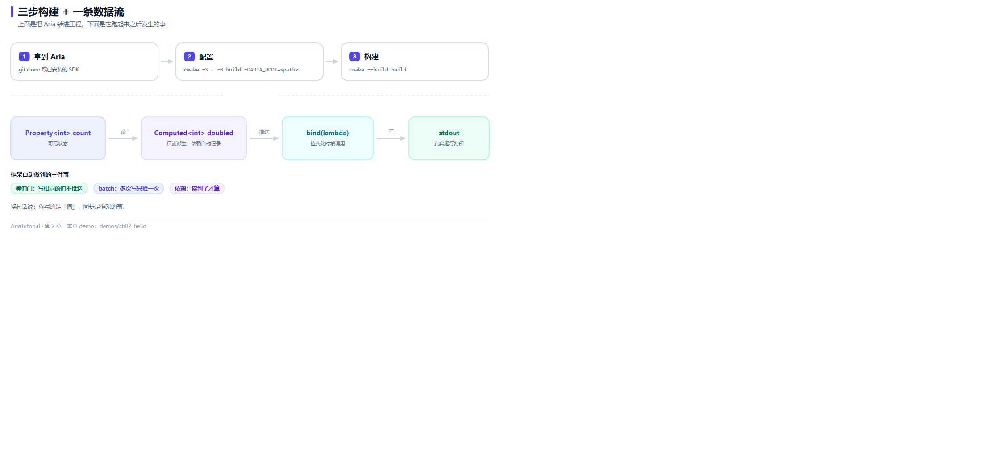

# 十分钟跑起第一个响应式程序



*上面三步是构建，下面一条是运行时数据流：Property → Computed → bind → 输出。*

上一章讲清了 Aria 要解决什么问题。这一章把它真正跑起来 —— 从零构建到看到输出，**全程不超过十分钟** ⏱️

## 📋 环境要求

| 项 | 要求 |
|---|---|
| CMake | >= 3.20 |
| 编译器 | MSVC v143+（VS 2022/2026）/ GCC 12+ / Clang 15+ |
| C++ 标准 | C++20 最低，可切 C++23 |
| 其他依赖 | 无。本章 demo 只依赖 `aria::core` |

**为什么门槛是 C++20** 🤔 Aria 用到了完整的协程与 concepts 支持，C++17 编不了。这不是设计偏好，是硬性依赖 —— 异步层 `aria::async` 整个建立在协程之上。

---

## 1️⃣ 拿到 Aria

两种方式，选一种即可。

**方式 A：源码树**（想边看框架源码边学，推荐这个）

```bash
git clone https://github.com/dqsjqian/Aria.git
```

**方式 B：安装成 SDK**（生产项目推荐）

```bash
cmake -S Aria -B Aria/build/release \
      -DCMAKE_BUILD_TYPE=Release \
      -DCMAKE_INSTALL_PREFIX=/usr/local
cmake --build Aria/build/release -j
cmake --install Aria/build/release
```

装完之后，自己的项目里一句 `find_package(aria 2.0 CONFIG REQUIRED)` 就能用：

```cmake
find_package(aria 2.0 CONFIG REQUIRED)
add_executable(my_app main.cpp)
target_link_libraries(my_app PRIVATE aria::core)
```

两种方式的区别只在"怎么找到 Aria"：方式 A 是把源码树 `add_subdirectory` 进来，方式 B 是链接已安装的库。本仓库的 `CMakeLists.txt` 两种都支持 —— 先试 `find_package`，找不到再用 `-DARIA_ROOT=` 指定的源码树。

---

## 2️⃣ 配置与构建

```bash
git clone https://github.com/dqsjqian/AriaTutorial.git
cd AriaTutorial

# 方式 A：用源码树
cmake -S . -B build -DCMAKE_BUILD_TYPE=Release -DARIA_ROOT=../Aria

# 方式 B：Aria 已安装
cmake -S . -B build -DCMAKE_BUILD_TYPE=Release

cmake --build build -j
```

> ⚠️ **Windows 用户注意**：`.ps1` 脚本和 `cmake` 都需要编译环境已就绪。用 **Developer PowerShell for VS** 打开终端，或者确认 `cmake`、`cl.exe` 在 `PATH` 里。直接双击打开 PowerShell 大概率会报"找不到编译器"。

配置成功时会打印一段 Aria 的构建信息，确认这几个关键项：

```text
-- aria v2.0.0 configuration:
--   Platform        : Windows
--   Build type      : Release
--   C++ standard    : 20
--   Compiler        : MSVC 19.51.36247.0
```

构建完成后，可执行文件统一在 `build/bin/` 下：

```bash
./build/bin/ch02_hello
```

---

## 3️⃣ 第一个程序

这是本章的完整程序，也是仓库里的 `demos/ch02_hello/main.cpp`：

```cpp
// ch02_hello: Aria 最小可运行程序
// 演示 Property / Computed / Command / Subscription 四件套的协作
#include "aria/aria.hpp"

#include <iostream>
#include <string>

using namespace aria;

int main() {
    // 1. Property: 可读写的状态, 初值 0
    Property<int> count{0};

    // 2. Computed: 只读派生值。依赖不用手写 -- 首次求值时读到了
    //    count, 就自动记下这个依赖。
    Computed<std::string> label([&] {
        return "count = " + std::to_string(count.get());
    });

    // 3. Command: 把"一个动作"包成对象, 可以被 UI 直接绑定
    Command<> increment([&] { count = count.get() + 1; });

    // 4. bind 建立订阅: 先立刻用当前值调一次, 之后每次变化都再调一次。
    //    返回值必须接住 -- 它决定订阅活多久。
    auto sub = label.bind([](const std::string& s) {
        std::cout << s << '\n';
    });

    std::cout << "-- 连续执行两次 increment --\n";
    increment();
    increment();

    std::cout << "-- 主动断开订阅 --\n";
    sub.release();

    increment();
    std::cout << "-- 断开后 count 实际值 = " << count.get() << " (但没有再打印)\n";
    return 0;
}
```

注意这里**没有任何 UI 代码** 🎯 没有 `QApplication`、没有窗口、没有事件循环。整个响应式系统在 `main` 里就能自洽运行 —— 这正是 Aria 想让你拥有的开发方式：**业务逻辑的验证不依赖界面**。

---

## 🔍 逐段拆解

### Property：可读写的状态

```cpp
Property<int> count{0};
```

`Property` 是响应式图上的一个可观察节点。它看起来像一个带初值的变量，但赋值时会发生一件额外的事：**通知所有依赖它的下游**。

```cpp
count = count.get() + 1;   // 赋值 → 下游自动重算
```

注意 `get()` 不是多余的包装。它的作用是**在读取的同时登记依赖** —— 谁在求值过程中读了 `count`，谁就成为 `count` 的下游。

### Computed：只读派生值

```cpp
Computed<std::string> label([&] {
    return "count = " + std::to_string(count.get());
});
```

这里最值得称道的是**没有依赖列表** 🎉 你在写 Vue 时写过 `computed`，在写 React 时写过 `useMemo` 并手动列 `[count]` 依赖数组 —— 漏一个就是 bug。

Aria 的 `Computed` 靠"首次求值时读了谁"来自动确定依赖：这次求值读到了 `count`，`count` 就成了依赖。**你没写、也不可能写漏**。

### Command：把动作包成对象

```cpp
Command<> increment([&] { count = count.get() + 1; });
increment();   // 像函数一样调用
```

`Command<>` 包住一个动作，可以被界面直接绑定（`engine.bind_command(...)`）。它比裸 lambda 多出来的是**"可执行状态"** —— 按钮的禁用/启用可以由 `can_execute` 驱动。这个我们留到第 8 章展开。

### bind：建立订阅

```cpp
auto sub = label.bind([](const std::string& s) {
    std::cout << s << '\n';
});
```

`bind` 做两件事：**立刻用当前值调一次**（所以下面输出里第一行就是 `count = 0`），然后**每次变化再调一次**。

---

## 🖥️ 运行结果

```text
count = 0
-- 连续执行两次 increment --
count = 1
count = 2
-- 主动断开订阅 --
-- 断开后 count 实际值 = 3 (但没有再打印)
```

逐步对一遍：

| 位置 | 发生了什么 |
|---|---|
| `count = 0` | `bind` 的初始同步，此时还没执行任何 `increment` |
| `count = 1` | 第一次 `increment()` → `count` 变 1 → `label` 依赖失效重算 → 推送 |
| `count = 2` | 第二次 `increment()`，同理 |
| 断开后无输出 | `sub.release()` 退订，后面 `increment()` 让 `count` 变成 3，但没人订阅了 |
| `count 实际值 = 3` | 用 `get()` 读到的真实值，证明值变了、只是没有监听者 |

---

## ⚠️ 一个必须说清的点：`bind` 的返回值

上面代码里这一行：

```cpp
auto sub = label.bind(...);   // 正确：接住返回值
```

如果写成这样：

```cpp
label.bind(...);              // 错误：订阅立刻失效
```

**订阅在那一行就断了，后面什么都不会打印** 😱

原因：`bind` 返回的 `Subscription` 是这条订阅的生命周期句柄。它一旦析构，订阅随之解除。写成 `label.bind(...)` 而不接收返回值，临时对象在分号处立即析构 —— 订阅当场结束。

Aria 在这里做了一个防护：`bind` 标了 `[[nodiscard]]`，所以上面这个写法**编译器会给出警告**，不会让你静默地踩坑 🛡️

顺带一提，这个设计在真实 UI 里有额外好处：`Subscription` 通常存为 View 的成员。View 销毁时成员析构，订阅自动解除 —— **不会回调到一个已经析构的控件上**。这就是第 6 章要讲的"用作用域表达订阅的生命周期"。

---

## 🔧 构建踩坑速查

| 现象 | 原因与解法 |
|---|---|
| `未找到 Aria` | 既没装 SDK 也没给 `-DARIA_ROOT`。补上 `-DARIA_ROOT=<Aria 源码树路径>` |
| `CMAKE_CXX_STANDARD` 相关报错 | 编译器太老。确认 GCC 12+ / Clang 15+ / MSVC v143+ |
| 找不到 `cl.exe`（Windows） | 用 Developer PowerShell for VS 打开终端 |
| 运行时报找不到 `aria_abi.dll` | 直接跑 `build/bin/` 下的 exe；该目录已同时存放 exe 与依赖库 |
| 中文输出乱码（MSVC） | 本项目已在 `CMakeLists.txt` 里加了 `/utf-8`；自己项目记得补 |

---

## 📌 小结

- 🧱 构建只三步：拿到 Aria → `cmake -S . -B build` → `cmake --build build`；
- 📦 `Property` 是可读写状态，`get()` 读值的同时登记依赖；
- 🪄 `Computed` 的依赖靠首次求值自动发现，**不需要手写依赖数组**；
- 🎬 `Command` 把动作包成可绑定对象；
- 🔗 `bind` 会先同步一次再订阅，返回值必须接住 —— 它是订阅的生命周期句柄。

---

**上一章** 👈 [第 1 章 为什么再造一个 C++ MVVM 框架](01-为什么再造一个C++MVVM框架.md)
**下一章** 👉 [第 3 章 Property 精讲：读写、追踪与等值门](03-Property精讲-读写追踪与等值门.md)

> 📂 本章代码来自本仓库 `demos/ch02_hello/main.cpp`，输出为该程序在 Windows / MSVC 19.51 下的真实打印结果。
