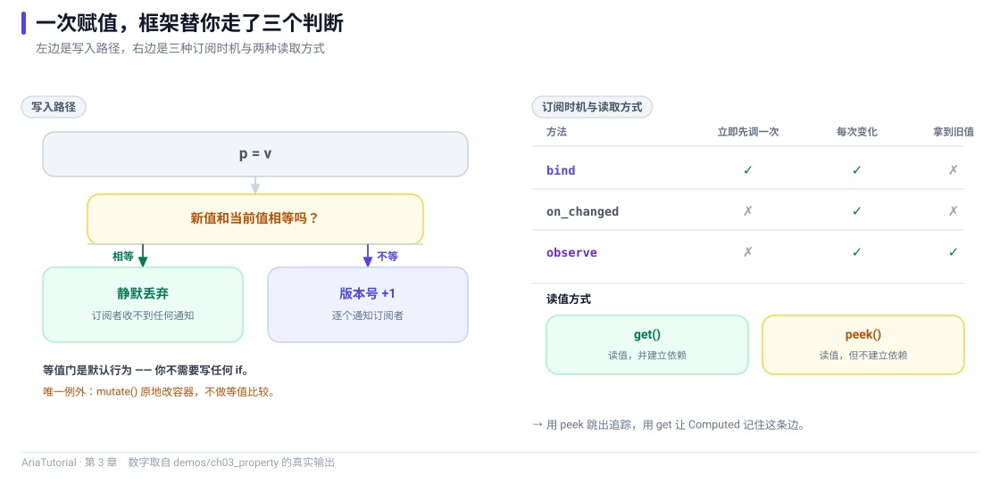

# Property 精讲：读写、追踪与等值门



*左边是写入路径的两个分支，右边是三种订阅时机与两种读取方式。*

`Property<T>` 看起来就是一个带初值的变量。但它是整套响应式系统的入口 —— **用错方式读、用错方式写，行为会完全不同** ⚠️

这一章用五个小实验把它的边界讲清。所有输出都来自仓库里的 `demos/ch03_property/main.cpp`。

---

## 📄 完整程序

```cpp
// ch03: Property 精讲 -- 读写、追踪与等值门
#include "aria/aria.hpp"

#include <iostream>
#include <vector>

using namespace aria;

int main() {
    std::cout << "== 1. 等值门: 写入相同值不产生任何通知 ==\n";
    Property<int> p{10};
    auto s1 = p.on_changed([](const int& v) {
        std::cout << "   on_changed -> " << v << '\n';
    });
    std::cout << "   p = 20\n";
    p = 20;
    std::cout << "   p = 20 (写入相同值)\n";
    p = 20;
    std::cout << "   p = 30\n";
    p = 30;

    std::cout << "\n== 2. bind 与 on_changed 的区别: bind 会先同步一次 ==\n";
    auto s2 = p.bind([](const int& v) {
        std::cout << "   bind -> " << v << '\n';
    });
    std::cout << "   p = 40\n";
    p = 40;

    std::cout << "\n== 3. observe: 同时拿到旧值和新值 ==\n";
    auto s3 = p.observe([](const int& old_v, const int& new_v) {
        std::cout << "   observe -> " << old_v << " 变成 " << new_v << '\n';
    });
    std::cout << "   p = 50\n";
    p = 50;

    std::cout << "\n== 4. mutate: 原地改容器, 不做等值比较 ==\n";
    Property<std::vector<int>> items{std::vector<int>{1, 2, 3}};
    auto s4 = items.on_changed([](const std::vector<int>& v) {
        std::cout << "   元素个数 -> " << v.size() << '\n';
    });
    std::cout << "   items.mutate(尾部追加 4)\n";
    items.mutate([](std::vector<int>& v) { v.push_back(4); });

    std::cout << "\n== 5. peek: 读值但不建立依赖 ==\n";
    Property<int> base{7};
    Computed<int> tracked([&] { return base.get() * 2; });   // 依赖 base
    Computed<int> frozen([&] { return base.peek() * 2; });   // 不依赖 base
    std::cout << "   tracked = " << tracked.get() << ", frozen = " << frozen.get() << '\n';
    std::cout << "   base = 100\n";
    base = 100;
    std::cout << "   tracked = " << tracked.get() << " (依赖失效, 自动重算)\n";
    std::cout << "   frozen  = " << frozen.get() << " (peek 不建依赖, 缓存没失效)\n";

    return 0;
}
```

**真实运行结果**：

```text
== 1. 等值门: 写入相同值不产生任何通知 ==
   p = 20
   on_changed -> 20
   p = 20 (写入相同值)
   p = 30
   on_changed -> 30

== 2. bind 与 on_changed 的区别: bind 会先同步一次 ==
   bind -> 30
   p = 40
   on_changed -> 40
   bind -> 40

== 3. observe: 同时拿到旧值和新值 ==
   p = 50
   on_changed -> 50
   bind -> 50
   observe -> 40 变成 50

== 4. mutate: 原地改容器, 不做等值比较 ==
   items.mutate(尾部追加 4)
   元素个数 -> 4

== 5. peek: 读值但不建立依赖 ==
   tracked = 14, frozen = 14
   base = 100
   tracked = 200 (依赖失效, 自动重算)
   frozen  = 14 (peek 不建依赖, 缓存没失效)
```

---

## 实验一：等值门 🚪

```cpp
Property<int> p{10};
auto s1 = p.on_changed([](const int& v) {
    std::cout << "   on_changed -> " << v << '\n';
});
p = 20;   // 打印
p = 20;   // 不打印
p = 30;   // 打印
```

看输出：

```text
   p = 20
   on_changed -> 20
   p = 20 (写入相同值)
   p = 30
   on_changed -> 30
```

第二次 `p = 20` **完全没有产生通知** 🔇

这是 Aria 的默认行为：**写入值与当前值相等时静默丢弃**。

这一条能省掉大量无谓刷新。界面里常见的"每秒轮询一次，值没变但整个列表重建"，在 Aria 里不会发生 —— 前提是你用 `set` / `operator=` 写值。

---

## 实验二：`bind` 与 `on_changed` 的差别 🔔

```cpp
auto s2 = p.bind([](const int& v) {
    std::cout << "   bind -> " << v << '\n';
});
```

看输出：

```text
   bind -> 30
   p = 40
   on_changed -> 40
   bind -> 40
```

注意 `bind -> 30` 出现在 `p = 40` **之前** —— `bind` 注册的瞬间就用当前值（30）调了一次。

这就是它和 `on_changed` 的全部区别：

| 接口 | 注册时是否立即调用 | 适用场景 |
|---|---|---|
| `on_changed(fn)` | 否 | 只关心"之后的变化"，比如埋点、日志 |
| `bind(fn)` | ✅ **是**，用当前值调一次 | 绑定界面控件，需要立刻显示当前值 |
| `observe(fn)` | 否 | 需要同时拿到旧值和新值 |

> 💡 **绑控件一定要用 `bind`。** 用 `on_changed` 的话，界面在你下一次改值之前都是空的。

---

## 实验三：`observe` 拿到新旧值 🔄

```cpp
auto s3 = p.observe([](const int& old_v, const int& new_v) {
    std::cout << "   observe -> " << old_v << " 变成 " << new_v << '\n';
});
```

看输出：

```text
   observe -> 40 变成 50
```

`observe` 是在 `on_changed` 之上实现的：它内部保存一份"上次见到的值"，每次变化时把旧值和新值一起交给你。适合做"值变化时同步到另一个系统"这类需要知道前后差异的场景。

---

## 实验四：`mutate` 原地改容器 📦

```cpp
Property<std::vector<int>> items{std::vector<int>{1, 2, 3}};
auto s4 = items.on_changed([](const std::vector<int>& v) {
    std::cout << "   元素个数 -> " << v.size() << '\n';
});
items.mutate([](std::vector<int>& v) { v.push_back(4); });
```

看输出：

```text
   items.mutate(尾部追加 4)
   元素个数 -> 4
```

`mutate` 把容器**原地**交给你改，改完直接通知 —— **不做等值比较**。

为什么不比较 🤔 对一个上万元素的 `vector` 做完整相等判断，代价可能比这次修改本身还高。Aria 的取舍是：`mutate` 明确表示"我知道我在改，一定通知"，把判断权交回给你。

所以规则很简单：

| 写法 | 等值门 | 什么时候用 |
|---|---|---|
| `p = v;` | ✅ 有 | 标量、小对象，希望无变化就不通知 |
| `p.mutate(fn);` | ❌ 无 | 容器、大对象，改完必须通知 |

> ⚠️ 误用 `mutate` 的后果是"值没变也刷新"。如果这个 Property 挂在列表控件上，就是整表重建。

---

## 实验五：`get` 与 `peek` 的区别 👁️

这是全章最重要的一点。

```cpp
Property<int> base{7};
Computed<int> tracked([&] { return base.get() * 2; });   // 依赖 base
Computed<int> frozen([&] { return base.peek() * 2; });   // 不依赖 base

base = 100;
```

看输出：

```text
   tracked = 14, frozen = 14
   base = 100
   tracked = 200 (依赖失效, 自动重算)
   frozen  = 14 (peek 不建依赖, 缓存没失效)
```

两个 `Computed` 初值都是 14。`base` 改成 100 之后：

- ✅ `tracked` 返回 **200** —— 它读过 `base`，依赖失效，自动重算；
- ❌ `frozen` 返回 **14** —— 它用 `peek` 读的，**没有建立依赖**，从未失效。

一句话记住：

| 接口 | 登记依赖 | 用途 |
|---|---|---|
| `get()` | ✅ **是** | 参与依赖追踪的读取，`Computed` / `Effect` 内部默认用这个 |
| `peek()` | ❌ 否 | 读取值但不希望引起重算，比如日志、调试输出、只读快照 |
| `get_ref()` | ✅ 是 | 同上，但返回 `const T&` 避免拷贝 |
| `peek_ref()` | ❌ 否 | 同上，返回 `const T&` |

> 🕳️ **`peek` 最容易踩的坑**：你以为 `Computed` 依赖了某个值，实际用了 `peek` 所以没依赖，界面死活不刷新。反过来，在 `Effect` 里用 `get()` 打日志，会让这个 Effect 出现莫名其妙的额外依赖。

---

## 🔒 两条硬约束

### 1. 写操作只能在图线程上

```cpp
prop.set(...);   // 非 graph 线程调用 -> Debug 下断言失败
```

Aria 的响应式图是**单线程**的。在 worker 线程直接写 `Property` 会触发断言（Debug），Release 下是未定义行为。

跨线程更新的正确姿势是回到调度器上再写：

```cpp
co_await schedule_on(main_dispatcher);
vm.status = "完成";
```

这条是第 17 章（协程与取消）的重点，这里先记住结论 ✅

### 2. `Property<T>` 要求 `T` 可拷贝且可比较

因为要支持等值门，`T` 必须能 `==`；因为 `observe` 要保存旧值，必须能拷贝。传一个只能移动的类型进 `Property<T>` 会**直接编译失败** —— 这是刻意的，早失败好过运行时崩溃 🛡️

---

## 📌 小结

- 👁️ **读值**：`get()` 登记依赖，`peek()` 不登记。`Computed` / `Effect` 里默认用 `get()`；
- ✍️ **写值**：`set` / `operator=` 有等值门，`mutate` 没有。容器用 `mutate`，标量用 `=`；
- 🔔 **观察**：绑控件用 `bind`（会立即同步一次），只关心变化用 `on_changed`，要新旧值用 `observe`；
- 🧵 **线程**：只在图线程写值，跨线程要先 `schedule_on` 切回来；
- 📐 **类型**：`T` 必须可拷贝、可比较，否则编译期就拦下来。

---

**上一章** 👈 [第 2 章 十分钟跑起第一个响应式程序](02-十分钟跑起第一个响应式程序.md)
**下一章** 👉 [第 4 章 Computed 的魔法：自动依赖追踪是怎么做到的](04-Computed的魔法-自动依赖追踪.md)

> 📂 本章代码来自本仓库 `demos/ch03_property/main.cpp`，输出为该程序在 Windows / MSVC 19.51 下的真实打印结果。
