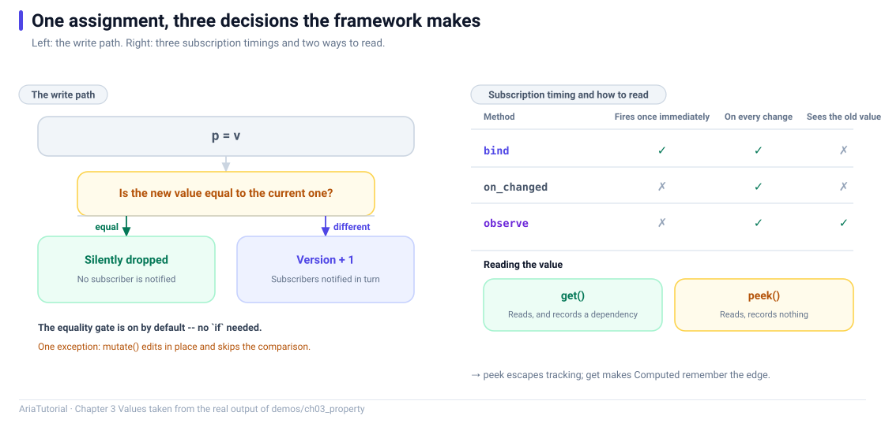

# Property in Depth: Reading, Tracking, and the Equality Gate



*Left: the two branches of a write. Right: three subscription timings and two ways to read.*

> The code in this chapter is reproduced verbatim from `demos/ch03_property/main.cpp`.
> Source comments are in Chinese, matching the repository.

`Property<T>` looks like a variable with an initial value. But it is the entry point to the entire reactive system — **read it the wrong way or write it the wrong way and its behaviour changes completely** ⚠️

This chapter pins down its boundaries with five small experiments. All output comes from `demos/ch03_property/main.cpp`.

---

## 📄 The complete program

```cpp
// ch03: Property 精讲 -- 读写、追踪与等值门
#include "aria/aria.hpp"

#include <iostream>
#include <vector>

using namespace aria;

int main() {
    std::cout << "== 1. 等值门: 写入相同值不产生任何通知 ==\n";
    Property<int> p{10};
    auto s1 = p.on_changed([](const int& v) {
        std::cout << "   on_changed -> " << v << '\n';
    });
    std::cout << "   p = 20\n";
    p = 20;
    std::cout << "   p = 20 (写入相同值)\n";
    p = 20;
    std::cout << "   p = 30\n";
    p = 30;

    std::cout << "\n== 2. bind 与 on_changed 的区别: bind 会先同步一次 ==\n";
    auto s2 = p.bind([](const int& v) {
        std::cout << "   bind -> " << v << '\n';
    });
    std::cout << "   p = 40\n";
    p = 40;

    std::cout << "\n== 3. observe: 同时拿到旧值和新值 ==\n";
    auto s3 = p.observe([](const int& old_v, const int& new_v) {
        std::cout << "   observe -> " << old_v << " 变成 " << new_v << '\n';
    });
    std::cout << "   p = 50\n";
    p = 50;

    std::cout << "\n== 4. mutate: 原地改容器, 不做等值比较 ==\n";
    Property<std::vector<int>> items{std::vector<int>{1, 2, 3}};
    auto s4 = items.on_changed([](const std::vector<int>& v) {
        std::cout << "   元素个数 -> " << v.size() << '\n';
    });
    std::cout << "   items.mutate(尾部追加 4)\n";
    items.mutate([](std::vector<int>& v) { v.push_back(4); });

    std::cout << "\n== 5. peek: 读值但不建立依赖 ==\n";
    Property<int> base{7};
    Computed<int> tracked([&] { return base.get() * 2; });   // 依赖 base
    Computed<int> frozen([&] { return base.peek() * 2; });   // 不依赖 base
    std::cout << "   tracked = " << tracked.get() << ", frozen = " << frozen.get() << '\n';
    std::cout << "   base = 100\n";
    base = 100;
    std::cout << "   tracked = " << tracked.get() << " (依赖失效, 自动重算)\n";
    std::cout << "   frozen  = " << frozen.get() << " (peek 不建依赖, 缓存没失效)\n";

    return 0;
}
```

**Actual output**:

```text
== 1. 等值门: 写入相同值不产生任何通知 ==
   p = 20
   on_changed -> 20
   p = 20 (写入相同值)
   p = 30
   on_changed -> 30

== 2. bind 与 on_changed 的区别: bind 会先同步一次 ==
   bind -> 30
   p = 40
   on_changed -> 40
   bind -> 40

== 3. observe: 同时拿到旧值和新值 ==
   p = 50
   on_changed -> 50
   bind -> 50
   observe -> 40 变成 50

== 4. mutate: 原地改容器, 不做等值比较 ==
   items.mutate(尾部追加 4)
   元素个数 -> 4

== 5. peek: 读值但不建立依赖 ==
   tracked = 14, frozen = 14
   base = 100
   tracked = 200 (依赖失效, 自动重算)
   frozen  = 14 (peek 不建依赖, 缓存没失效)
```

---

## Experiment 1: the equality gate 🚪

```cpp
Property<int> p{10};
auto s1 = p.on_changed([](const int& v) {
    std::cout << "   on_changed -> " << v << '\n';
});
p = 20;   // prints
p = 20;   // prints nothing
p = 30;   // prints
```

Look at the output:

```text
   p = 20
   on_changed -> 20
   p = 20 (写入相同值)
   p = 30
   on_changed -> 30
```

The second `p = 20` produced **no notification at all** 🔇

That is Aria's default: **writing a value equal to the current one is silently dropped**.

This single rule removes a large class of pointless refreshes. A UI that polls once a second and rebuilds the whole list even though nothing changed simply cannot happen here — provided you write values through `set` / `operator=`.

---

## Experiment 2: `bind` versus `on_changed` 🔔

```cpp
auto s2 = p.bind([](const int& v) {
    std::cout << "   bind -> " << v << '\n';
});
```

Output:

```text
   bind -> 30
   p = 40
   on_changed -> 40
   bind -> 40
```

Note that `bind -> 30` appears **before** `p = 40` — `bind` called the callback once at registration time, with the current value (30).

That is the entire difference:

| Interface | Calls immediately at registration | When to use |
|---|---|---|
| `on_changed(fn)` | No | You only care about later changes — telemetry, logging |
| `bind(fn)` | ✅ **Yes**, once with the current value | Binding a widget, which must display the current value right away |
| `observe(fn)` | No | You need both the old and the new value |

> 💡 **Binding a widget always means `bind`.** With `on_changed`, your widget stays blank until the next change.

---

## Experiment 3: `observe` gives you both values 🔄

```cpp
auto s3 = p.observe([](const int& old_v, const int& new_v) {
    std::cout << "   observe -> " << old_v << " 变成 " << new_v << '\n';
});
```

Output:

```text
   observe -> 40 变成 50
```

`observe` is built on top of `on_changed`: it keeps the last value it saw and hands you both sides of the change. Reach for it when a value change must be propagated into another system that needs to know what changed.

---

## Experiment 4: `mutate` edits in place 📦

```cpp
Property<std::vector<int>> items{std::vector<int>{1, 2, 3}};
auto s4 = items.on_changed([](const std::vector<int>& v) {
    std::cout << "   元素个数 -> " << v.size() << '\n';
});
items.mutate([](std::vector<int>& v) { v.push_back(4); });
```

Output:

```text
   items.mutate(尾部追加 4)
   元素个数 -> 4
```

`mutate` hands you the container itself, and notifies unconditionally afterwards — **no equality comparison**.

Why not compare 🤔 Running a full equality check on a `vector` with tens of thousands of elements can cost more than the mutation that triggered it. Aria's trade-off is explicit: `mutate` means "I know I am changing it, notify", and the judgement call stays with you.

So the rule is simple:

| Form | Equality gate | When to use |
|---|---|---|
| `p = v;` | ✅ Yes | Scalars and small objects, where an unchanged value should not notify |
| `p.mutate(fn);` | ❌ No | Containers and large objects that must notify after an edit |

> ⚠️ Misusing `mutate` means "refresh even when nothing changed". If that Property drives a list widget, you get a full list rebuild.

---

## Experiment 5: `get` versus `peek` 👁️

This is the most important point in the chapter.

```cpp
Property<int> base{7};
Computed<int> tracked([&] { return base.get() * 2; });   // depends on base
Computed<int> frozen([&] { return base.peek() * 2; });   // does not
```

Output:

```text
   tracked = 14, frozen = 14
   base = 100
   tracked = 200 (依赖失效, 自动重算)
   frozen  = 14 (peek 不建依赖, 缓存没失效)
```

Both start at 14. After `base = 100`:

- ✅ `tracked` returns **200** — it read `base`, its dependency invalidated, it recomputed;
- ❌ `frozen` returns **14** — it read via `peek`, **registered no dependency**, and was never invalidated.

Remember it like this:

| Interface | Registers a dependency | Purpose |
|---|---|---|
| `get()` | ✅ **Yes** | A tracked read; the default inside `Computed` and `Effect` |
| `peek()` | ❌ No | Read without causing recomputation — logging, debugging, read-only snapshots |
| `get_ref()` | ✅ Yes | Same as `get()`, but returns `const T&` to avoid a copy |
| `peek_ref()` | ❌ No | Same as `peek()`, returning `const T&` |

> 🕳️ **The classic `peek` trap**: you believe a `Computed` depends on some value, but you used `peek`, so it does not — and the UI mysteriously never updates. The mirror image: using `get()` for logging inside an `Effect` quietly adds an extra dependency to that Effect.

---

## 🔒 Two hard constraints

### 1. Writes happen on the graph thread only

```cpp
prop.set(...);   // from a non-graph thread -> assertion in Debug
```

Aria's reactive graph is **single-threaded**. Writing a `Property` from a worker thread trips an assertion in Debug builds and is undefined behaviour in Release.

The correct way to update across threads is to hop back onto a scheduler first:

```cpp
co_await schedule_on(main_dispatcher);
vm.status = "done";
```

This is the subject of Chapter 17 (coroutines and cancellation); for now, remember the conclusion ✅

### 2. `Property<T>` requires `T` to be copyable and comparable

The equality gate needs `==`; `observe` needs to store an old value, so it needs a copy. Passing a move-only type into `Property<T>` fails at **compile time** — deliberately, because failing early beats crashing at runtime 🛡️

---

## 📌 Summary

- 👁️ **Reading**: `get()` registers a dependency, `peek()` does not. `Computed` / `Effect` use `get()` by default;
- ✍️ **Writing**: `set` / `operator=` go through the equality gate, `mutate` does not. Containers use `mutate`, scalars use `=`;
- 🔔 **Observing**: bind widgets with `bind` (it syncs once immediately), use `on_changed` for change-only interest, `observe` when you need both values;
- 🧵 **Threading**: write only on the graph thread; hop back with `schedule_on` when crossing threads;
- 📐 **Types**: `T` must be copyable and comparable, enforced at compile time.

---

**Previous chapter** 👈 [Chapter 2 — First Reactive Program in Ten Minutes](02-first-reactive-program-in-ten-minutes.en.md)
**Next chapter** 👉 [Chapter 4 — The Magic of Computed: How Automatic Dependency Tracking Works](04-computed-dependency-tracking.en.md)

> 📂 Code from `demos/ch03_property/main.cpp`. Output is the program's real stdout on Windows / MSVC 19.51.
