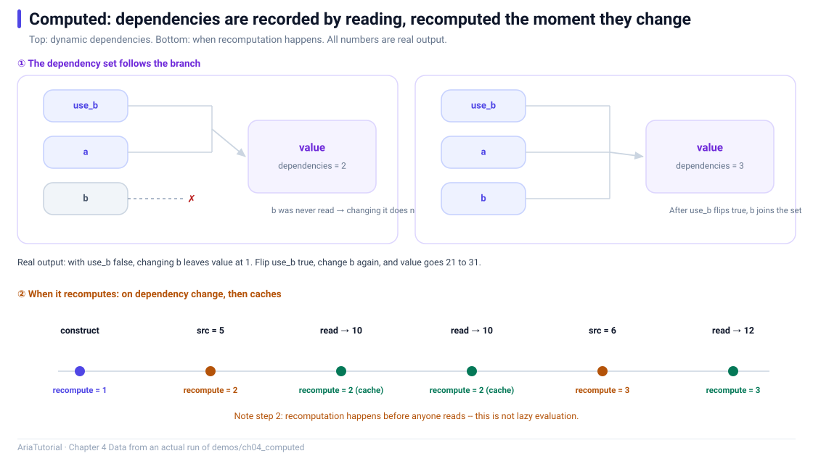

# The Magic of Computed: How Automatic Dependency Tracking Works



*Top: the dependency set follows the branch. Bottom: when recomputation happens -- note step 2, it recomputes before anyone reads.*

> The code in this chapter is reproduced verbatim from `demos/ch04_computed/main.cpp`.
> Source comments are in Chinese, matching the repository.

`Computed` is the most underrated piece of Aria.

On the surface it is "a derived value that keeps itself up to date". The real value is elsewhere: **you never write a dependency list** 🪄

Anyone who has used React knows how easy it is to miss an entry in `useMemo(fn, [deps])`. Anyone who has used Vue knows a `watch` whose dependencies are off by one simply stops firing. Aria removes that step from the process entirely.

---

## 📄 The complete program

```cpp
// ch04: Computed 自动依赖追踪 -- 依赖不用手写, 用到了才记上
#include "aria/aria.hpp"

#include <iostream>

using namespace aria;

int main() {
    std::cout << "== 1. 动态依赖: 依赖集随分支变化 ==\n";
    Property<int>  a{1};
    Property<int>  b{2};
    Property<bool> use_b{false};

    Computed<int> value{[&] {
        int x = a.get();
        if (use_b.get()) {
            x += b.get();
        }
        return x;
    }};

    std::cout << "   use_b=false: value = " << value.get()
              << ", 依赖个数 = " << value.dependency_count() << '\n';

    b = 20;
    std::cout << "   改 b 后 value = " << value.get() << " (b 还没被读到, 不算依赖)\n";

    use_b = true;
    std::cout << "   use_b=true : value = " << value.get()
              << ", 依赖个数 = " << value.dependency_count() << '\n';

    b = 30;
    std::cout << "   改 b 后 value = " << value.get() << " (现在传播了)\n";

    std::cout << "\n== 2. 重算时机: 依赖一变就算, 结果会缓存 ==\n";
    int recomputes = 0;
    Property<int>  src{1};
    Computed<int>  doubled{[&] {
        ++recomputes;
        return src.get() * 2;
    }};

    std::cout << "   构造后重算次数 = " << recomputes << " (构造时会求值一次)\n";

    src = 5;
    std::cout << "   改 src 后重算次数 = " << recomputes << " (依赖失效, 立即重算)\n";

    std::cout << "   第一次读 = " << doubled.get()
              << ", 重算次数 = " << recomputes << '\n';
    std::cout << "   第二次读 = " << doubled.get()
              << ", 重算次数 = " << recomputes << " (命中缓存, 不重复算)\n";

    src = 6;
    std::cout << "   再改 src 后重算次数 = " << recomputes << '\n';
    std::cout << "   读一下 = " << doubled.get()
              << ", 重算次数 = " << recomputes << '\n';

    std::cout << "\n== 3. 依赖变化时, 下游自动收到通知 ==\n";
    Property<int>  price{100};
    Computed<int>  with_tax{[&] { return price.get() * 105 / 100; }};

    auto sub = with_tax.bind([](int v) {
        std::cout << "   含税价 -> " << v << '\n';
    });

    std::cout << "   price = 200\n";
    price = 200;

    std::cout << "   price = 200 (写相同的值)\n";
    price = 200;

    return 0;
}
```

**Actual output**:

```text
== 1. 动态依赖: 依赖集随分支变化 ==
   use_b=false: value = 1, 依赖个数 = 2
   改 b 后 value = 1 (b 还没被读到, 不算依赖)
   use_b=true : value = 21, 依赖个数 = 3
   改 b 后 value = 31 (现在传播了)

== 2. 重算时机: 依赖一变就算, 结果会缓存 ==
   构造后重算次数 = 1 (构造时会求值一次)
   改 src 后重算次数 = 2 (依赖失效, 立即重算)
   第一次读 = 10, 重算次数 = 2
   第二次读 = 10, 重算次数 = 2 (命中缓存, 不重复算)
   再改 src 后重算次数 = 3
   读一下 = 12, 重算次数 = 3

== 3. 依赖变化时, 下游自动收到通知 ==
   含税价 -> 105
   price = 200
   含税价 -> 210
   price = 200 (写相同的值)
```

---

## Experiment 1: dependencies are recorded by *reading* 🎯

The body has a branch:

```cpp
Computed<int> value{[&] {
    int x = a.get();
    if (use_b.get()) {      // the branch switch
        x += b.get();       // b is only read on this path
    }
    return x;
}};
```

Output:

```text
   use_b=false: value = 1, 依赖个数 = 2
   改 b 后 value = 1 (b 还没被读到, 不算依赖)
   use_b=true : value = 21, 依赖个数 = 3
   改 b 后 value = 31 (现在传播了)
```

Step by step:

| Stage | What it read | Dependency count | Effect of writing `b` |
|---|---|---|---|
| `use_b=false` | `a`, `use_b` | 2 | None — `b` is not a dependency |
| `b = 20` | — | 2 | `value` stays 1 |
| `use_b=true` | `a`, `b`, `use_b` | **3** | — |
| `b = 30` | — | 3 | `value` becomes 31 ✅ |

This is **dynamic dependency tracking**: the dependency set is not declared, it is whatever the evaluation actually read. Only after `use_b` flips to `true` does `b` become a dependency.

`dependency_count()` lets you watch this happen — 2 becomes 3, visible to the naked eye 👀

> 💡 The practical payoff: an expensive calculation hidden behind a condition only registers a dependency when that condition actually holds. While the branch is not taken, changing its inputs triggers nothing.

---

## Experiment 2: when recomputation happens, and caching ⚡

There is a detail here that only a real run can settle. I had assumed `Computed` was lazy — "not read, not computed". The actual run says otherwise:

```text
   构造后重算次数 = 1 (构造时会求值一次)
   改 src 后重算次数 = 2 (依赖失效, 立即重算)
   第一次读 = 10, 重算次数 = 2
   第二次读 = 10, 重算次数 = 2 (命中缓存, 不重复算)
```

Three facts:

1. **It evaluates once at construction** — a `Computed` is not deferred until first use; it computes its initial value immediately;
2. **It recomputes the moment a dependency changes** — right after `src = 5`, the counter has already moved from 1 to 2, without anyone reading it;
3. **Repeated reads do not recompute** — two consecutive `get()` calls leave the counter untouched.

That means `get()` **never returns a stale value**, and you never pay for a read.

> ⚠️ The flip side: if you put heavy work inside a `Computed` body, **every dependency change pays that cost**, even with nobody watching. Heavy work belongs behind an explicit call, or under an `Effect` that controls when it runs.

---

## Experiment 3: downstream is notified automatically 📣

```cpp
Property<int>  price{100};
Computed<int>  with_tax{[&] { return price.get() * 105 / 100; }};

auto sub = with_tax.bind([](int v) {
    std::cout << "   含税价 -> " << v << '\n';
});
```

Output:

```text
   含税价 -> 105
   price = 200
   含税价 -> 210
   price = 200 (写相同的值)
```

Three things happened at once:

- ✅ `bind` performed its initial sync (`含税价 -> 105`, which is `100 * 105 / 100`);
- ✅ `price = 200` pushed the new value 210;
- 🔇 The final `price = 200` writes the same value, the equality gate intercepts it, and nothing is printed.

Throughout this entire sequence, **you never called an update function**.

---

## 🧠 So how does it actually work

The mechanism is not complicated, but it is precise. One sentence:

> **Whatever `get()` reads during an evaluation becomes a dependency of that evaluation.**

Three steps:

1. **Register on read** — while a `Computed` evaluates, a tracking window is open; `Property::get()` notices it is being tracked and records itself in the current evaluator's dependency table;
2. **Invalidate on write** — `Property::set()` walks its downstream list, marking dependent `Computed` nodes stale and recomputing them;
3. **Rebuild dependencies on recompute** — the next evaluation **clears the old dependency table and collects a fresh one**. That is exactly why the dependency count moved from 2 to 3 in experiment 1.

Dependencies are therefore a **by-product of evaluation** rather than a declaration. And `peek()` is simply "read while skipping step 1" — which is why `frozen` stayed at 14 back in Chapter 3.

---

## 🕳️ Two real pitfalls

### The dependency set is rebuilt on every recompute

Because the table is rebuilt each evaluation, **a branch that was not taken loses its dependencies immediately**. This is by design, not a bug — but it means a body full of conditionals has a dependency set that changes with the data, and `dependency_count()` is your only window into it.

### Cycles are detected and cut

If the dependency graph forms a cycle (A depends on B while B depends on A), the framework does not recurse forever — it raises `CircularDependencyError`. That is the subject of Chapter 7, where a minimal, runnable reproduction is provided.

---

## 📌 Summary

- 🎯 **Dependencies are discovered, not declared**: whatever is read during evaluation becomes a dependency;
- 🔄 **Dynamic dependencies**: the set changes with branches, observable via `dependency_count()`;
- ⚡ **Recompute timing**: evaluated at construction, recomputed immediately when a dependency changes, result cached, repeated reads free;
- 📣 **Downstream notification**: changes propagate to subscribers automatically, with the equality gate suppressing pointless refreshes;
- 👁️ **Opting out**: use `peek()` when a read must not create a dependency — the counterpart to Chapter 3.

---

**Previous chapter** 👈 [Chapter 3 — Property in Depth: Reading, Tracking, and the Equality Gate](03-property-in-depth.en.md)
**Next chapter** 👉 Chapter 5 — batch / untracked / Effect: Controlling the Scope of Notification (in progress)

> 📂 Code from `demos/ch04_computed/main.cpp`. Output is the program's real stdout on Windows / MSVC 19.51.
