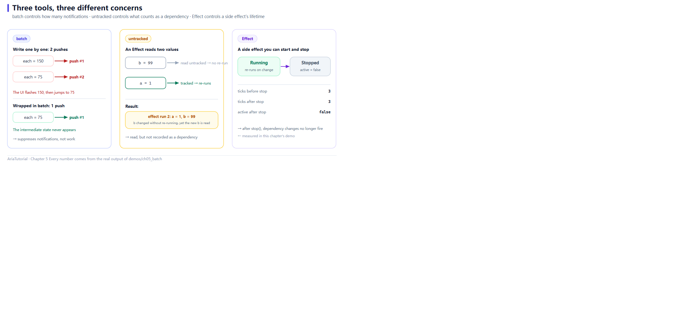

# batch / untracked / Effect: Controlling the Scope of Notification



*batch controls how many notifications fire, untracked controls what counts as a dependency, Effect controls how long a side effect lives.*

The first four chapters were about *making data flow*. This chapter is about **knowing when to hit the brakes** 🛑

Three tools, three different jobs:

| Tool | Problem it solves |
|---|---|
| `batch` | Several writes produce one push, removing intermediate states |
| `untracked` | Read a value without registering a dependency |
| `Effect` | Turn a side effect into an object you can start and stop |

---

## 📄 The complete program

```cpp
// ch05: batch / untracked / Effect -- 精确控制"什么时候通知"
#include "aria/aria.hpp"

#include <iostream>

using namespace aria;

int main() {
    std::cout << "== 1. 逐个改 vs 包进 batch ==\n";
    Property<int>  bill{100};
    Property<int>  people{2};
    Computed<int>  per_person{[&] { return bill.get() / people.get(); }};

    auto sub = per_person.bind([](int v) {
        std::cout << "   每人 = " << v << '\n';
    });

    std::cout << "   -- 逐个改: 每改一次推一次, 中间态会闪 --\n";
    bill = 300;
    people = 4;

    std::cout << "   -- 包进 batch: 只在结束时推一次 --\n";
    aria::batch([&] {
        bill   = 1200;
        people = 8;
    });

    std::cout << "\n== 2. untracked: 读值但不建立依赖 ==\n";
    Property<int> a{0};
    Property<int> b{0};
    int runs = 0;

    Effect e{[&] {
        const int x = a.get();
        const int y = reactive::untracked([&] { return b.get(); });
        ++runs;
        std::cout << "   effect 第 " << runs << " 次: a = " << x << ", b = " << y << '\n';
    }};

    std::cout << "   b = 99 (untracked 读的, 不触发)\n";
    b = 99;

    std::cout << "   a = 1 (追踪到的, 触发)\n";
    a = 1;

    std::cout << "\n== 3. Effect 的停止 ==\n";
    Property<int> counter{0};
    int ticks = 0;

    Effect ticker{[&] {
        counter.get();
        ++ticks;
    }};

    counter = 1;
    counter = 2;
    std::cout << "   停止前 ticks = " << ticks << '\n';

    ticker.stop();
    counter = 3;
    std::cout << "   停止后 ticks = " << ticks
              << ", active = " << (ticker.active() ? "true" : "false") << '\n';

    return 0;
}
```

**Actual output**:

```text
== 1. 逐个改 vs 包进 batch ==
   每人 = 50
   -- 逐个改: 每改一次推一次, 中间态会闪 --
   每人 = 150
   每人 = 75
   -- 包进 batch: 只在结束时推一次 --
   每人 = 150

== 2. untracked: 读值但不建立依赖 ==
   effect 第 1 次: a = 0, b = 0
   b = 99 (untracked 读的, 不触发)
   a = 1 (追踪到的, 触发)
   effect 第 2 次: a = 1, b = 99

== 3. Effect 的停止 ==
   停止前 ticks = 3
   停止后 ticks = 3, active = false
```

---

## 1️⃣ batch: making intermediate states disappear

Look at the first block. Changing **one field at a time** produced two pushes:

```text
   每人 = 150      ← bill became 300 while people was still 2
   每人 = 75       ← then people became 4
```

`300/2 = 150` is a value **nobody wants** — it is merely the unavoidable product of two consecutive writes. On screen, the user sees a flicker 😵

Wrapped in `batch`:

```cpp
aria::batch([&] {
    bill   = 1200;
    people = 8;
});
```

Only one push happened, and since `1200/8 = 150` equals the previous value, the equality gate swallowed even that one. The last `每人 = 150` in the output is left over from the previous step.

> 💡 **Rule of thumb**: whenever a valid state requires writing several fields, wrap it in `batch`. Bulk form fill, bulk list update, whole-theme switching — all in this category.

`batch` nests; the flush happens when the outermost one closes.

---

## 2️⃣ untracked: read it without depending on it

```cpp
Effect e{[&] {
    const int x = a.get();                                    // tracked
    const int y = reactive::untracked([&] { return b.get(); }); // not tracked
    ...
}};
```

Output:

```text
   effect 第 1 次: a = 0, b = 0     ← runs once at construction
   b = 99 (untracked 读的, 不触发)   ← no third run
   a = 1 (追踪到的, 触发)
   effect 第 2 次: a = 1, b = 99    ← a changed; re-runs and reads the latest b
```

`b = 99` let the Effect *see* the new value but **did not trigger a re-run** — that read was wrapped in `untracked`, so no dependency was recorded.

This solves a subtle class of bug: **you read a value in passing for logging or debugging, and it silently becomes a dependency**, making the Effect re-run for reasons you never intended.

> ⚠️ `untracked` affects tracking only, never the read itself. It returns the inner expression's value, so you can assign it directly.

---

## 3️⃣ Effect: a side effect you can start and stop

The difference from `Computed` is that `Effect` **has no return value**. It produces no new value; it performs side effects — logging, persisting, calling an external API, driving a non-reactive legacy widget.

```cpp
Effect ticker{[&] {
    counter.get();
    ++ticks;
}};
```

Note it **ran immediately at construction**. That is the Effect contract, same as `Computed`.

Output:

```text
   停止前 ticks = 3     ← construction + counter=1 + counter=2
   停止后 ticks = 3, active = false
```

After `counter = 3` the count did not become 4 — `ticker.stop()` detached that Effect.

Three things to remember:

- `stop()` takes effect immediately; later dependency changes no longer fire it;
- `active()` reports the current state, handy for assertions;
- You do not have to call `stop()` — an Effect stops automatically when destroyed. That is the RAII idea Chapter 6 builds on.

---

## 🧭 Choosing between them

| You want to | Use |
|---|---|
| Change several fields and only care about the final result | `batch(fn)` |
| Read a value for logging/debugging without making it a dependency | `reactive::untracked(fn)` |
| Perform a side effect (write a file, call an API, drive a legacy widget) | `Effect` |
| Compute a new value for others to use | `Computed` (Chapter 4) |

---

## 📌 Summary

- 🛑 `batch` merges a group of writes into one push — **intermediate states never reach the UI**;
- 👻 `untracked` reads without registering a dependency, curing the "read it once and got re-triggered forever" problem;
- ⚙️ `Effect` is a pure side-effect object: runs at construction, stopped by `stop()`, cleaned up on destruction;
- 🧠 Keep the distinction straight: **`Computed` produces values, `Effect` produces actions**.

---

**Previous chapter** 👈 [Chapter 4 — The Magic of Computed: How Automatic Dependency Tracking Works](04-computed-dependency-tracking.en.md)
**Next chapter** 👉 [Chapter 6 — Subscription: Expressing Subscription Lifetime with Scope](06-subscription-lifetime-and-raii.en.md)

> 📂 Code from `demos/ch05_batch/main.cpp`. Output is the program's real stdout on Windows / MSVC 19.51.
