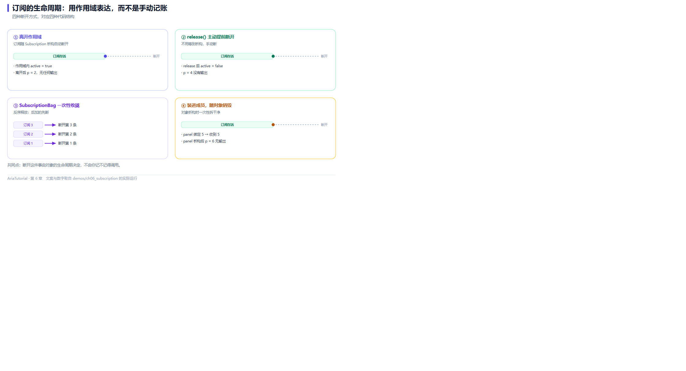

# Subscription：用作用域表达订阅的生命周期



*四种断开方式，共同点是由对象生命周期决定，不由你记不记得调用。*

第 2 章埋了一个点：`bind` 的返回值必须接住。这一章把那个点讲透 —— **订阅活多久，由持有它的那个变量决定** 🔗

这条规则听起来简单，但它替掉的是手动 `disconnect` / `unsubscribe` / `removeObserver` 那一整套容易漏写的代码。

---

## 📄 完整程序

```cpp
// ch06: Subscription -- 用作用域表达订阅的生命周期
#include "aria/aria.hpp"

#include <iostream>

using namespace aria;

int main() {
    std::cout << "== 1. 离开作用域, 订阅自动断开 ==\n";
    Property<int> p{0};
    {
        auto sub = p.on_changed([](const int& v) {
            std::cout << "   收到 " << v << '\n';
        });
        p = 1;
        std::cout << "   作用域内 active = " << (sub.active() ? "true" : "false") << '\n';
    }
    p = 2;
    std::cout << "   (离开作用域后 p = 2 没有任何输出)\n";

    std::cout << "\n== 2. release(): 提前主动断开 ==\n";
    auto sub2 = p.on_changed([](const int& v) {
        std::cout << "   收到 " << v << '\n';
    });
    p = 3;
    sub2.release();
    std::cout << "   release 后 active = " << (sub2.active() ? "true" : "false") << '\n';
    p = 4;
    std::cout << "   (p = 4 没有输出)\n";

    std::cout << "\n== 3. SubscriptionBag: 一次性收拢, 反序释放 ==\n";
    {
        SubscriptionBag bag;
        bag += Subscription{[] { std::cout << "   断开第 1 条\n"; }};
        bag += Subscription{[] { std::cout << "   断开第 2 条\n"; }};
        bag += Subscription{[] { std::cout << "   断开第 3 条\n"; }};
        std::cout << "   bag 内订阅数 = " << bag.size() << '\n';
        std::cout << "   离开作用域:\n";
    }

    std::cout << "\n== 4. 装进成员: 对象销毁时一次性拆干净 ==\n";
    struct Panel {
        SubscriptionBag bag;
        Subscription   keep_alive;

        explicit Panel(Property<int>& source) {
            bag += source.on_changed([](const int& v) {
                std::cout << "   panel 收到 " << v << '\n';
            });
            keep_alive = source.bind([](const int& v) {
                std::cout << "   panel 绑定 " << v << '\n';
            });
        }
    };

    {
        Panel panel{p};
        p = 5;
        std::cout << "   panel 析构:\n";
    }
    p = 6;
    std::cout << "   (panel 销毁后 p = 6 没有输出)\n";

    return 0;
}
```

**真实运行结果**：

```text
== 1. 离开作用域, 订阅自动断开 ==
   收到 1
   作用域内 active = true
   (离开作用域后 p = 2 没有任何输出)

== 2. release(): 提前主动断开 ==
   收到 3
   release 后 active = false
   (p = 4 没有输出)

== 3. SubscriptionBag: 一次性收拢, 反序释放 ==
   bag 内订阅数 = 3
   离开作用域:
   断开第 3 条
   断开第 2 条
   断开第 1 条

== 4. 装进成员: 对象销毁时一次性拆干净 ==
   panel 绑定 4
   panel 收到 5
   panel 绑定 5
   panel 析构:
   (panel 销毁后 p = 6 没有输出)
```

---

## 1️⃣ 作用域结束，订阅就结束

```cpp
{
    auto sub = p.on_changed(...);
    p = 1;      // 打印 "收到 1"
}               // sub 在这里析构
p = 2;          // 什么都不会打印
```

输出里 `(离开作用域后 p = 2 没有任何输出)` 就是证据。

**订阅的生命周期 == 变量的生命周期。** 你不需要写任何清理代码，也不需要记得写 —— 编译器帮你保证。

---

## 2️⃣ release()：主动提前断开

```cpp
auto sub2 = p.on_changed(...);
p = 3;
sub2.release();      // 立即断开
p = 4;               // 没有输出
```

输出里 `release 后 active = false` 证实了状态确实变了。

什么时候需要主动断开 🤔 典型场景是**订阅还在作用域内，但逻辑上已经不需要了**：

- 用户取消了订阅某个频道；
- 对话框关闭了，但对话框对象还活着；
- 切换到只读模式，不再接收编辑事件。

用 `release()` 比用 `if (disabled) return;` 在回调里挡要干净得多 —— 前者是真的断了，后者每次变化还会白跑一趟回调。

---

## 3️⃣ SubscriptionBag：一次性收拢，反序释放

当一个对象要管很多条订阅时，逐个存成员变量很快就乱了。`SubscriptionBag` 就是为此准备的：

```cpp
SubscriptionBag bag;
bag += Subscription{[] { std::cout << "   断开第 1 条\n"; }};
bag += Subscription{[] { std::cout << "   断开第 2 条\n"; }};
bag += Subscription{[] { std::cout << "   断开第 3 条\n"; }};
```

注意输出里的顺序：

```text
   断开第 3 条
   断开第 2 条
   断开第 1 条
```

**反序释放** 🌀 后注册的先断开。这不是随手的选择 —— 它模仿了 C++ 局部变量的析构顺序，也符合依赖直觉：**后建立的东西，可能依赖先建立的资源**，所以必须先拆。

`bag.size()` 可以随时查数量，`bag.clear()` 可以提前全清。

---

## 4️⃣ 装进成员：对象销毁时一次性拆干净

这是真实代码里最常见的形态：

```cpp
struct Panel {
    SubscriptionBag bag;
    Subscription   keep_alive;

    explicit Panel(Property<int>& source) {
        bag += source.on_changed(...);
        keep_alive = source.bind(...);
    }
};
```

看输出：

```text
   panel 绑定 4      ← bind 的初始同步立即触发
   panel 收到 5      ← p = 5, on_changed 触发
   panel 绑定 5      ← p = 5, bind 也触发
   panel 析构:       ← 两个成员一起析构, 订阅全部解除
   (panel 销毁后 p = 6 没有输出)
```

这里有个值得注意的细节：**`panel 绑定 4` 出现在 `panel 收到 5` 之前**。因为 `bind` 注册时立刻同步一次（第 3 章讲过），而 `on_changed` 不。

这套模式在 Aria 的 View 里是标准做法，它带来一个硬保证：

> 🛡️ **控件先于订阅消失时，不会回调到已销毁的对象上。**

因为订阅的释放紧跟着 View 成员的析构走，而不是靠某个回调里手写的"检查对象是否还有效"。

---

## 🧭 四种断开方式对照

| 方式 | 时机 | 典型场景 |
|---|---|---|
| 让变量出作用域 | 自动、确定 | 局部订阅，最常见 |
| `sub.release()` | 手动、立即 | 逻辑上不再需要，但变量还活着 |
| `SubscriptionBag` 析构 | 自动、反序 | 一个对象管多条订阅 |
| `Effect::stop()` | 手动 | 副作用对象需要暂停（第 5 章） |

---

## 📌 小结

- 🔗 **订阅的生命周期由持有它的变量决定**，不需要手写清理；
- ✂️ `release()` 提前断开，比在回调里写条件判断更干净；
- 🌀 `SubscriptionBag` 反序释放全部订阅，符合依赖直觉；
- 🛡️ 存成员是真实项目的标准形态，**保证不会回调到已析构的控件上**。

---

**上一章** 👈 [第 5 章 batch / untracked / Effect：精确控制通知范围](05-batch-untracked-Effect.md)
**下一章** 👉 [第 7 章 两个必踩的坑：幽灵依赖与循环依赖](07-幽灵依赖与循环依赖.md)

> 📂 本章代码来自本仓库 `demos/ch06_subscription/main.cpp`，输出为该程序在 Windows / MSVC 19.51 下的真实打印结果。
