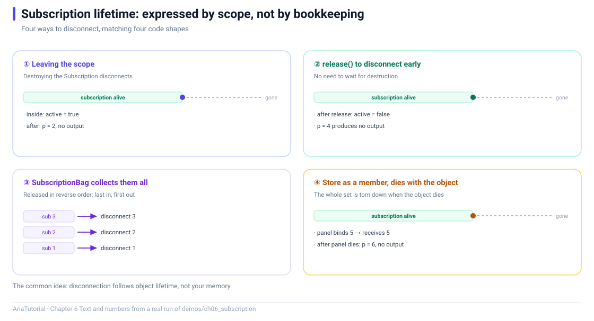

# Subscription: Expressing Subscription Lifetime with Scope



*Four ways to disconnect, all driven by object lifetime rather than by remembering to call something.*

Chapter 2 left a detail hanging: `bind`'s return value must be kept. This chapter makes that concrete — **how long a subscription lives is decided by the variable holding it** 🔗

Simple as it sounds, this rule replaces manual `disconnect` / `unsubscribe` / `removeObserver` bookkeeping that is so easy to get wrong.

---

## 📄 The complete program

```cpp
// ch06: Subscription -- 用作用域表达订阅的生命周期
#include "aria/aria.hpp"

#include <iostream>

using namespace aria;

int main() {
    std::cout << "== 1. 离开作用域, 订阅自动断开 ==\n";
    Property<int> p{0};
    {
        auto sub = p.on_changed([](const int& v) {
            std::cout << "   收到 " << v << '\n';
        });
        p = 1;
        std::cout << "   作用域内 active = " << (sub.active() ? "true" : "false") << '\n';
    }
    p = 2;
    std::cout << "   (离开作用域后 p = 2 没有任何输出)\n";

    std::cout << "\n== 2. release(): 提前主动断开 ==\n";
    auto sub2 = p.on_changed([](const int& v) {
        std::cout << "   收到 " << v << '\n';
    });
    p = 3;
    sub2.release();
    std::cout << "   release 后 active = " << (sub2.active() ? "true" : "false") << '\n';
    p = 4;
    std::cout << "   (p = 4 没有输出)\n";

    std::cout << "\n== 3. SubscriptionBag: 一次性收拢, 反序释放 ==\n";
    {
        SubscriptionBag bag;
        bag += Subscription{[] { std::cout << "   断开第 1 条\n"; }};
        bag += Subscription{[] { std::cout << "   断开第 2 条\n"; }};
        bag += Subscription{[] { std::cout << "   断开第 3 条\n"; }};
        std::cout << "   bag 内订阅数 = " << bag.size() << '\n';
        std::cout << "   离开作用域:\n";
    }

    std::cout << "\n== 4. 装进成员: 对象销毁时一次性拆干净 ==\n";
    struct Panel {
        SubscriptionBag bag;
        Subscription   keep_alive;

        explicit Panel(Property<int>& source) {
            bag += source.on_changed([](const int& v) {
                std::cout << "   panel 收到 " << v << '\n';
            });
            keep_alive = source.bind([](const int& v) {
                std::cout << "   panel 绑定 " << v << '\n';
            });
        }
    };

    {
        Panel panel{p};
        p = 5;
        std::cout << "   panel 析构:\n";
    }
    p = 6;
    std::cout << "   (panel 销毁后 p = 6 没有输出)\n";

    return 0;
}
```

**Actual output**:

```text
== 1. 离开作用域, 订阅自动断开 ==
   收到 1
   作用域内 active = true
   (离开作用域后 p = 2 没有任何输出)

== 2. release(): 提前主动断开 ==
   收到 3
   release 后 active = false
   (p = 4 没有输出)

== 3. SubscriptionBag: 一次性收拢, 反序释放 ==
   bag 内订阅数 = 3
   离开作用域:
   断开第 3 条
   断开第 2 条
   断开第 1 条

== 4. 装进成员: 对象销毁时一次性拆干净 ==
   panel 绑定 4
   panel 收到 5
   panel 绑定 5
   panel 析构:
   (panel 销毁后 p = 6 没有输出)
```

---

## 1️⃣ Scope ends, subscription ends

```cpp
{
    auto sub = p.on_changed(...);
    p = 1;      // prints "收到 1"
}               // sub destroyed here
p = 2;          // prints nothing
```

The line `(离开作用域后 p = 2 没有任何输出)` is the proof.

**A subscription's lifetime equals the variable's lifetime.** You write no cleanup code, and you cannot forget to — the compiler guarantees it.

---

## 2️⃣ release(): ending it early

```cpp
auto sub2 = p.on_changed(...);
p = 3;
sub2.release();      // detach now
p = 4;               // no output
```

The output confirms the state changed: `release 后 active = false`.

When is that needed 🤔 Typically when **the subscription is still in scope but logically no longer wanted**:

- The user unsubscribed from a channel;
- A dialog closed, but the dialog object is still alive;
- Switching to read-only mode, no longer accepting edit events.

`release()` is cleaner than an `if (disabled) return;` guard inside the callback — the former genuinely detaches, while the latter still runs the callback on every change for nothing.

---

## 3️⃣ SubscriptionBag: collect them, release in reverse

A `SubscriptionBag` exists so you do not have to keep a member variable per subscription:

```cpp
SubscriptionBag bag;
bag += Subscription{[] { std::cout << "   断开第 1 条\n"; }};
bag += Subscription{[] { std::cout << "   断开第 2 条\n"; }};
bag += Subscription{[] { std::cout << "   断开第 3 条\n"; }};
```

Note the order in the output:

```text
   断开第 3 条
   断开第 2 条
   断开第 1 条
```

**Reverse order** 🌀 Last registered, first released. That mirrors C++ local-variable destruction and matches dependency intuition: **things created later may depend on things created earlier**, so they must be torn down first.

`bag.size()` reports the count at any time; `bag.clear()` empties it early.

---

## 4️⃣ Storing as members: the pattern real code uses

```cpp
struct Panel {
    SubscriptionBag bag;
    Subscription   keep_alive;

    explicit Panel(Property<int>& source) {
        bag += source.on_changed(...);
        keep_alive = source.bind(...);
    }
};
```

Output:

```text
   panel 绑定 4      ← bind's initial sync fires immediately
   panel 收到 5      ← p = 5, on_changed fires
   panel 绑定 5      ← p = 5, bind fires too
   panel 析构:       ← both members destroyed, all subscriptions released
   (panel 销毁后 p = 6 没有输出)
```

One detail worth noticing: **`panel 绑定 4` appears before `panel 收到 5`**. Because `bind` syncs once at registration (Chapter 3), while `on_changed` does not.

This pattern leads to a hard guarantee that matters in UI code:

> 🛡️ **When a widget dies before its subscription does, the callback can never reach the destroyed object.**

Subscription release follows the View's member destruction, rather than relying on a hand-written "is this object still alive" check inside a callback.

---

## 🧭 Four ways to end a subscription

| Way | Timing | Typical use |
|---|---|---|
| Let the variable leave scope | Automatic, deterministic | Local subscriptions — the common case |
| `sub.release()` | Manual, immediate | No longer needed, but the variable lives on |
| `SubscriptionBag` destruction | Automatic, reverse order | One object owning several subscriptions |
| `Effect::stop()` | Manual | Pausing a side-effect object (Chapter 5) |

---

## 📌 Summary

- 🔗 **A subscription's lifetime is the lifetime of the variable holding it** — no manual cleanup;
- ✂️ `release()` detaches early, cleaner than a conditional inside the callback;
- 🌀 `SubscriptionBag` releases everything in reverse order, matching dependency intuition;
- 🛡️ Storing as members is what real projects do — it **guarantees no callback into a destroyed widget**.

---

**Previous chapter** 👈 [Chapter 5 — batch / untracked / Effect: Controlling the Scope of Notification](05-batch-untracked-effect.en.md)
**Next chapter** 👉 [Chapter 7 — Two Pitfalls: Phantom and Circular Dependencies](07-phantom-and-circular-dependencies.en.md)

> 📂 Code from `demos/ch06_subscription/main.cpp`. Output is the program's real stdout on Windows / MSVC 19.51.
