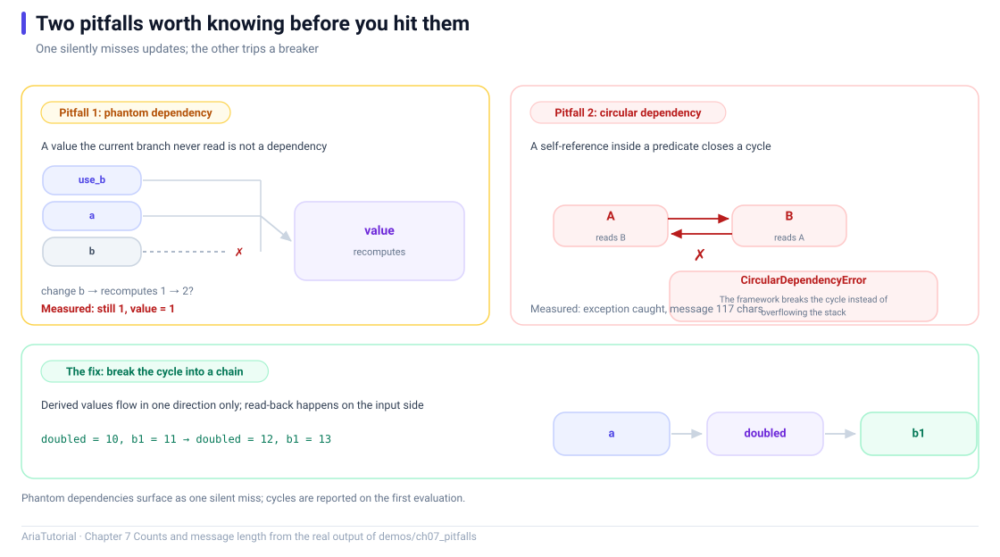

# Two Pitfalls: Phantom and Circular Dependencies



*One silently misses updates, the other trips a breaker. Below: how to break the cycle.*

Automatic dependency tracking is convenient, but it has two boundaries. Stepping over either one does not crash your program — it **behaves differently from what you assumed**, which is the hardest kind of bug to find 🕳️

This chapter turns both into runnable minimal reproductions.

---

## 📄 The complete program

```cpp
// ch07: 两个必踩的坑 -- 幽灵依赖与循环依赖
#include "aria/aria.hpp"

#include <iostream>
#include <string>

using namespace aria;

int main() {
    std::cout << "== 1. 幽灵依赖: 当前分支没读到的值不算依赖 ==\n";
    Property<int>  a{1};
    Property<int>  b{2};
    Property<bool> use_a{true};

    int recomputes = 0;
    Computed<int> chosen{[&] {
        ++recomputes;
        return use_a.get() ? a.get() : b.get();
    }};

    std::cout << "   初值 = " << chosen.get()
              << ", 重算次数 = " << recomputes << '\n';

    b = 20;
    std::cout << "   改 b (当前分支没读到): 重算次数 = " << recomputes
              << ", 值 = " << chosen.get() << '\n';

    a = 10;
    std::cout << "   改 a (当前分支读到了): 重算次数 = " << recomputes
              << ", 值 = " << chosen.get() << '\n';

    std::cout << "\n== 2. 循环依赖: 会被框架熔断 ==\n";
    Property<int> p{0};
    Property<int> q{0};
    p.set_debug_name("p");
    q.set_debug_name("q");

    bool live = false;
    Effect e_pq{[&] {
        const int v = p.get();
        if (live) {
            q.set(v + 1);
        }
    }};
    Effect e_qp{[&] {
        const int v = q.get();
        if (live) {
            p.set(v + 1);
        }
    }};

    live = true;
    try {
        p.set(1);
        std::cout << "   没有触发熔断\n";
    } catch (const CircularDependencyError& ex) {
        const std::string message = ex.what();
        std::cout << "   捕获到 CircularDependencyError\n";
        std::cout << "   消息长度 = " << message.size() << " 字符\n";
    }

    std::cout << "\n== 3. 正确做法: 打破环 ==\n";
    Property<int> a1{1};
    Property<int> b1{0};
    Computed<int> doubled{[&] { return a1.get() * 2; }};   // 单向: a1 -> doubled

    auto sub = doubled.on_changed([&](const int& v) {
        b1 = v + 1;                                        // 只在外层订阅里改, 不参与依赖追踪
        std::cout << "   doubled = " << v << ", b1 = " << b1.get() << '\n';
    });

    a1 = 5;
    a1 = 6;

    return 0;
}
```

**Actual output**:

```text
== 1. 幽灵依赖: 当前分支没读到的值不算依赖 ==
   初值 = 1, 重算次数 = 1
   改 b (当前分支没读到): 重算次数 = 1, 值 = 1
   改 a (当前分支读到了): 重算次数 = 2, 值 = 10

== 2. 循环依赖: 会被框架熔断 ==
   捕获到 CircularDependencyError
   消息长度 = 117 字符

== 3. 正确做法: 打破环 ==
   doubled = 10, b1 = 11
   doubled = 12, b1 = 13
```

---

## 🕳️ Pitfall one: the phantom dependency

"Phantom" here means: **a dependency you believe exists, but which does not.**

```cpp
Computed<int> chosen{[&] {
    ++recomputes;
    return use_a.get() ? a.get() : b.get();   // ternary: only one branch evaluates
}};
```

When `use_a` is `true`, the `b.get()` side **never executes** — C++'s ternary operator short-circuits.

Output:

```text
   初值 = 1, 重算次数 = 1              ← read a and use_a
   改 b (当前分支没读到): 重算次数 = 1   ← counter unchanged!
   改 a (当前分支读到了): 重算次数 = 2   ← this one is a dependency
```

After `b = 20`, `recomputes` is **still 1**. `b` was never read, so it is not a dependency, and writing it does not invalidate `chosen`.

### Why this bites

The danger is that **dependencies are not static**. Once `use_a` flips to `false`, `b` *becomes* a dependency. In other words — **the same code has different dependency sets under different data**.

That leads to two real classes of incident:

| Situation | Symptom |
|---|---|
| You reason about it as if it depends on `b` | The UI does not refresh under some data, and you blame the framework |
| You read a value inside a branch for logging | It becomes a dependency and causes pointless recomputation (fix with `untracked`, Chapter 5) |

### How to investigate

`dependency_count()` from Chapter 4 exists precisely for this — it is your only window into a dynamic dependency set.

```cpp
std::cout << "依赖个数 = " << chosen.dependency_count() << '\n';
```

---

## 💥 Pitfall two: circular dependencies

A cycle means "changing A triggers B, and changing B triggers A back". Look at this:

```cpp
Effect e_pq{[&] {
    const int v = p.get();     // read p
    if (live) { q.set(v + 1); }  // write q
}};
Effect e_qp{[&] {
    const int v = q.get();     // read q
    if (live) { p.set(v + 1); }  // write p
}};
```

Two `Effect`s read each other's output and write back. Output:

```text
   捕获到 CircularDependencyError
   消息长度 = 117 字符
```

The framework **did not recurse forever**. After a bounded number of rounds it raised `CircularDependencyError`.

### The cut-off mechanism

Aria's reactive graph caps the number of flush rounds. Exceeding the cap is treated as a cycle: it throws and hands control back to the caller, instead of overflowing the stack or pegging a CPU.

That matters: **it turns "the program hangs" into "a catchable exception"** ✅

```cpp
try {
    p.set(1);
} catch (const CircularDependencyError& ex) {
    // log it, report it, degrade gracefully
}
```

---

## ✅ The fix: break the cycle into a one-way chain

The remedy is always the same: **keep dependency direction one-way**.

```cpp
Property<int>  a1{1};
Property<int>  b1{0};
Computed<int>  doubled{[&] { return a1.get() * 2; }};   // one-way: a1 -> doubled

auto sub = doubled.on_changed([&](const int& v) {
    b1 = v + 1;      // written in the outer subscription, outside dependency collection
    ...
});
```

Output:

```text
   doubled = 10, b1 = 11     ← a1 = 5
   doubled = 12, b1 = 13     ← a1 = 6
```

The critical difference: `b1 = v + 1` sits in the **`on_changed` callback**, not inside the `Computed` body.

- Inside the body → the write to `b1` is part of the dependency chain → can form a cycle;
- Inside a subscription callback → it is just an assignment, **not part of dependency collection** → the chain terminates here.

> 💡 In one sentence: **a `Computed` body should be pure** (reads only). Any "read this, then write something else" logic is a side effect and belongs in an `Effect` or a subscription callback.

---

## 📌 Summary

- 🕳️ **Phantom dependency**: values in untaken branches are not dependencies; the set is dynamic, so do not reason about it statically;
- 👀 Use `dependency_count()` to observe the real dependency count;
- 💥 **Circular dependency**: cut off by `CircularDependencyError`, never a stack overflow;
- ✂️ **The fix**: keep chains one-way; move writes out of evaluation bodies into subscription callbacks;
- 🧼 **The underlying rule**: keep `Computed` bodies pure; side effects go to `Effect`.

---

**Previous chapter** 👈 [Chapter 6 — Subscription: Expressing Subscription Lifetime with Scope](06-subscription-lifetime-and-raii.en.md)
**Next chapter** 👉 [Chapter 8 — Command and AsyncCommand: Actions Have State Too](08-command-and-async-command.en.md)

> 📂 Code from `demos/ch07_pitfalls/main.cpp`. Output is the program's real stdout on Windows / MSVC 19.51.
