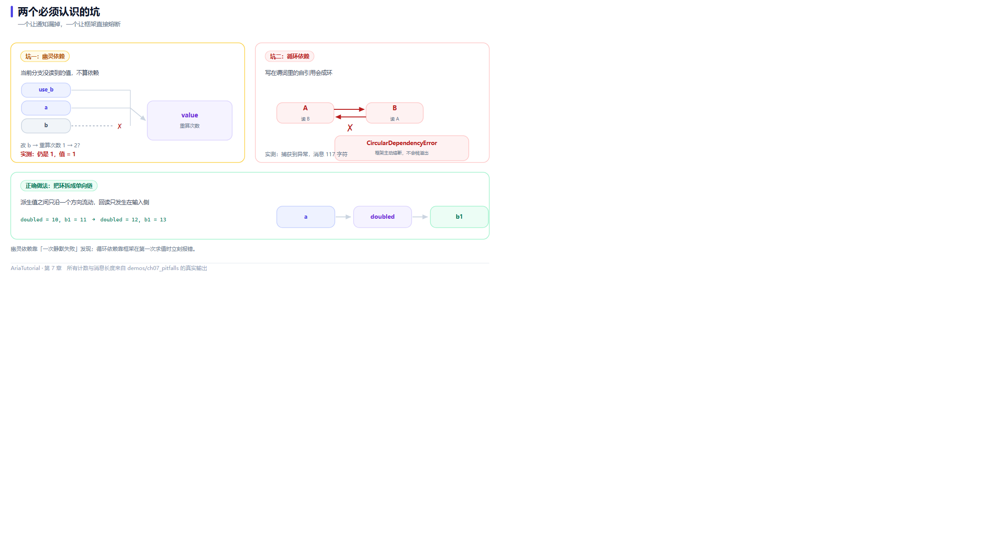

# 两个必踩的坑：幽灵依赖与循环依赖



*一个让通知漏掉，一个让框架直接熔断；下面是拆环的写法。*

自动依赖追踪很省心，但它有两条边界。踩上去都不会崩，而是**行为和你以为的不一样** —— 这类 bug 最难查 🕳️

这一章把两个坑都做成可运行的最小复现。

---

## 📄 完整程序

```cpp
// ch07: 两个必踩的坑 -- 幽灵依赖与循环依赖
#include "aria/aria.hpp"

#include <iostream>
#include <string>

using namespace aria;

int main() {
    std::cout << "== 1. 幽灵依赖: 当前分支没读到的值不算依赖 ==\n";
    Property<int>  a{1};
    Property<int>  b{2};
    Property<bool> use_a{true};

    int recomputes = 0;
    Computed<int> chosen{[&] {
        ++recomputes;
        return use_a.get() ? a.get() : b.get();
    }};

    std::cout << "   初值 = " << chosen.get()
              << ", 重算次数 = " << recomputes << '\n';

    b = 20;
    std::cout << "   改 b (当前分支没读到): 重算次数 = " << recomputes
              << ", 值 = " << chosen.get() << '\n';

    a = 10;
    std::cout << "   改 a (当前分支读到了): 重算次数 = " << recomputes
              << ", 值 = " << chosen.get() << '\n';

    std::cout << "\n== 2. 循环依赖: 会被框架熔断 ==\n";
    Property<int> p{0};
    Property<int> q{0};
    p.set_debug_name("p");
    q.set_debug_name("q");

    bool live = false;
    Effect e_pq{[&] {
        const int v = p.get();
        if (live) {
            q.set(v + 1);
        }
    }};
    Effect e_qp{[&] {
        const int v = q.get();
        if (live) {
            p.set(v + 1);
        }
    }};

    live = true;
    try {
        p.set(1);
        std::cout << "   没有触发熔断\n";
    } catch (const CircularDependencyError& ex) {
        const std::string message = ex.what();
        std::cout << "   捕获到 CircularDependencyError\n";
        std::cout << "   消息长度 = " << message.size() << " 字符\n";
    }

    std::cout << "\n== 3. 正确做法: 打破环 ==\n";
    Property<int> a1{1};
    Property<int> b1{0};
    Computed<int> doubled{[&] { return a1.get() * 2; }};   // 单向: a1 -> doubled

    auto sub = doubled.on_changed([&](const int& v) {
        b1 = v + 1;                                        // 只在外层订阅里改, 不参与依赖追踪
        std::cout << "   doubled = " << v << ", b1 = " << b1.get() << '\n';
    });

    a1 = 5;
    a1 = 6;

    return 0;
}
```

**真实运行结果**：

```text
== 1. 幽灵依赖: 当前分支没读到的值不算依赖 ==
   初值 = 1, 重算次数 = 1
   改 b (当前分支没读到): 重算次数 = 1, 值 = 1
   改 a (当前分支读到了): 重算次数 = 2, 值 = 10

== 2. 循环依赖: 会被框架熔断 ==
   捕获到 CircularDependencyError
   消息长度 = 117 字符

== 3. 正确做法: 打破环 ==
   doubled = 10, b1 = 11
   doubled = 12, b1 = 13
```

---

## 🕳️ 坑一：幽灵依赖

先明确这里的"幽灵"是什么：**你以为存在的依赖，其实不存在。**

```cpp
Computed<int> chosen{[&] {
    ++recomputes;
    return use_a.get() ? a.get() : b.get();   // 三元表达式, 只有一个分支会被求值
}};
```

`use_a` 为 `true` 时，`b.get()` 那一边**根本没有被执行** —— C++ 的三元运算符是短路求值。

看输出：

```text
   初值 = 1, 重算次数 = 1              ← 读到了 a 和 use_a
   改 b (当前分支没读到): 重算次数 = 1   ← 重算次数没变!
   改 a (当前分支读到了): 重算次数 = 2   ← 这才是依赖
```

`b = 20` 之后，`recomputes` **仍然是 1**。因为 `b` 从来没被读过，它就不是依赖，改它不会让 `chosen` 失效。

### 为什么这是个坑

危险的地方在于：**依赖不是静态的**。当 `use_a` 翻成 `false` 之后，`b` 才会变成依赖。也就是说 —— **同一段代码，在不同数据下有不同的依赖集**。

这带来两类真实事故：

| 场景 | 表现 |
|---|---|
| 你按"它依赖 b"的假设去推理 | 在某些数据下界面不刷新，你以为是框架坏了 |
| 你在分支里读了某个值做日志 | 它成了依赖，导致无谓重算（用第 5 章的 `untracked` 解决） |

### 怎么排查

第 4 章介绍的 `dependency_count()` 就是为这个准备的 —— 它是观察动态依赖的唯一窗口。

```cpp
std::cout << "依赖个数 = " << chosen.dependency_count() << '\n';
```

---

## 💥 坑二：循环依赖

如果依赖图形成了环，就是"改 A 触发 B、改 B 又触发 A"。看这段：

```cpp
Effect e_pq{[&] {
    const int v = p.get();     // 读 p
    if (live) { q.set(v + 1); }  // 写 q
}};
Effect e_qp{[&] {
    const int v = q.get();     // 读 q
    if (live) { p.set(v + 1); }  // 写 p
}};
```

两个 `Effect` 互相读对方的输出、又互相写回去。输出：

```text
   捕获到 CircularDependencyError
   消息长度 = 117 字符
```

框架**没有无限递归下去**，而是在若干轮之后抛出了 `CircularDependencyError`。

### 熔断机制

Aria 的响应式图对 flush 轮数设了上限。一旦超过，就认为是环，抛异常并把控制权交给调用方 —— 而不是栈溢出或者把 CPU 跑满。

这一点很重要：**它把"程序卡死"变成"一个可捕获的异常"** ✅

```cpp
try {
    p.set(1);
} catch (const CircularDependencyError& ex) {
    // 可以记录、可以上报、可以降级
}
```

---

## ✅ 正确做法：把环拆成单向链

修复思路永远是同一个：**让依赖关系保持单向**。

```cpp
Property<int>  a1{1};
Property<int>  b1{0};
Computed<int>  doubled{[&] { return a1.get() * 2; }};   // 单向: a1 -> doubled

auto sub = doubled.on_changed([&](const int& v) {
    b1 = v + 1;      // 在外层订阅里改 b1, 这个赋值不参与依赖追踪
    ...
});
```

看输出：

```text
   doubled = 10, b1 = 11     ← a1 = 5
   doubled = 12, b1 = 13     ← a1 = 6
```

关键区别：`b1 = v + 1` 写在 **`on_changed` 回调**里，而不是写在 `Computed` 的求值函数里。

- 写在求值函数里 → `b1` 的写入会被当作依赖链的一部分 → 可能成环；
- 写在订阅回调里 → 它只是一次普通赋值，**不参与依赖收集** → 链条终止在这里。

> 💡 一句话记住：**`Computed` 的求值函数应该是纯的**（只读不写）。任何"读了之后要写点别的"的逻辑，都属于副作用，应该放到 `Effect` 或订阅回调里。

---

## 📌 小结

- 🕳️ **幽灵依赖**：分支没走到的值不算依赖，依赖集是动态的，别按静态假设推理；
- 👀 用 `dependency_count()` 观察真实的依赖数量；
- 💥 **循环依赖**：会被 `CircularDependencyError` 熔断，不会栈溢出；
- ✂️ **修复方式**：保持单向链，把写入逻辑从求值函数挪到订阅回调里；
- 🧼 **根本原则**：`Computed` 求值函数保持纯函数，副作用交给 `Effect`。

---

**上一章** 👈 [第 6 章 Subscription：用作用域表达订阅的生命周期](06-Subscription-生命周期与RAII.md)
**下一章** 👉 [第 8 章 Command 与 AsyncCommand：动作也要有状态](08-Command与AsyncCommand.md)

> 📂 本章代码来自本仓库 `demos/ch07_pitfalls/main.cpp`，输出为该程序在 Windows / MSVC 19.51 下的真实打印结果。
