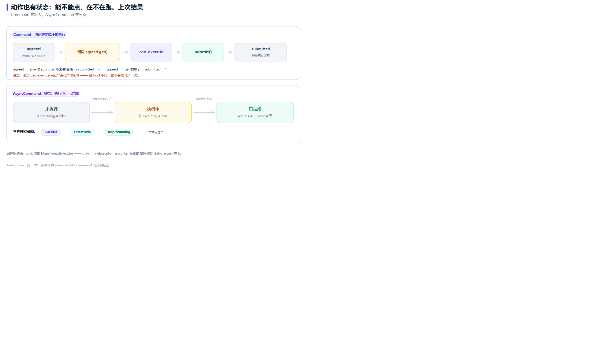

# Command 与 AsyncCommand：动作也要有状态



*上面是 Command 的准入链，下面是 AsyncCommand 的三态与并发策略。*

前面几章讲的都是**值**。界面上还有另一类东西：**动作** —— 点击一个按钮会发生什么。

裸 lambda 能表达"做什么"，但表达不了"**现在能不能做**"。而后者恰恰是界面最需要的：表单没填完，提交按钮就该是灰的。

`Command` 就是为此存在的 🎬

---

## 📄 完整程序

```cpp
// ch08: Command 与 AsyncCommand -- 动作本身也要有状态
#include "aria/aria.hpp"
#include "aria/async/async_command.hpp"
#include "aria/async/executor.hpp"

#include <iostream>

using namespace aria;
using namespace aria::async;

int main() {
    std::cout << "== 1. Command: 谓词决定能不能执行 ==\n";
    Property<bool> agreed{false};
    int submitted = 0;

    Command<> submit(
        [&] { ++submitted; },
        [&] { return agreed.get(); });

    auto sub = submit.observe_can_execute([](bool can) {
        std::cout << "   按钮可点 -> " << (can ? "true" : "false") << '\n';
    });

    submit();
    std::cout << "   未勾选时点击: 提交次数 = " << submitted << '\n';

    agreed = true;
    submit();
    std::cout << "   勾选后点击: 提交次数 = " << submitted << '\n';

    agreed = false;

    std::cout << "\n== 2. Command<Args...>: 带参数的动作 ==\n";
    int captured = 0;
    Command<int> scale([&](int x) { captured = x * 2; });
    scale.execute(21);
    std::cout <<    "   scale(21) -> captured = " << captured << '\n';

    std::cout << "\n== 3. AsyncCommand: 三态 ==\n";
    // ui 用 MainThreadExecutor: 它的任务由本线程 pump, 状态更新不跨线程。
    // worker 用 ThreadPoolExecutor: 真正耗时的活丢到后台线程池。
    // (框架不允许 ui 用 InlineExecutor 而 worker 在别的线程 -- 编译期就会拦下)
    MainThreadExecutor ui;
    ThreadPoolExecutor worker{2};

    AsyncCommand<int, int> twice{
        ui, worker,
        [](int x) -> Task<int> { co_return x * 2; },
        AsyncCommandPolicy::DropIfRunning};

    std::cout << "   执行前 is_executing = "
              << (twice.is_executing.get() ? "true" : "false") << '\n';

    twice.execute(21);
    std::cout << "   刚提交 is_executing = "
              << (twice.is_executing.get() ? "true" : "false") << '\n';

    ui.pump_until([&] { return !twice.is_executing.get(); });

    std::cout << "   执行后 is_executing = "
              << (twice.is_executing.get() ? "true" : "false") << '\n';
    std::cout << "   有错误 = "
              << (twice.last_error.get().has_value() ? "true" : "false") << '\n';
    if (twice.last_result.get().has_value()) {
        std::cout << "   结果 = " << *twice.last_result.get() << '\n';
    }

    return 0;
}
```

**真实运行结果**：

```text
== 1. Command: 谓词决定能不能执行 ==
   未勾选时点击: 提交次数 = 0
   按钮可点 -> true
   勾选后点击: 提交次数 = 1
   按钮可点 -> false

== 2. Command<Args...>: 带参数的动作 ==
   scale(21) -> captured = 42

== 3. AsyncCommand: 三态 ==
   执行前 is_executing = false
   刚提交 is_executing = true
   执行后 is_executing = false
   有错误 = false
   结果 = 42
```

---

## 1️⃣ Command：带准入条件的动作

```cpp
Command<> submit(
    [&] { ++submitted; },          // 动作
    [&] { return agreed.get(); }); // 谓词: 什么时候允许执行
```

两个参数：做什么、什么时候能做。看输出：

```text
   未勾选时点击: 提交次数 = 0     ← execute() 被 predicate 拦下
   按钮可点 -> true               ← agreed = true 触发的通知
   勾选后点击: 提交次数 = 1       ← 这次真的执行了
```

注意 `submit()` 在未勾选时**没有抛异常、没有报错**，只是安静地不执行。这是刻意的：界面上"点了灰按钮"不该是错误。

### 谓词是响应式的

`Command<>` 的谓词在构造时会被自动追踪。这意味着谓词里读了哪些 `Property`，`agreed` 一变，可执行状态就自动更新 —— 你不需要手动调什么"刷新按钮状态"。

### observe_can_execute：把状态接到按钮上

```cpp
auto sub = submit.observe_can_execute([](bool can) {
    std::cout << "   按钮可点 -> " << (can ? "true" : "false") << '\n';
});
```

真实项目里这个回调直接写控件：

```cpp
engine.bind_command(submit, button);           // 绑定点击
engine.bind_enabled(submit.can_execute_as_readonly(), button); // 绑定启用状态
```

（第 14 章讲绑定全表时会看到，`bind_command` 本身也会写一次 enabled。）

---

## 2️⃣ Command<Args...>：带参数的动作

```cpp
Command<int> scale([&](int x) { captured = x * 2; });
scale.execute(21);    // → captured = 42
```

带参数的 `Command` 在列表场景里很有用 —— 比如"删除第 N 条"：

```cpp
Command<int> remove_at([&](int index) { todos.remove_at(index); });
```

⚠️ 但要注意与 `Command<>` 的一个差异：**带参数版本的谓词不会自动追踪**，需要你在合适的时候手动调 `notify_can_execute_changed()`。空参版本因为只有一个状态，可以安全地自动追踪。

---

## 3️⃣ AsyncCommand：异步动作的三态

异步动作比同步多出一堆状态：**正在跑吗？上次成功了吗？上次结果是什么？**

`AsyncCommand` 把这三个都做成了 `Property`：

| 状态 | 类型 | 用途 |
|---|---|---|
| `is_executing` | `Property<bool>` | 转圈、禁用按钮、防止重复提交 |
| `last_error` | `Property<optional<Error>>` | 错误提示 |
| `last_result` | `Property<optional<R>>` | 结果展示 |

看输出：

```text
   执行前 is_executing = false
   刚提交 is_executing = true      ← execute() 后立刻翻转
   执行后 is_executing = false     ← pump 到完成为止
   有错误 = false
   结果 = 42
```

**这三个状态都是响应式的**，所以界面上「加载转圈」和「提交按钮禁用」不需要你手写一行开关代码 —— 绑到 `is_executing` 上就行。

---

## ⚠️ 一个编译期就会拦下的错误搭配

这段代码里 `ui` 和 `worker` 的选择不是随意的：

```cpp
MainThreadExecutor ui;      // 必须在主线程构造, 由本线程 pump
ThreadPoolExecutor worker{2};
```

如果写成 `InlineExecutor ui` + 跨线程 worker，**编译期就会报错**：

```text
static assertion failed: 'AsyncCommand: cannot use `InlineExecutor` as the
graph-thread executor when `worker` runs on a different thread.
Use `MainThreadExecutor` for the `ui` parameter.'
```

这条断言背后是第 3 章讲过的硬约束：**响应式图是单线程的**。`InlineExecutor` 意味着"就在调用线程上执行"，而 worker 在别的线程完成任务后需要回到 ui 线程更新状态 —— 如果 ui 是 `InlineExecutor`，这个"回来"就发生在 worker 线程上，直接违反图线程约束。

框架选择在编译期拦住它，而不是让你在运行时偶发崩溃 🛡️

---

## 🔄 三种并发策略

`AsyncCommandPolicy` 决定"上一次还没跑完，用户又点了一次"时怎么办：

| 策略 | 行为 | 适用场景 |
|---|---|---|
| `Parallel` | 允许并发执行 | 相互独立、可并行的操作 |
| `LatestOnly` | 取消旧的，只保留最新一次 | 搜索框输入联想 |
| `DropIfRunning` | 直接丢弃新请求 | 提交按钮防重复 |

本例用的是 `DropIfRunning` —— 提交类操作最安全的选择。

---

## 📌 小结

- 🎬 `Command` = 动作 + 准入谓词，动作不行时安静跳过而不是报错；
- 🔔 `observe_can_execute` 把可执行状态接到控件上，`Command<>` 的谓词自动追踪；
- ⚠️ `Command<Args...>` 的谓词需要手动 `notify_can_execute_changed()`；
- 🔄 `AsyncCommand` 把 `is_executing` / `last_error` / `last_result` 做成响应式状态；
- 🛡️ ui/worker 的 executor 组合有编译期约束，别用 `InlineExecutor` 当 ui 配跨线程 worker。

---

**上一章** 👈 [第 7 章 两个必踩的坑：幽灵依赖与循环依赖](07-幽灵依赖与循环依赖.md)
**下一章** 👉 [第 9 章 ObservableList：可观察列表](09-ObservableList.md)

> 📂 本章代码来自本仓库 `demos/ch08_command/main.cpp`，输出为该程序在 Windows / MSVC 19.51 下的真实打印结果。
