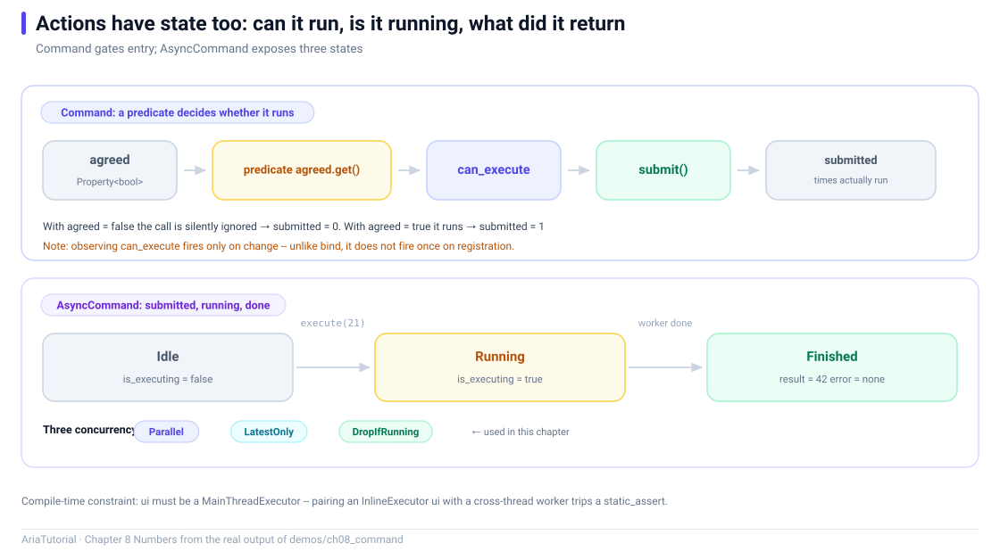

# Command and AsyncCommand: Actions Have State Too



*Top: the gate chain of a Command. Bottom: the three states of an AsyncCommand and its concurrency policies.*

The previous chapters were all about **values**. A UI also has **actions** — what happens when a button is clicked.

A bare lambda expresses *what to do*, but not *whether it can be done right now*. That second part is exactly what a UI needs: while the form is incomplete, the submit button should be greyed out.

`Command` exists for that 🎬

---

## 📄 The complete program

```cpp
// ch08: Command 与 AsyncCommand -- 动作本身也要有状态
#include "aria/aria.hpp"
#include "aria/async/async_command.hpp"
#include "aria/async/executor.hpp"

#include <iostream>

using namespace aria;
using namespace aria::async;

int main() {
    std::cout << "== 1. Command: 谓词决定能不能执行 ==\n";
    Property<bool> agreed{false};
    int submitted = 0;

    Command<> submit(
        [&] { ++submitted; },
        [&] { return agreed.get(); });

    auto sub = submit.observe_can_execute([](bool can) {
        std::cout << "   按钮可点 -> " << (can ? "true" : "false") << '\n';
    });

    submit();
    std::cout << "   未勾选时点击: 提交次数 = " << submitted << '\n';

    agreed = true;
    submit();
    std::cout << "   勾选后点击: 提交次数 = " << submitted << '\n';

    agreed = false;

    std::cout << "\n== 2. Command<Args...>: 带参数的动作 ==\n";
    int captured = 0;
    Command<int> scale([&](int x) { captured = x * 2; });
    scale.execute(21);
    std::cout <<    "   scale(21) -> captured = " << captured << '\n';

    std::cout << "\n== 3. AsyncCommand: 三态 ==\n";
    // ui 用 MainThreadExecutor: 它的任务由本线程 pump, 状态更新不跨线程。
    // worker 用 ThreadPoolExecutor: 真正耗时的活丢到后台线程池。
    // (框架不允许 ui 用 InlineExecutor 而 worker 在别的线程 -- 编译期就会拦下)
    MainThreadExecutor ui;
    ThreadPoolExecutor worker{2};

    AsyncCommand<int, int> twice{
        ui, worker,
        [](int x) -> Task<int> { co_return x * 2; },
        AsyncCommandPolicy::DropIfRunning};

    std::cout << "   执行前 is_executing = "
              << (twice.is_executing.get() ? "true" : "false") << '\n';

    twice.execute(21);
    std::cout << "   刚提交 is_executing = "
              << (twice.is_executing.get() ? "true" : "false") << '\n';

    ui.pump_until([&] { return !twice.is_executing.get(); });

    std::cout << "   执行后 is_executing = "
              << (twice.is_executing.get() ? "true" : "false") << '\n';
    std::cout << "   有错误 = "
              << (twice.last_error.get().has_value() ? "true" : "false") << '\n';
    if (twice.last_result.get().has_value()) {
        std::cout << "   结果 = " << *twice.last_result.get() << '\n';
    }

    return 0;
}
```

**Actual output**:

```text
== 1. Command: 谓词决定能不能执行 ==
   未勾选时点击: 提交次数 = 0
   按钮可点 -> true
   勾选后点击: 提交次数 = 1
   按钮可点 -> false

== 2. Command<Args...>: 带参数的动作 ==
   scale(21) -> captured = 42

== 3. AsyncCommand: 三态 ==
   执行前 is_executing = false
   刚提交 is_executing = true
   执行后 is_executing = false
   有错误 = false
   结果 = 42
```

---

## 1️⃣ Command: an action with an admission condition

```cpp
Command<> submit(
    [&] { ++submitted; },          // the action
    [&] { return agreed.get(); }); // the predicate: when may it run
```

Two parameters: what to do, and when it is allowed. Output:

```text
   未勾选时点击: 提交次数 = 0     ← execute() blocked by the predicate
   按钮可点 -> true               ← notification triggered by agreed = true
   勾选后点击: 提交次数 = 1       ← this time it ran
```

Note that `submit()` while unchecked **threw nothing and reported nothing** — it simply did not run. That is deliberate: clicking a greyed-out button is not an error.

### The predicate is reactive

The `Command<>` predicate is tracked automatically at construction. So whichever `Property` the predicate reads, a change to it updates the executable state — you never write "refresh the button" code.

### Wire it to a widget

```cpp
engine.bind_command(submit, button);   // clicks
engine.bind_enabled(can_submit, button); // enabled state (Chapter 14)
```

---

## 2️⃣ Command<Args...>: an action with arguments

```cpp
Command<int> scale([&](int x) { captured = x * 2; });
scale.execute(21);    // → captured = 42
```

Handy for list operations — "delete row N":

```cpp
Command<int> remove_at([&](int index) { todos.remove_at(index); });
```

⚠️ One difference from `Command<>`: **the parameterised version's predicate is not tracked automatically**; you call `notify_can_execute_changed()` at the right moments. The no-argument version has a single state, so it can be tracked safely.

---

## 3️⃣ AsyncCommand: three states for async work

An async action carries extra states: **is it running? did the last one fail? what was the result?**

`AsyncCommand` exposes all three as `Property`s:

| State | Type | Use |
|---|---|---|
| `is_executing` | `Property<bool>` | Spinner, disable button, prevent double submit |
| `last_error` | `Property<optional<Error>>` | Error message |
| `last_result` | `Property<optional<R>>` | Result display |

Output:

```text
   执行前 is_executing = false
   刚提交 is_executing = true      ← flips immediately on execute()
   执行后 is_executing = false     ← after pumping to completion
   有错误 = false
   结果 = 42
```

**All three are reactive**, so the spinner and the disabled button need no hand-written toggling — bind them to `is_executing`.

---

## ⚠️ A combination the compiler rejects

The choice of `ui` and `worker` here is not arbitrary:

```cpp
MainThreadExecutor ui;      // must be constructed on the main thread, pumped by it
ThreadPoolExecutor worker{2};
```

Writing `InlineExecutor ui` with a cross-thread worker **fails at compile time**:

```text
static assertion failed: 'AsyncCommand: cannot use `InlineExecutor` as the
graph-thread executor when `worker` runs on a different thread.
Use `MainThreadExecutor` for the `ui` parameter.'
```

Behind that assertion is the hard constraint from Chapter 3: **the reactive graph is single-threaded**. `InlineExecutor` means "run on the calling thread", but a worker completing on another thread must come back to the UI thread to update state — if `ui` is `InlineExecutor`, that "coming back" happens on the worker thread and violates graph-thread affinity.

The framework chooses to stop it at compile time rather than let you hit an intermittent runtime crash 🛡️

---

## 🔄 Three concurrency policies

`AsyncCommandPolicy` decides what happens when the user clicks again while the previous run is still going:

| Policy | Behaviour | Use case |
|---|---|---|
| `Parallel` | Allow concurrent runs | Independent, parallelisable operations |
| `LatestOnly` | Cancel the old one, keep only the newest | Search-as-you-type |
| `DropIfRunning` | Discard the new request | Submit buttons that must not double-fire |

This example uses `DropIfRunning` — the safe default for submit-like actions.

---

## 📌 Summary

- 🎬 `Command` = action + admission predicate; a blocked action is skipped silently;
- 🔔 `observe_can_execute` wires the state to a widget; `Command<>`'s predicate is tracked automatically;
- ⚠️ `Command<Args...>`'s predicate needs a manual `notify_can_execute_changed()`;
- 🔄 `AsyncCommand` exposes `is_executing` / `last_error` / `last_result` as reactive state;
- 🛡️ The ui/worker executor combination is enforced at compile time — never `InlineExecutor` as ui with a cross-thread worker.

---

**Previous chapter** 👈 [Chapter 7 — Two Pitfalls: Phantom and Circular Dependencies](07-phantom-and-circular-dependencies.en.md)
**Next chapter** 👉 [Chapter 9 — ObservableList: A List That Announces Its Changes](09-observable-list.en.md)

> 📂 Code from `demos/ch08_command/main.cpp`. Output is the program's real stdout on Windows / MSVC 19.51.
