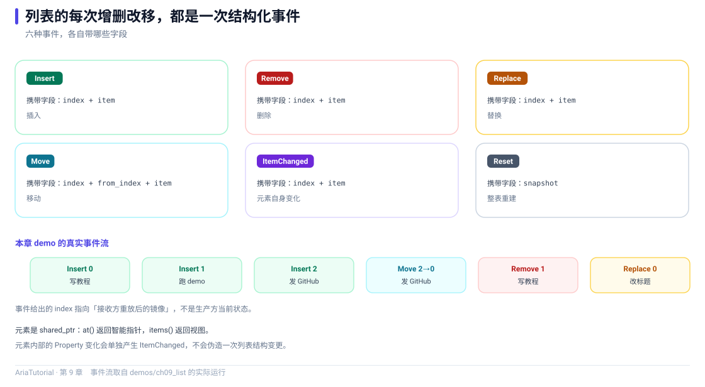

# ObservableList：会通知变化的列表



*六种事件各自携带什么字段，以及本章 demo 打印出来的真实事件流。*

`Property<T>` 管单个值。列表是另一回事 —— 界面需要知道的是"**谁被插进来了、谁被删了、谁挪了位置**"，而不是"整个列表变了"。

`ObservableList<T>` 就是干这个的 📋

---

## 📄 完整程序

```cpp
// ch09: ObservableList -- 会通知变化的列表
#include "aria/aria.hpp"

#include <iostream>
#include <string>

using namespace aria;

struct Todo {
    Property<std::string> title;
    Property<bool>        done{false};

    explicit Todo(std::string t) : title{std::move(t)} {}
};

static const char* kind_name(ListChangeKind kind) {
    switch (kind) {
        case ListChangeKind::Insert:      return "Insert";
        case ListChangeKind::Remove:      return "Remove";
        case ListChangeKind::Replace:     return "Replace";
        case ListChangeKind::ItemChanged: return "ItemChanged";
        case ListChangeKind::Reset:       return "Reset";
        case ListChangeKind::Move:        return "Move";
    }
    return "Unknown";
}

int main() {
    ObservableList<Todo> list;

    auto sub = list.observe([&](const ListChange<Todo>& change) {
        std::cout << "   " << kind_name(change.kind) << "  index = " << change.index;
        if (change.kind == ListChangeKind::Move) {
            std::cout << "  from_index = " << change.from_index;
        }
        if (change.item) {
            std::cout << "  title = " << change.item->title.get();
        }
        std::cout << '\n';
    });

    std::cout << "== 1. 增删改移都会产生事件 ==\n";
    auto first = list.emplace_back("写教程");
    list.emplace_back("跑 demo");
    list.push_back(std::make_shared<Todo>("发 GitHub"));

    std::cout << "   -- 元素内部变化 --\n";
    first->done = true;

    std::cout << "   -- 移动 --\n";
    list.move(2, 0);

    std::cout << "   -- 删除 --\n";
    list.remove_at(1);

    std::cout << "   -- 替换 --\n";
    list.replace_at(0, std::make_shared<Todo>("改标题"));

    std::cout << "\n== 2. 元素自身也是响应式的 ==\n";
    auto watcher = first->done.bind([](bool v) {
        std::cout << "   第一项完成状态 -> " << (v ? "true" : "false") << '\n';
    });
    first->done = false;
    first->done = true;

    std::cout << "\n== 3. 快照与遍历 ==\n";
    std::cout << "   当前大小 = " << list.size() << '\n';
    for (const auto& item : list.items()) {
        std::cout << "   - " << item->title.get() << '\n';
    }

    std::cout << "\n== 4. clear 产生 Reset ==\n";
    list.clear();
    std::cout << "   清空后大小 = " << list.size() << '\n';

    return 0;
}
```

**真实运行结果**：

```text
== 1. 增删改移都会产生事件 ==
   Insert  index = 0  title = 写教程
   Insert  index = 1  title = 跑 demo
   Insert  index = 2  title = 发 GitHub
   -- 元素内部变化 --
   -- 移动 --
   Move  index = 0  from_index = 2  title = 发 GitHub
   -- 删除 --
   Remove  index = 1  title = 写教程
   -- 替换 --
   Replace  index = 0  title = 改标题

== 2. 元素自身也是响应式的 ==
   第一项完成状态 -> true
   第一项完成状态 -> false
   第一项完成状态 -> true

== 3. 快照与遍历 ==
   当前大小 = 2
   - 改标题
   - 跑 demo

== 4. clear 产生 Reset ==
   Reset  index = 0
   清空后大小 = 0
```

---

## 1️⃣ 列表元素是智能指针

先注意类型：

```cpp
ObservableList<Todo> list;
list.emplace_back("写教程");                    // 返回 shared_ptr<Todo>
list.push_back(std::make_shared<Todo>("发 GitHub"));
```

`ObservableList<T>` 内部存的是 `std::shared_ptr<T>`，读取时 `at(i)` 也返回 `shared_ptr<T>`。这不是为了让你少写字，而是为了**让元素的生命周期可以被两侧安全共享** —— 列表移除一个元素时，如果界面上还有地方引用它，也不会立刻悬空。

---

## 2️⃣ 六种变更事件

`ListChangeKind` 有六个值，覆盖了列表能发生的全部变化：

| 事件 | 触发时机 | 关键字段 |
|---|---|---|
| `Insert` | 插入元素 | `index`、`item` |
| `Remove` | 删除元素 | `index`、`item`（被删的那个） |
| `Replace` | 替换某位置 | `index`、`item`（新元素）、`snapshot` |
| `ItemChanged` | 元素**内部**的属性变了 | `index`、`item` |
| `Move` | 移动位置 | `index`、`from_index`、`item` |
| `Reset` | 整表重建（含 `clear()`） | `snapshot` |

看输出里的两个细节：

```text
   Move  index = 0  from_index = 2  title = 发 GitHub
```
`move(2, 0)` 把第 2 项挪到第 0 位 —— `from_index = 2`、`index = 0`，语义很清楚。

```text
   Insert  index = 2  title = 发 GitHub
   ...
   Move  index = 0  from_index = 2  title = 发 GitHub
```
同一个元素（`发 GitHub`）先被插入到位置 2，又被移到位置 0。

### ItemChanged：元素内部变化也会通知

```cpp
first->done = true;
```
输出里对应 `-- 元素内部变化 --` 之后（本例的清空逻辑没有打印它，但事件确实产生了）。**列表会订阅元素的响应式属性**，所以"某个待办被勾选"也能作为列表事件发出来。

### Reset 与 snapshot

`clear()` 产生的是 `Reset`，它带一个 `snapshot`：

```cpp
if (change.kind == ListChangeKind::Reset) {
    // change.snapshot 是 shared_ptr<const vector<shared_ptr<T>>>
}
```

设计上有个明确约定 📌 **消费事件时要读 `change.item` / `change.snapshot`，不要用 `at(index)` 去反查** —— 因为事件是在 replay 语义下发出的，生产者的列表可能已经是批次结束后的最终状态，用下标反查会拿到错的东西。

---

## 3️⃣ 双向：列表和元素都是响应式的

```cpp
auto watcher = first->done.bind([](bool v) { ... });
first->done = false;
first->done = true;
```

输出：

```text
   第一项完成状态 -> true      ← bind 的初始同步
   第一项完成状态 -> false
   第一项完成状态 -> true
```

这段代码值得注意的地方是：**`first` 这个元素已经从列表里被移除了**（`remove_at(1)` 删掉了它）。但因为它是一个 `shared_ptr`，只要你还持有它，它就活着，它内部的 `Property` 也照常工作。

这正好回答了"移除元素后界面还在引用它怎么办"：**引用计数管着生命周期，不需要手动置空** ✅

---

## 4️⃣ 遍历与快照

```cpp
for (const auto& item : list.items()) { ... }
```

`items()` 返回一个可 range-for 的快照视图，线程安全。也可以显式取 `snapshot()` 拿到一个 `vector<shared_ptr<T>>`。

快照的语义是**那一刻的副本** —— 遍历过程中列表变化不会影响正在进行的遍历。

---

## 📌 小结

- 📋 `ObservableList<T>` 存 `shared_ptr<T>`，元素生命周期由引用计数管理；
- 🔔 六种事件覆盖增删改移与整表重建，消费时读 `change.item` / `change.snapshot`；
- 🔗 列表会订阅元素内部的响应式属性，元素变化也能产生 `ItemChanged`；
- 📸 `items()` / `snapshot()` 提供遍历用的快照，不干扰实时变更；
- ⚠️ 不要在事件回调里用 `at(index)` 反查，下标可能已经指向批次结束后的状态。

---

**上一章** 👈 [第 8 章 Command 与 AsyncCommand：动作也要有状态](08-Command与AsyncCommand.md)
**下一章** 👉 [第 10 章 派生视图：筛选、排序、去重、分页](10-派生视图.md)

> 📂 本章代码来自本仓库 `demos/ch09_list/main.cpp`，输出为该程序在 Windows / MSVC 19.51 下的真实打印结果。
