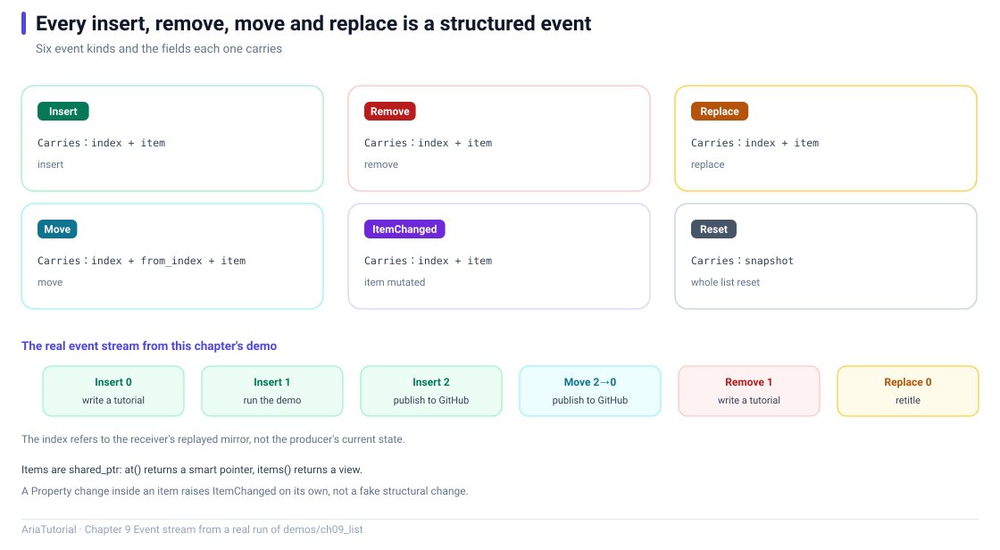

# ObservableList: A List That Announces Its Changes



*What each of the six event kinds carries, plus the real event stream this chapter's demo prints.*

`Property<T>` handles a single value. A list is different — what the UI needs to know is **who was inserted, who was removed, who moved**, not merely "the list changed".

`ObservableList<T>` is exactly that 📋

---

## 📄 The complete program

```cpp
// ch09: ObservableList -- 会通知变化的列表
#include "aria/aria.hpp"

#include <iostream>
#include <string>

using namespace aria;

struct Todo {
    Property<std::string> title;
    Property<bool>        done{false};

    explicit Todo(std::string t) : title{std::move(t)} {}
};

static const char* kind_name(ListChangeKind kind) {
    switch (kind) {
        case ListChangeKind::Insert:      return "Insert";
        case ListChangeKind::Remove:      return "Remove";
        case ListChangeKind::Replace:     return "Replace";
        case ListChangeKind::ItemChanged: return "ItemChanged";
        case ListChangeKind::Reset:       return "Reset";
        case ListChangeKind::Move:        return "Move";
    }
    return "Unknown";
}

int main() {
    ObservableList<Todo> list;

    auto sub = list.observe([&](const ListChange<Todo>& change) {
        std::cout << "   " << kind_name(change.kind) << "  index = " << change.index;
        if (change.kind == ListChangeKind::Move) {
            std::cout << "  from_index = " << change.from_index;
        }
        if (change.item) {
            std::cout << "  title = " << change.item->title.get();
        }
        std::cout << '\n';
    });

    std::cout << "== 1. 增删改移都会产生事件 ==\n";
    auto first = list.emplace_back("写教程");
    list.emplace_back("跑 demo");
    list.push_back(std::make_shared<Todo>("发 GitHub"));

    std::cout << "   -- 元素内部变化 --\n";
    first->done = true;

    std::cout << "   -- 移动 --\n";
    list.move(2, 0);

    std::cout << "   -- 删除 --\n";
    list.remove_at(1);

    std::cout << "   -- 替换 --\n";
    list.replace_at(0, std::make_shared<Todo>("改标题"));

    std::cout << "\n== 2. 元素自身也是响应式的 ==\n";
    auto watcher = first->done.bind([](bool v) {
        std::cout << "   第一项完成状态 -> " << (v ? "true" : "false") << '\n';
    });
    first->done = false;
    first->done = true;

    std::cout << "\n== 3. 快照与遍历 ==\n";
    std::cout << "   当前大小 = " << list.size() << '\n';
    for (const auto& item : list.items()) {
        std::cout << "   - " << item->title.get() << '\n';
    }

    std::cout << "\n== 4. clear 产生 Reset ==\n";
    list.clear();
    std::cout << "   清空后大小 = " << list.size() << '\n';

    return 0;
}
```

**Actual output**:

```text
== 1. 增删改移都会产生事件 ==
   Insert  index = 0  title = 写教程
   Insert  index = 1  title = 跑 demo
   Insert  index = 2  title = 发 GitHub
   -- 元素内部变化 --
   -- 移动 --
   Move  index = 0  from_index = 2  title = 发 GitHub
   -- 删除 --
   Remove  index = 1  title = 写教程
   -- 替换 --
   Replace  index = 0  title = 改标题

== 2. 元素自身也是响应式的 ==
   第一项完成状态 -> true
   第一项完成状态 -> false
   第一项完成状态 -> true

== 3. 快照与遍历 ==
   当前大小 = 2
   - 改标题
   - 跑 demo

== 4. clear 产生 Reset ==
   Reset  index = 0
   清空后大小 = 0
```

---

## 1️⃣ Elements are smart pointers

```cpp
ObservableList<Todo> list;
list.emplace_back("写教程");                    // returns shared_ptr<Todo>
list.push_back(std::make_shared<Todo>("发 GitHub"));
```

`ObservableList<T>` stores `std::shared_ptr<T>`, and `at(i)` returns one too. This is not merely for brevity — it lets **element lifetime be shared safely between the list and the UI**. When an element is removed, a reference held elsewhere does not dangle.

---

## 2️⃣ Six change events

`ListChangeKind` covers everything a list can do:

| Event | Trigger | Key fields |
|---|---|---|
| `Insert` | Element inserted | `index`, `item` |
| `Remove` | Element removed | `index`, `item` (the removed one) |
| `Replace` | Position replaced | `index`, `item`, `snapshot` |
| `ItemChanged` | A **property inside** the element changed | `index`, `item` |
| `Move` | Position changed | `index`, `from_index`, `item` |
| `Reset` | Whole list rebuilt (includes `clear()`) | `snapshot` |

Two details from the output:

```text
   Move  index = 0  from_index = 2  title = 发 GitHub
```
`move(2, 0)` moved index 2 to index 0 — `from_index = 2`, `index = 0`, unambiguous.

```text
   Insert  index = 2  title = 发 GitHub
   ...
   Move  index = 0  from_index = 2  title = 发 GitHub
```
The same element was inserted at 2 and then moved to 0.

### ItemChanged: changes inside an element are announced too

```cpp
first->done = true;
```
**The list subscribes to its elements' reactive properties**, so "a todo got checked" also surfaces as a list event.

### Reset and snapshot

`clear()` produces a `Reset` carrying a `snapshot`:

```cpp
if (change.kind == ListChangeKind::Reset) {
    // change.snapshot is shared_ptr<const vector<shared_ptr<T>>>
}
```

There is an explicit contract here 📌 **Consume events by reading `change.item` / `change.snapshot`, not by looking up `at(index)`** — events are emitted under replay semantics, so the producer's list may already be in its final post-batch state and index lookups return the wrong thing.

---

## 3️⃣ Both the list and its elements are reactive

```cpp
auto watcher = first->done.bind([](bool v) { ... });
first->done = false;
first->done = true;
```

Output:

```text
   第一项完成状态 -> true      ← bind's initial sync
   第一项完成状态 -> false
   第一项完成状态 -> true
```

Worth noting: **`first` had already been removed from the list** (`remove_at(1)` removed it). Because it is a `shared_ptr`, it lives as long as you hold it, and its internal `Property` keeps working.

That answers "what if the UI still references a removed element": **reference counting owns the lifetime; nothing needs manual nulling** ✅

---

## 4️⃣ Iteration and snapshots

```cpp
for (const auto& item : list.items()) { ... }
```

`items()` returns a range-for-able snapshot view that is thread-safe. You can also take `snapshot()` for a plain `vector<shared_ptr<T>>`.

A snapshot is **a copy taken at that instant** — concurrent list mutation does not disturb an ongoing iteration.

---

## 📌 Summary

- 📋 `ObservableList<T>` stores `shared_ptr<T>`; element lifetime is reference-counted;
- 🔔 Six events cover insert/remove/replace/move/rebuild; consume `change.item` / `change.snapshot`;
- 🔗 The list subscribes to elements' reactive properties, so inner changes produce `ItemChanged`;
- 📸 `items()` / `snapshot()` give iteration-safe copies;
- ⚠️ Never look up `at(index)` inside an event callback — indices may already reflect the post-batch state.

---

**Previous chapter** 👈 [Chapter 8 — Command and AsyncCommand: Actions Have State Too](08-command-and-async-command.en.md)
**Next chapter** 👉 [Chapter 10 — Derived Views: Filtering, Sorting, Deduplication, Paging](10-derived-views.en.md)

> 📂 Code from `demos/ch09_list/main.cpp`. Output is the program's real stdout on Windows / MSVC 19.51.
