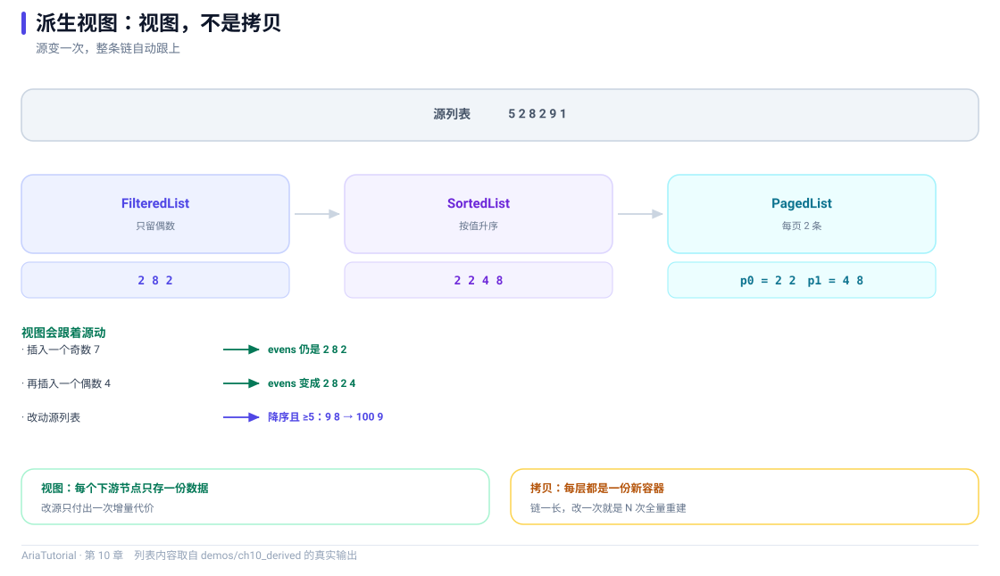

# 派生视图：筛选、排序、去重、分页的组合



*派生链上每一层都是视图：源变一次，整条链按增量更新。*

列表有了，接下来就是最常见的四件事：**只看一部分、按某个字段排序、去重、分页** 🔍

在 Aria 里这四个都是"视图"而不是"拷贝"。区别很关键：视图会**跟着源列表自动更新**，你不需要在数据变化时重新算一遍。

---

## ⚠️ 先说一个容易踩的地方

这几个派生视图**不在 `<aria/aria.hpp>` 这把伞里**，必须单独包含：

```cpp
#include "aria/derived/distinct_list.hpp"
#include "aria/derived/filtered_list.hpp"
#include "aria/derived/paged_list.hpp"
#include "aria/derived/sorted_list.hpp"
```

工厂函数（`filtered` / `sorted` / `distinct` / `paged`）位于 `aria::` 命名空间。

`aria.hpp` 只带核心的 `Property` / `Computed` / `Command` / `ObservableList` / `Validator`，派生视图属于独立头文件 —— 这是刻意的，避免伞头把所有东西都拖进来。

---

## 📄 完整程序

```cpp
// ch10: 派生视图 -- 筛选、排序、去重、分页的组合
//
// 注意: 这几个派生视图不在 <aria/aria.hpp> 这把伞里, 需要单独包含。
// 工厂函数 (filtered / sorted / distinct / paged) 位于 aria:: 命名空间。
#include "aria/aria.hpp"
#include "aria/derived/distinct_list.hpp"
#include "aria/derived/filtered_list.hpp"
#include "aria/derived/paged_list.hpp"
#include "aria/derived/sorted_list.hpp"

#include <iostream>
#include <memory>

using namespace aria;

struct Row {
    int value = 0;
    explicit Row(int v) : value{v} {}
};

template <typename List>
static void dump(const char* name, const List& list) {
    std::cout << "   " << name << " =";
    for (std::size_t i = 0; i < list.size(); ++i) {
        std::cout << ' ' << list.at(i)->value;
    }
    std::cout << '\n';
}

int main() {
    auto source = std::make_shared<ObservableList<Row>>();
    for (int v : {5, 2, 8, 2, 9, 1}) {
        source->push_back(std::make_shared<Row>(v));
    }
    dump("源列表     ", *source);

    std::cout << "\n== 1. FilteredList: 只留下偶数 ==\n";
    auto evens = filtered(source, [](const Row& r) { return r.value % 2 == 0; });
    dump("evens      ", *evens);
    std::cout << "   新插入一个奇数 7 ...\n";
    source->push_back(std::make_shared<Row>(7));
    dump("evens      ", *evens);
    std::cout << "   再插入一个偶数 4 ...\n";
    source->push_back(std::make_shared<Row>(4));
    dump("evens      ", *evens);

    std::cout << "\n== 2. SortedList: 按值升序 ==\n";
    auto ascending = sorted(evens, [](const Row& a, const Row& b) {
        return a.value < b.value;
    });
    dump("ascending  ", *ascending);

    std::cout << "\n== 3. DistinctList: 去重 ==\n";
    auto unique = distinct<int>(source, [](const Row& r) { return r.value; });
    dump("unique     ", *unique);

    std::cout << "\n== 4. PagedList: 每页 2 条 ==\n";
    auto page = paged(ascending, 2, 0);
    dump("page 0     ", *page);
    page->page_index().set(1);
    dump("page 1     ", *page);
    page->page_index().set(2);
    dump("page 2     ", *page);

    std::cout << "\n== 5. 链式组合: 源 -> 筛选 -> 排序 -> 分页 ==\n";
    auto chained = paged(
        sorted(filtered(source, [](const Row& r) { return r.value >= 5; }),
               [](const Row& a, const Row& b) { return a.value > b.value; }),
        2, 0);
    dump("降序且 >=5  ", *chained);

    std::cout << "\n   改动源列表, 整条链自动更新 ...\n";
    source->push_back(std::make_shared<Row>(100));
    dump("降序且 >=5  ", *chained);

    return 0;
}
```

**真实运行结果**：

```text
   源列表      = 5 2 8 2 9 1

== 1. FilteredList: 只留下偶数 ==
   evens       = 2 8 2
   新插入一个奇数 7 ...
   evens       = 2 8 2
   再插入一个偶数 4 ...
   evens       = 2 8 2 4

== 2. SortedList: 按值升序 ==
   ascending   = 2 2 4 8

== 3. DistinctList: 去重 ==
   unique      = 5 2 8 9 1 7 4

== 4. PagedList: 每页 2 条 ==
   page 0      = 2 2
   page 1      = 4 8
   page 2      =

== 5. 链式组合: 源 -> 筛选 -> 排序 -> 分页 ==
   降序且 >=5   = 9 8

   改动源列表, 整条链自动更新 ...
   降序且 >=5   = 100 9
```

---

## 1️⃣ FilteredList：源变了，视图自己跟上

```cpp
auto evens = filtered(source, [](const Row& r) { return r.value % 2 == 0; });
```

源列表是 `5 2 8 2 9 1`，筛选后是 `2 8 2`。接着插入一个奇数 7：

```text
   新插入一个奇数 7 ...
   evens       = 2 8 2       ← 没有变化
```

再插入偶数 4：

```text
   再插入一个偶数 4 ...
   evens       = 2 8 2 4     ← 自动加进来了
```

**你没写过一行"源列表变了要重新筛选"的代码** ✅ 这就是"视图"的含义：它订阅了源列表的事件，并按自己的规则决定这个事件要不要反映出来。

而且注意：插入奇数时视图**没有重建**，只是忽略了这个事件 —— 这正是视图比"每次重新算一遍"高效的地方。

---

## 2️⃣ SortedList：排序也是视图

```cpp
auto ascending = sorted(evens, [](const Row& a, const Row& b) {
    return a.value < b.value;
});
```

`evens` 是 `2 8 2 4`，排序后是 `2 2 4 8`。

比较器是 `bool(const T&, const T&)`，和 `std::sort` 的约定一致，写起来没有额外学习成本。

---

## 3️⃣ DistinctList：按键去重

```cpp
auto unique = distinct<int>(source, [](const Row& r) { return r.value; });
```

源列表 `5 2 8 2 9 1`（后来追加了 7 和 4）去重后是 `5 2 8 9 1 7 4`。

第一个模板参数是**键的类型**（这里是 `int`），第二个参数是"从元素里取键"的函数。用显式模板参数是因为键类型无法从 lambda 推导出来。

---

## 4️⃣ PagedList：翻页是响应式的

```cpp
auto page = paged(ascending, 2, 0);
page->page_index().set(1);
```

注意 `page_index()` 返回的是一个 **`Property`** —— 翻页本身就是一个响应式状态：

```text
   page 0      = 2 2
   page 1      = 4 8
   page 2      =            ← 越界了, 空
```

这意味着你可以把它直接绑到"上一页/下一页"按钮上，或者和 URL 参数联动，不需要自己维护"当前第几页"再手动过滤。

---

## 5️⃣ 链式组合：一条数据流水线

```cpp
auto chained = paged(
    sorted(filtered(source, [](const Row& r) { return r.value >= 5; }),
           [](const Row& a, const Row& b) { return a.value > b.value; }),
    2, 0);
```

这一行建了一条完整的链：**源 → 筛选（≥5）→ 降序排序 → 分页（每页 2 条）**。

看输出：

```text
   降序且 >=5   = 9 8
   改动源列表, 整条链自动更新 ...
   降序且 >=5   = 100 9
```

往源列表尾部追加 `100`，这条链**自己重算了一遍**：筛选通过、排到最前、第一页变成 `100 9`。

工厂函数的参数就是上游视图的 `shared_ptr`，所以链式写法很自然：

| 工厂 | 签名 |
|---|---|
| `filtered(source, pred)` | `pred: bool(const T&)` |
| `sorted(source, cmp)` | `cmp: bool(const T&, const T&)` |
| `distinct<Key>(source, key_of)` | `key_of: Key(const T&)` |
| `paged(source, size, index = 0)` | 页大小与初始页号 |

---

## 💡 视图 vs 拷贝：性能上的实际差别

把派生视图理解成"查询"而不是"结果"：

- **零拷贝**：视图不复制元素，它只保存"哪些下标"和排序关系；
- **增量更新**：源列表插入一条，视图只处理这一条，而不是全量重算；
- **惰性代价**：链越长，每次源变化要走的环节越多。第 11 章的 `reconcile` 会给出另一种更彻底的方案。

---

## 📌 小结

- 📦 派生视图需要单独 `#include "aria/derived/..."`，不含在 `aria.hpp` 里；
- 🔍 `filtered` / `sorted` / `distinct` / `paged` 四个工厂函数在 `aria::` 下，返回 `shared_ptr`；
- 🔄 视图订阅源列表，**源变化时自动更新，不需要手写刷新**；
- 📄 `paged` 的 `page_index()` 本身就是 `Property`，翻页可以直接参与响应式；
- 🔗 工厂可以任意链式组合，形成"源 → 筛选 → 排序 → 分页"的数据流水线。

---

**上一章** 👈 [第 9 章 ObservableList：会通知变化的列表](09-ObservableList.md)
**下一章** 👉 [第 11 章 reconcile：一万行列表的增量更新](11-reconcile增量更新.md)

> 📂 本章代码来自本仓库 `demos/ch10_derived/main.cpp`，输出为该程序在 Windows / MSVC 19.51 下的真实打印结果。
