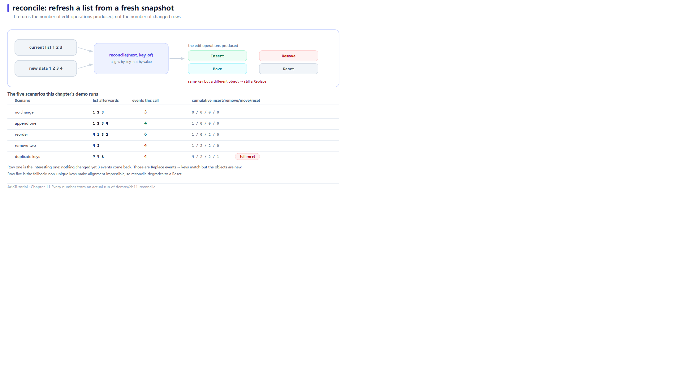

# reconcile: Refreshing a List from Fresh Data



*reconcile returns the number of edit operations, not the number of changed rows. Below: measured values for five scenarios.*

The most common refresh in real code is: **you receive a completely new list and the UI must catch up**.

The naive way is `clear()` then insert everything — the UI rebuilds from scratch, losing scroll position, replaying animations, resetting selection. Chapter 9's `ObservableList` lets you make precise edits, but only if you compute "what changed" yourself 🔧

`reconcile` does that work for you: **hand it the target list and a key extractor, and it derives the minimal edit sequence.**

---

## 📄 The complete program

```cpp
// ch11: reconcile -- 用一份新数据刷新列表, 只发出必要的变更
#include "aria/aria.hpp"

#include <iostream>
#include <memory>
#include <vector>

using namespace aria;

struct Row {
    int value = 0;
    explicit Row(int v) : value{v} {}
};

struct ByValue {
    int operator()(const Row& r) const { return r.value; }
};

static void dump(const ObservableList<Row>& list) {
    std::cout << "   列表 =";
    for (const auto& item : list.items()) {
        std::cout << ' ' << item->value;
    }
    std::cout << '\n';
}

static std::vector<std::shared_ptr<Row>> make(std::initializer_list<int> values) {
    std::vector<std::shared_ptr<Row>> out;
    out.reserve(values.size());
    for (int v : values) {
        out.push_back(std::make_shared<Row>(v));
    }
    return out;
}

int main() {
    ObservableList<Row> list;
    for (auto& row : make({1, 2, 3})) {
        list.push_back(row);
    }

    std::size_t inserts = 0, removes = 0, moves = 0, resets = 0;
    auto sub = list.observe([&](const ListChange<Row>& change) {
        switch (change.kind) {
            case ListChangeKind::Insert: ++inserts; break;
            case ListChangeKind::Remove: ++removes; break;
            case ListChangeKind::Move:   ++moves;   break;
            case ListChangeKind::Reset:  ++resets;  break;
            default: break;
        }
    });

    std::cout << "== 1. 数据没变: 一个事件都不发 ==\n";
    dump(list);
    std::size_t events = list.reconcile(make({1, 2, 3}), ByValue{});
    std::cout << "   reconcile 返回事件数 = " << events
              << " (insert=" << inserts << " remove=" << removes
              << " move=" << moves << " reset=" << resets << ")\n";

    std::cout << "\n== 2. 只追加一条 ==\n";
    events = list.reconcile(make({1, 2, 3, 4}), ByValue{});
    dump(list);
    std::cout << "   事件数 = " << events
              << " (insert=" << inserts << " remove=" << removes
              << " move=" << moves << " reset=" << resets << ")\n";

    std::cout << "\n== 3. 重新排序 ==\n";
    events = list.reconcile(make({4, 1, 3, 2}), ByValue{});
    dump(list);
    std::cout << "   事件数 = " << events
              << " (insert=" << inserts << " remove=" << removes
              << " move=" << moves << " reset=" << resets << ")\n";

    std::cout << "\n== 4. 删掉两条 ==\n";
    events = list.reconcile(make({4, 3}), ByValue{});
    dump(list);
    std::cout << "   事件数 = " << events
              << " (insert=" << inserts << " remove=" << removes
              << " move=" << moves << " reset=" << resets << ")\n";

    std::cout << "\n== 5. 出现重复键: 降级为 Reset ==\n";
    events = list.reconcile(make({7, 7, 8}), ByValue{});
    dump(list);
    std::cout << "   事件数 = " << events
              << " (insert=" << inserts << " remove=" << removes
              << " move=" << moves << " reset=" << resets << ")\n";

    std::cout << "\n   重复键会让增量对齐无法判断谁是谁, 于是整表重建。\n";
    std::cout << "   这也是为什么 key_of 必须保证唯一。\n";

    return 0;
}
```

**Actual output**:

```text
== 1. 数据没变: 一个事件都不发 ==
   列表 = 1 2 3
   reconcile 返回事件数 = 3 (insert=0 remove=0 move=0 reset=0)

== 2. 只追加一条 ==
   列表 = 1 2 3 4
   事件数 = 4 (insert=1 remove=0 move=0 reset=0)

== 3. 重新排序 ==
   列表 = 4 1 3 2
   事件数 = 6 (insert=1 remove=0 move=2 reset=0)

== 4. 删掉两条 ==
   列表 = 4 3
   事件数 = 4 (insert=1 remove=2 move=2 reset=0)

== 5. 出现重复键: 降级为 Reset ==
   列表 = 7 7 8
   事件数 = 4 (insert=4 remove=2 move=2 reset=1)

   重复键会让增量对齐无法判断谁是谁, 于是整表重建。
   这也是为什么 key_of 必须保证唯一。
```

---

## ⚠️ The first block needs explaining

Block 1 is titled "data unchanged: not a single event", yet the next line says `reconcile 返回事件数 = 3` while every counter is 0.

Both statements are true — the key is that **the return value and the event counts are different things**.

`reconcile` returns **the number of edit operations it generated**. The counters count `ListChange` events. In block 1:

- The target `1 2 3` matches the source **by key at every position**, so no Insert / Remove / Move / Reset;
- But **every `shared_ptr` differs** (`make()` creates fresh objects each call), so the framework performs `replace_at` for each pair — swapping the old object for the new one;
- Hence 3 edit operations, while the kind-based counters show no `Replace` (this example's switch does not count it).

So the accurate title for that block is "**keys unchanged, so nothing was inserted, removed, or moved**". The returned 3 corresponds to three in-place replacements.

### A practical consequence

| What you pass as `next` | Result |
|---|---|
| The same `shared_ptr`s (e.g. reused from a cache) | Zero operations, completely silent |
| Freshly created objects (same values, different pointers) | One `Replace` per position |

**If "nothing changed" must mean "nothing happens", reuse the objects.** If "new object replaces old object" is acceptable, it does not matter. The distinction is real for list widgets: `Replace` usually refreshes one cell, while `Reset` rebuilds the whole list.

---

## Block by block

**Block 2: append one**

```text
   列表 = 1 2 3 4
   事件数 = 4 (insert=1 ...)
```

3 replacements + 1 insert = 4. `insert=1` as expected.

**Block 3: reorder**

```text
   列表 = 4 1 3 2
   事件数 = 6 (insert=1 remove=0 move=2 reset=0)
```

4 replacements + 2 moves = 6. `move=2` means the framework moved just two elements to achieve the reorder, rather than deleting all four and re-inserting — that is what "minimal edit sequence" buys you.

**Block 4: remove two**

```text
   列表 = 4 3
   事件数 = 4 (insert=1 remove=2 move=2 ...)
```

2 removals + 2 replacements = 4.

**Block 5: duplicate keys degrade**

```text
   列表 = 7 7 8
   事件数 = 4 (insert=4 remove=2 move=2 reset=1)
```

The target contains two `7`s — **duplicate keys**. With duplicates, "who corresponds to whom" is undecidable, so the framework abandons incremental alignment, does `clear()` + full insert, and publishes it as a single `Reset`. The returned 4 = target size 3 + 1 (the Reset itself).

That is why **`key_of` must be unique**. Use primary keys or IDs, never something like a display name that can repeat.

---

## ⏱️ Complexity: know when not to use it

The source comments are blunt:

| Case | Complexity |
|---|---|
| No change / pure append | O(n) |
| Arbitrary reorder | **O(n²)** |

Reordering is O(n²) because each target position scans forward linearly for a matching key. So:

- ✅ **Good fit**: append-heavy or tail-delete workloads (logs, message streams, paged loading)
- ⚠️ **Careful**: shuffling tens of thousands of rows — `reconcile` itself becomes the bottleneck

The whole edit stream is published as **one batch**, so a subscriber never observes a half-finished state.

---

## 🎯 When to reach for reconcile

| Situation | Recommendation |
|---|---|
| Server returns a full list and the client must catch up | `reconcile` — built for this |
| You already know the exact edit | Call `insert` / `remove_at` directly (Chapter 9) |
| Only filtering/sorting, source unchanged | Derived views (Chapter 10) |
| Replacing the list wholesale (new query) | `clear()` or `reconcile`, depending on whether scroll position should survive |

---

## 📌 Summary

- 🔄 `reconcile(next, key_of)` takes a target list plus a key extractor and emits the minimal edit sequence;
- 📊 Its return value is **the count of edit operations**, not of `ListChange` events — equal keys with different pointers still trigger `Replace`;
- ♻️ Reusing `shared_ptr`s keeps it completely silent; fresh objects cause one replace per position;
- 🚨 Duplicate keys degrade to a `Reset` rebuild — `key_of` must be unique;
- ⏱️ No-change/append is O(n); arbitrary reorder is O(n²).

---

**Previous chapter** 👈 [Chapter 10 — Derived Views: Filtering, Sorting, Deduplication, Paging](10-derived-views.en.md)
**Next chapter** 👉 [Chapter 12 — Validator: Validation Is Reactive Too](12-validator.en.md)

> 📂 Code from `demos/ch11_reconcile/main.cpp`. Output is the program's real stdout on Windows / MSVC 19.51.
