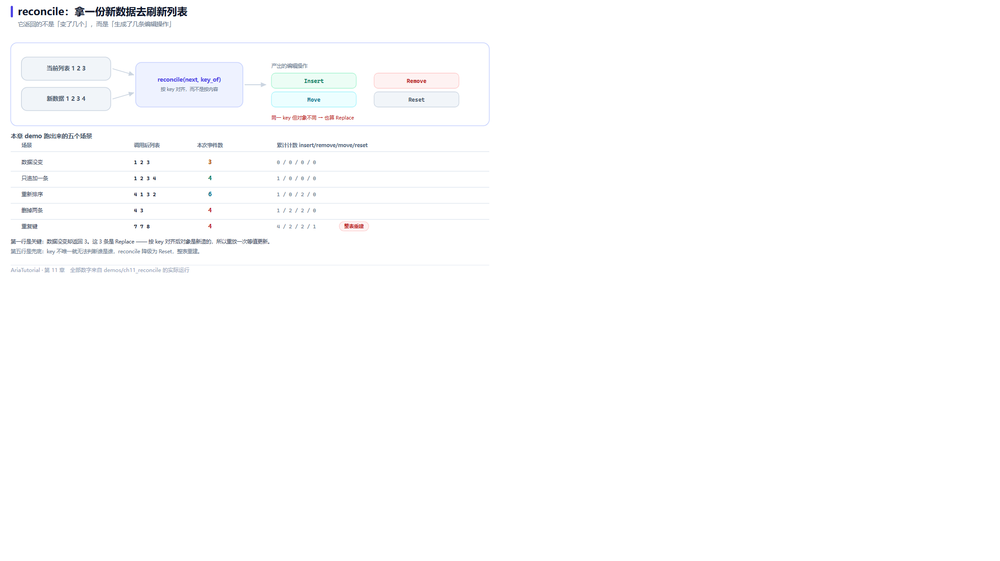

# reconcile：用一份新数据刷新列表



*reconcile 返回的是编辑操作数，不是「变了几个」；下面是五个场景的实测值。*

真实业务里最常见的一种刷新是：**拿到一份全新的列表数据，然后让界面跟上**。

最笨的做法是 `clear()` 再全量插入 —— 界面会整个重建，滚动位置丢失、动画重放、选中状态归零。第 9 章的 `ObservableList` 能让你精确地增删改，但前提是你自己算出"哪些变了" 🔧

`reconcile` 把这个活接了过去：**你给它一份目标列表和一个取键函数，它自己算出最小编辑序列。**

---

## 📄 完整程序

```cpp
// ch11: reconcile -- 用一份新数据刷新列表, 只发出必要的变更
#include "aria/aria.hpp"

#include <iostream>
#include <memory>
#include <vector>

using namespace aria;

struct Row {
    int value = 0;
    explicit Row(int v) : value{v} {}
};

struct ByValue {
    int operator()(const Row& r) const { return r.value; }
};

static void dump(const ObservableList<Row>& list) {
    std::cout << "   列表 =";
    for (const auto& item : list.items()) {
        std::cout << ' ' << item->value;
    }
    std::cout << '\n';
}

static std::vector<std::shared_ptr<Row>> make(std::initializer_list<int> values) {
    std::vector<std::shared_ptr<Row>> out;
    out.reserve(values.size());
    for (int v : values) {
        out.push_back(std::make_shared<Row>(v));
    }
    return out;
}

int main() {
    ObservableList<Row> list;
    for (auto& row : make({1, 2, 3})) {
        list.push_back(row);
    }

    std::size_t inserts = 0, removes = 0, moves = 0, resets = 0;
    auto sub = list.observe([&](const ListChange<Row>& change) {
        switch (change.kind) {
            case ListChangeKind::Insert: ++inserts; break;
            case ListChangeKind::Remove: ++removes; break;
            case ListChangeKind::Move:   ++moves;   break;
            case ListChangeKind::Reset:  ++resets;  break;
            default: break;
        }
    });

    std::cout << "== 1. 数据没变: 一个事件都不发 ==\n";
    dump(list);
    std::size_t events = list.reconcile(make({1, 2, 3}), ByValue{});
    std::cout << "   reconcile 返回事件数 = " << events
              << " (insert=" << inserts << " remove=" << removes
              << " move=" << moves << " reset=" << resets << ")\n";

    std::cout << "\n== 2. 只追加一条 ==\n";
    events = list.reconcile(make({1, 2, 3, 4}), ByValue{});
    dump(list);
    std::cout << "   事件数 = " << events
              << " (insert=" << inserts << " remove=" << removes
              << " move=" << moves << " reset=" << resets << ")\n";

    std::cout << "\n== 3. 重新排序 ==\n";
    events = list.reconcile(make({4, 1, 3, 2}), ByValue{});
    dump(list);
    std::cout << "   事件数 = " << events
              << " (insert=" << inserts << " remove=" << removes
              << " move=" << moves << " reset=" << resets << ")\n";

    std::cout << "\n== 4. 删掉两条 ==\n";
    events = list.reconcile(make({4, 3}), ByValue{});
    dump(list);
    std::cout << "   事件数 = " << events
              << " (insert=" << inserts << " remove=" << removes
              << " move=" << moves << " reset=" << resets << ")\n";

    std::cout << "\n== 5. 出现重复键: 降级为 Reset ==\n";
    events = list.reconcile(make({7, 7, 8}), ByValue{});
    dump(list);
    std::cout << "   事件数 = " << events
              << " (insert=" << inserts << " remove=" << removes
              << " move=" << moves << " reset=" << resets << ")\n";

    std::cout << "\n   重复键会让增量对齐无法判断谁是谁, 于是整表重建。\n";
    std::cout << "   这也是为什么 key_of 必须保证唯一。\n";

    return 0;
}
```

**真实运行结果**：

```text
== 1. 数据没变: 一个事件都不发 ==
   列表 = 1 2 3
   reconcile 返回事件数 = 3 (insert=0 remove=0 move=0 reset=0)

== 2. 只追加一条 ==
   列表 = 1 2 3 4
   事件数 = 4 (insert=1 remove=0 move=0 reset=0)

== 3. 重新排序 ==
   列表 = 4 1 3 2
   事件数 = 6 (insert=1 remove=0 move=2 reset=0)

== 4. 删掉两条 ==
   列表 = 4 3
   事件数 = 4 (insert=1 remove=2 move=2 reset=0)

== 5. 出现重复键: 降级为 Reset ==
   列表 = 7 7 8
   事件数 = 4 (insert=4 remove=2 move=2 reset=1)

   重复键会让增量对齐无法判断谁是谁, 于是整表重建。
   这也是为什么 key_of 必须保证唯一。
```

---

## ⚠️ 第一段的输出需要解释

段 1 标题写着"数据没变：一个事件都不发"，但下一行写着 `reconcile 返回事件数 = 3`，同时计数器全是 0。

看着矛盾，其实两句话都成立 —— 关键在于**返回值和事件数是两码事**。

`reconcile` 的返回值是**本次生成的编辑操作个数**。而计数器统计的是 `ListChange` 事件。第一段里：

- 目标列表 `1 2 3` 和源列表**按键全部对得上**，所以没有 Insert / Remove / Move / Reset；
- 但**每个位置的 `shared_ptr` 都不同**（`make()` 每次都会新建对象），所以框架为每一对执行了 `replace_at` —— 用新对象替换旧对象；
- 于是编辑操作数是 3，而按 kind 归类的计数器里没有 `Replace` 分支（本例的 switch 没统计它）。

所以这段的准确标题应该是"**键没变，所以没有增删移动**"。返回值 3 对应的是三次原地替换。

### 这带来一个实用结论

| 你传入的 next | 结果 |
|---|---|
| 复用同一批 `shared_ptr`（比如从缓存里取的） | 一个操作都不产生，完全静默 |
| 每次新建对象（值相同、指针不同） | 每个位置都 `Replace` 一次 |

**如果你希望"值没变就完全不动"，就要复用对象；如果接受"新对象替换旧对象"，那就无所谓。** 这个区别在列表控件上很实际：`Replace` 通常只刷新单个格子，而 `Reset` 会重建整表。

---

## 逐个场景看

**段 2：只追加一条**

```text
   列表 = 1 2 3 4
   事件数 = 4 (insert=1 ...)
```

3 次替换 + 1 次插入 = 4。`insert=1` 与预期一致。

**段 3：重新排序**

```text
   列表 = 4 1 3 2
   事件数 = 6 (insert=1 remove=0 move=2 reset=0)
```

4 次替换 + 2 次移动 = 6。`move=2` 说明框架只挪了两个元素就完成了重排，而不是把四个都删了重插 —— 这正是"最小编辑序列"的意义。

**段 4：删掉两条**

```text
   列表 = 4 3
   事件数 = 4 (insert=1 remove=2 move=2 ...)
```

2 次删除 + 2 次替换 = 4。删除是从后往前扫的，删掉的正是 `1` 和 `2`。

**段 5：重复键降级**

```text
   列表 = 7 7 8
   事件数 = 4 (insert=4 remove=2 move=2 reset=1)
```

目标列表里出现了两个 `7` —— **键重复**。这时"谁对应谁"根本无法判断，框架直接放弃增量对齐，改成 `clear()` + 全量插入，并把它作为一个 `Reset` 发布。返回的 4 = 目标大小 3 + 1（Reset 本身）。

这就是为什么 **`key_of` 必须保证唯一**。用主键、ID 这类天然唯一的字段，不要用"名称"这种可能重复的字段。

---

## ⏱️ 复杂度：知道什么时候别用它

源码注释里写得很直白：

| 场景 | 复杂度 |
|---|---|
| 无变化 / 纯追加 | O(n) |
| 任意重排 | **O(n²)** |

重排是 O(n²) 的 —— 因为对每个目标位置都要向后线性扫描找匹配键。所以：

- ✅ **适合**：列表以追加、尾部删除为主（日志、消息流、分页加载）
- ⚠️ **谨慎**：上万条数据整体打乱重排，`reconcile` 本身会成为瓶颈

整个编辑流会作为**一个 batch** 发布 —— 这意味着订阅者在处理第一个事件时，不会看到半完成的状态。

---

## 🎯 什么时候用 reconcile

| 场景 | 建议 |
|---|---|
| 服务端返回全量列表，本地要跟上 | `reconcile` —— 正是为此设计 |
| 本地已知具体改动（插入了一条） | 直接调 `insert` / `remove_at`（第 9 章） |
| 只是筛选/排序，数据源没变 | 用派生视图（第 10 章） |
| 列表整体替换语义（换了个查询条件） | `clear()` 或 `reconcile`，看是否希望保留滚动位置 |

---

## 📌 小结

- 🔄 `reconcile(next, key_of)` 输入目标列表与取键函数，输出**最小编辑序列**；
- 📊 返回值是**编辑操作个数**，不等于 `ListChange` 事件数 —— 键相同但指针不同时会触发原地替换；
- ♻️ 复用 `shared_ptr` 可以完全静默，新建对象则每个位置替换一次；
- 🚨 键重复会降级为 `Reset` 全表重建，`key_of` 必须唯一；
- ⏱️ 无变化/追加是 O(n)，任意重排是 O(n²)，大列表重排要谨慎。

---

**上一章** 👈 [第 10 章 派生视图：筛选、排序、去重、分页](10-派生视图.md)
**下一章** 👉 [第 12 章 Validator：校验也是响应式的](12-Validator表单校验.md)

> 📂 本章代码来自本仓库 `demos/ch11_reconcile/main.cpp`，输出为该程序在 Windows / MSVC 19.51 下的真实打印结果。
