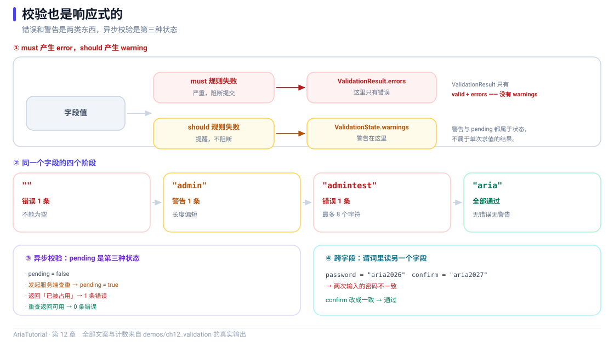

# Validator：校验也是响应式的



*must 与 should 分成两路，异步校验带来第三种状态 pending。*

表单校验通常是这样写的：拿到输入、跑一遍规则、把错误塞进某个变量、让界面去读。

Aria 的 `Validator` 把校验结果本身做成了**响应式状态** —— 它跟着字段值自动重算，你只需要订阅它 ✅

---

## 📄 完整程序

```cpp
// ch12: Validator -- 校验也是响应式的
//
// 两个对外类型的区别:
//   ValidationResult -- 只有 valid + errors, 轻量
//   ValidationState  -- 另外带 pending / touched / dirty / warnings
// 需要显示警告或异步状态时, 用 state()。
#include "aria/aria.hpp"

#include <iostream>
#include <string>
#include <vector>

using namespace aria;

int main() {
    std::cout << "== 1. must 产生 error, should 产生 warning ==\n";
    Property<std::string>  name{""};
    Validator<std::string> name_v{name, "user.name"};

    name_v.must([](const std::string& s) { return !s.empty(); }, "不能为空", "not_empty")
          .must([](const std::string& s) { return s.size() <= 8; }, "最多 8 个字符", "max_len")
          .should([](const std::string& s) { return s != "admin"; }, "不建议使用 admin", "avoid_admin");

    auto print_name = [&] {
        const auto& st = name_v.state().get();
        std::cout << "   值 = \"" << name.get() << "\""
                  << ", 错误 " << st.errors.size()
                  << " 条, 警告 " << st.warnings.size() << " 条";
        if (!st.errors.empty()) {
            std::cout << "  首个错误: " << st.errors[0].message;
        }
        std::cout << '\n';
    };

    print_name();
    auto name_sub = name_v.state().on_changed([&](const auto&) { print_name(); });

    std::cout << "   name = \"admin\"\n";
    name = "admin";
    std::cout << "   name = \"admintest\"\n";
    name = "admintest";
    std::cout << "   name = \"aria\"\n";
    name = "aria";

    std::cout << "\n== 2. 按规则 id 精确查询 ==\n";
    const auto& st = name_v.state().get();
    std::cout << "   has_error_with_rule(\"not_empty\") = "
              << (st.has_error_with_rule("not_empty") ? "true" : "false") << '\n';
    std::cout << "   has_error_with_rule(\"max_len\") = "
              << (st.has_error_with_rule("max_len") ? "true" : "false") << '\n';

    std::cout << "\n== 3. 异步校验: pending 状态 ==\n";
    Property<std::string>  user{"aria"};
    Validator<std::string> user_v{user, "user.id"};

    auto print_pending = [&] {
        const auto& s = user_v.state().get();
        std::cout << "   pending = " << (s.pending ? "true" : "false")
                  << ", 错误 " << s.errors.size() << " 条\n";
    };

    print_pending();
    std::cout << "   发起异步校验 (去服务端查重) ...\n";
    user_v.begin_pending();
    print_pending();
    std::cout << "   服务端返回: 已被占用\n";
    user_v.end_pending(std::vector<std::string>{"该用户名已被占用"});
    print_pending();
    std::cout << "   重新查一次, 这次返回可用\n";
    user_v.begin_pending();
    user_v.end_pending();
    print_pending();

    std::cout << "\n== 4. 跨字段: 确认密码要和密码一致 ==\n";
    Property<std::string> password{"aria2026"};
    Property<std::string> confirm{"aria2027"};

    Validator<std::string> confirm_v{confirm, "form.confirm"};
    confirm_v.must([&](const std::string& s) { return s == password.get(); },
                   "两次输入的密码不一致", "match");

    auto print_confirm = [&] {
        const auto& s = confirm_v.state().get();
        std::cout << "   password = \"" << password.get()
                  << "\", confirm = \"" << confirm.get() << "\"  ->  ";
        if (s.errors.empty()) {
            std::cout << "通过";
        } else {
            std::cout << s.errors[0].message;
        }
        std::cout << '\n';
    };

    print_confirm();
    auto confirm_sub = confirm_v.state().on_changed([&](const auto&) { print_confirm(); });

    std::cout << "   confirm 改成 \"aria2026\"\n";
    confirm = "aria2026";

    return 0;
}
```

**真实运行结果**：

```text
== 1. must 产生 error, should 产生 warning ==
   值 = "", 错误 1 条, 警告 0 条  首个错误: 不能为空
   name = "admin"
   值 = "admin", 错误 0 条, 警告 1 条
   name = "admintest"
   值 = "admintest", 错误 1 条, 警告 0 条  首个错误: 最多 8 个字符
   name = "aria"
   值 = "aria", 错误 0 条, 警告 0 条

== 2. 按规则 id 精确查询 ==
   has_error_with_rule("not_empty") = false
   has_error_with_rule("max_len") = false

== 3. 异步校验: pending 状态 ==
   pending = false, 错误 0 条
   发起异步校验 (去服务端查重) ...
   pending = true, 错误 0 条
   服务端返回: 已被占用
   pending = false, 错误 1 条
   重新查一次, 这次返回可用
   pending = false, 错误 0 条

== 4. 跨字段: 确认密码要和密码一致 ==
   password = "aria2026", confirm = "aria2027"  ->  两次输入的密码不一致
   confirm 改成 "aria2026"
   password = "aria2026", confirm = "aria2026"  ->  通过
```

---

## 1️⃣ must / should：错误与警告是两类东西

```cpp
name_v.must([](const std::string& s) { return !s.empty(); }, "不能为空", "not_empty")
      .must([](const std::string& s) { return s.size() <= 8; }, "最多 8 个字符", "max_len")
      .should([](const std::string& s) { return s != "admin"; }, "不建议使用 admin", "avoid_admin");
```

三个参数一组的规则：**谓词**（满足才算通过）、**消息**、**规则 id**。

`must` 与 `should` 的区别只在严重级别：

| 方法 | 级别 | 对 `valid` 的影响 |
|---|---|---|
| `must` | error | **会**把字段判为无效 |
| `should` | warning | **不会**，只是提示 |

看输出里最能说明问题的一行：

```text
   值 = "admin", 错误 0 条, 警告 1 条
```

`admin` 通过了两个 `must`（非空、≤8 字符），只触发一条 `should`。字段被判定为"有效"，但有一条提示 —— 这正是"强烈不建议但仍允许"的表达方式 👌

而 `admintest` 超了 8 个字符：

```text
   值 = "admintest", 错误 1 条, 警告 0 条  首个错误: 最多 8 个字符
```

---

## 2️⃣ 校验结果是响应式的

```cpp
auto name_sub = name_v.state().on_changed([&](const auto&) { print_name(); });
```

输出里每改一次 `name`，下面立刻跟着一行新的校验状态 —— **你没有任何"值变了要重新校验"的代码**。

`state()` 返回的是一个 `Property<ValidationState>`，所以：

```cpp
engine.bind_text_projected(validator.state(), error_label, [](const ValidationState& st) {
    return st.first_error_message().value_or("");
});
```

错误提示标签就这么接上了。校验从"计算"变成了"状态"。

### ValidationState 与 ValidationResult

Aria 对外有两个类型，别混用：

| 类型 | 包含 |
|---|---|
| `ValidationResult` | `valid`、`errors` —— 轻量版 |
| `ValidationState` | 上面两个 + `pending`、`touched`、`dirty`、`warnings` |

**需要显示警告或异步状态时用 `state()`**，只要"对不对"的结论用 `result()` 就够。

---

## 3️⃣ 按规则 id 精确查询

```cpp
st.has_error_with_rule("max_len")
```

每条规则都可以带一个 id（`"not_empty"` / `"max_len"` / `"avoid_admin"` 就是），于是界面可以精确知道**是哪个规则**失败了。

这比"有错误"这个布尔值有用得多：

- 想给某个规则配一条特殊的提示样式 → 按 id 分辨；
- 想做"错误定位到具体输入框" → 用 `errors_for(field_path)`；
- 想区分"格式错"和"业务错" → 靠 id 分类。

输出里两行都是 `false`，因为此时 `name` 是 `"aria"`（非空、≤8），两条 `must` 都通过了。

---

## 4️⃣ 异步校验：pending 状态

有些校验必须问服务端：用户名是否占用、优惠券是否有效。这类校验有"正在查"的中间态。

```cpp
user_v.begin_pending();                                 // pending = true
user_v.end_pending(std::vector<std::string>{"该用户名已被占用"});  // 落为一条 error
```

看输出：

```text
   pending = false, 错误 0 条
   发起异步校验 (去服务端查重) ...
   pending = true, 错误 0 条      ← 界面可以显示"检查中..."
   服务端返回: 已被占用
   pending = false, 错误 1 条     ← 落定为一个错误
   重新查一次, 这次返回可用
   pending = false, 错误 0 条     ← end_pending() 无参 = 清空错误
```

`end_pending()` 有两个重载：带消息列表表示"查完了，有这些错"，不带表示"查完了，没问题"。

这套接口的价值在于：**界面不需要自己维护一个 `isChecking` 变量**，"检查中"和"有错误"是两个正交的状态，都在 `state()` 里 ✅

---

## 5️⃣ 跨字段校验：谓词里读另一个字段

```cpp
confirm_v.must([&](const std::string& s) { return s == password.get(); },
               "两次输入的密码不一致", "match");
```

注意 `s` 是**本字段的值**（`confirm`），而 `password` 是从外部捕获进来读的。看输出：

```text
   password = "aria2026", confirm = "aria2027"  ->  两次输入的密码不一致
   confirm 改成 "aria2026"
   password = "aria2026", confirm = "aria2026"  ->  通过
```

一句话就能表达"两个字段必须相等"。

> ⚠️ 一个细节：谓词里读 `password.get()` 会**建立依赖**。所以当 `password` 变化时，这个校验也会失效重算 —— 这通常正是你想要的行为（密码改了，确认密码的校验结论当然要重算）。
>
> 反过来说，如果你**不希望**某个读取参与追踪，用第 5 章的 `reactive::untracked`。

---

## 6️⃣ touched 与 dirty：什么时候显示错误

真实表单有个体验问题：**用户还没填完，就红着报错很烦人。**

`ValidationState` 里的 `touched` 和 `dirty` 就是给这个用的：

| 字段 | 含义 |
|---|---|
| `touched` | 用户是否交互过（通常 focus-out 时调 `touch()` 置位） |
| `dirty` | 值是否偏离过初始值 |

典型用法：

```cpp
if (state.touched && !state.valid) {
    show_error();
}
```

在用户真正碰过这个字段之前，即使校验失败也先不显示。`reset_touched()` / `reset_dirty()` 可以在提交或重置时清掉这两个标记。

---

## 📌 小结

- ✅ `must` 产生 error（影响 `valid`），`should` 产生 warning（不影响）；
- 🔄 `state()` 是 `Property<ValidationState>`，**校验结果本身是响应式的**，可直接绑定；
- 📦 `ValidationResult` 轻量（`valid` + `errors`），`ValidationState` 全量（另含 `pending` / `touched` / `dirty` / `warnings`）；
- 🏷️ 给规则起 id，就能用 `has_error_with_rule()` / `errors_for()` 精确定位；
- ⏳ `begin_pending()` / `end_pending()` 把异步校验纳入同一套状态；
- 🔗 跨字段校验就是"在谓词里读另一个 `Property`"，依赖会自动建立。

---

**上一章** 👈 [第 11 章 reconcile：用一份新数据刷新列表](11-reconcile增量更新.md)
**下一章** 👉 [第 13 章 ViewModel 生命周期与作用域](13-ViewModel生命周期.md)

> 📂 本章代码来自本仓库 `demos/ch12_validation/main.cpp`，输出为该程序在 Windows / MSVC 19.51 下的真实打印结果。
