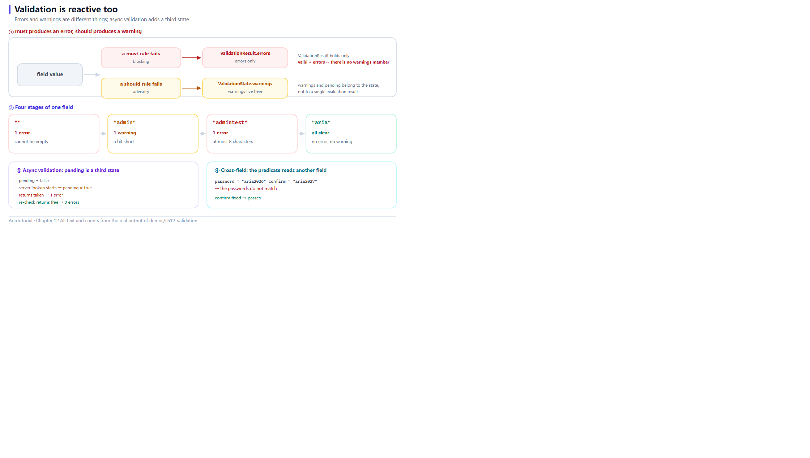

# Validator: Validation Is Reactive Too



*must and should split into two paths, and async validation adds a third state: pending.*

Form validation is usually written like this: take the input, run the rules, stuff the errors into a variable, and let the UI read it.

Aria's `Validator` turns the validation result itself into **reactive state** — it recomputes with the field value and you simply subscribe ✅

---

## 📄 The complete program

```cpp
// ch12: Validator -- 校验也是响应式的
//
// 两个对外类型的区别:
//   ValidationResult -- 只有 valid + errors, 轻量
//   ValidationState  -- 另外带 pending / touched / dirty / warnings
// 需要显示警告或异步状态时, 用 state()。
#include "aria/aria.hpp"

#include <iostream>
#include <string>
#include <vector>

using namespace aria;

int main() {
    std::cout << "== 1. must 产生 error, should 产生 warning ==\n";
    Property<std::string>  name{""};
    Validator<std::string> name_v{name, "user.name"};

    name_v.must([](const std::string& s) { return !s.empty(); }, "不能为空", "not_empty")
          .must([](const std::string& s) { return s.size() <= 8; }, "最多 8 个字符", "max_len")
          .should([](const std::string& s) { return s != "admin"; }, "不建议使用 admin", "avoid_admin");

    auto print_name = [&] {
        const auto& st = name_v.state().get();
        std::cout << "   值 = \"" << name.get() << "\""
                  << ", 错误 " << st.errors.size()
                  << " 条, 警告 " << st.warnings.size() << " 条";
        if (!st.errors.empty()) {
            std::cout << "  首个错误: " << st.errors[0].message;
        }
        std::cout << '\n';
    };

    print_name();
    auto name_sub = name_v.state().on_changed([&](const auto&) { print_name(); });

    std::cout << "   name = \"admin\"\n";
    name = "admin";
    std::cout << "   name = \"admintest\"\n";
    name = "admintest";
    std::cout << "   name = \"aria\"\n";
    name = "aria";

    std::cout << "\n== 2. 按规则 id 精确查询 ==\n";
    const auto& st = name_v.state().get();
    std::cout << "   has_error_with_rule(\"not_empty\") = "
              << (st.has_error_with_rule("not_empty") ? "true" : "false") << '\n';
    std::cout << "   has_error_with_rule(\"max_len\") = "
              << (st.has_error_with_rule("max_len") ? "true" : "false") << '\n';

    std::cout << "\n== 3. 异步校验: pending 状态 ==\n";
    Property<std::string>  user{"aria"};
    Validator<std::string> user_v{user, "user.id"};

    auto print_pending = [&] {
        const auto& s = user_v.state().get();
        std::cout << "   pending = " << (s.pending ? "true" : "false")
                  << ", 错误 " << s.errors.size() << " 条\n";
    };

    print_pending();
    std::cout << "   发起异步校验 (去服务端查重) ...\n";
    user_v.begin_pending();
    print_pending();
    std::cout << "   服务端返回: 已被占用\n";
    user_v.end_pending(std::vector<std::string>{"该用户名已被占用"});
    print_pending();
    std::cout << "   重新查一次, 这次返回可用\n";
    user_v.begin_pending();
    user_v.end_pending();
    print_pending();

    std::cout << "\n== 4. 跨字段: 确认密码要和密码一致 ==\n";
    Property<std::string> password{"aria2026"};
    Property<std::string> confirm{"aria2027"};

    Validator<std::string> confirm_v{confirm, "form.confirm"};
    confirm_v.must([&](const std::string& s) { return s == password.get(); },
                   "两次输入的密码不一致", "match");

    auto print_confirm = [&] {
        const auto& s = confirm_v.state().get();
        std::cout << "   password = \"" << password.get()
                  << "\", confirm = \"" << confirm.get() << "\"  ->  ";
        if (s.errors.empty()) {
            std::cout << "通过";
        } else {
            std::cout << s.errors[0].message;
        }
        std::cout << '\n';
    };

    print_confirm();
    auto confirm_sub = confirm_v.state().on_changed([&](const auto&) { print_confirm(); });

    std::cout << "   confirm 改成 \"aria2026\"\n";
    confirm = "aria2026";

    return 0;
}
```

**Actual output**:

```text
== 1. must 产生 error, should 产生 warning ==
   值 = "", 错误 1 条, 警告 0 条  首个错误: 不能为空
   name = "admin"
   值 = "admin", 错误 0 条, 警告 1 条
   name = "admintest"
   值 = "admintest", 错误 1 条, 警告 0 条  首个错误: 最多 8 个字符
   name = "aria"
   值 = "aria", 错误 0 条, 警告 0 条

== 2. 按规则 id 精确查询 ==
   has_error_with_rule("not_empty") = false
   has_error_with_rule("max_len") = false

== 3. 异步校验: pending 状态 ==
   pending = false, 错误 0 条
   发起异步校验 (去服务端查重) ...
   pending = true, 错误 0 条
   服务端返回: 已被占用
   pending = false, 错误 1 条
   重新查一次, 这次返回可用
   pending = false, 错误 0 条

== 4. 跨字段: 确认密码要和密码一致 ==
   password = "aria2026", confirm = "aria2027"  ->  两次输入的密码不一致
   confirm 改成 "aria2026"
   password = "aria2026", confirm = "aria2026"  ->  通过
```

---

## 1️⃣ must / should: errors and warnings are different things

```cpp
name_v.must(...)    // error: flips the field to invalid
      .should(...)  // warning: does not
```

Three arguments per rule: **predicate**, **message**, **rule id**.

The line that says it best:

```text
   值 = "admin", 错误 0 条, 警告 1 条
```

`admin` passes both `must` rules (non-empty, ≤8 chars) and trips only the `should`. The field is valid with an advisory — exactly how "strongly discouraged but allowed" is expressed 👌

And `admintest`, being too long:

```text
   值 = "admintest", 错误 1 条, 警告 0 条  首个错误: 最多 8 个字符
```

---

## 2️⃣ Validation results are reactive

```cpp
auto name_sub = name_v.state().on_changed([&](const auto&) { print_name(); });
```

Every change to `name` is followed by a fresh validation line — **with no "revalidate on change" code anywhere**.

`state()` returns a `Property<ValidationState>`, so binding it is trivial:

```cpp
engine.bind_text_projected(validator.state(), error_label, [](const ValidationState& st) {
    return st.first_error_message().value_or("");
});
```

Validation stops being a computation and becomes state.

### ValidationState versus ValidationResult

Two public types; do not mix them up:

| Type | Contains |
|---|---|
| `ValidationResult` | `valid`, `errors` — the lightweight one |
| `ValidationState` | Those plus `pending`, `touched`, `dirty`, `warnings` |

**Use `state()` when you need warnings or async status**; `result()` suffices for a plain valid/invalid verdict.

---

## 3️⃣ Querying by rule id

```cpp
st.has_error_with_rule("max_len")
```

Every rule can carry an id (`"not_empty"` / `"max_len"` / `"avoid_admin"` here), so the UI can tell **which rule** failed.

That is far more useful than a boolean "has errors":

- Style a specific rule's message differently → match on id;
- Point the error at a specific input → `errors_for(field_path)`;
- Distinguish "format error" from "business error" → classify by id.

Both lines in the output are `false` because `name` is `"aria"` — non-empty and within 8 characters, so both `must` rules pass.

---

## 4️⃣ Async validation: the pending state

Some validation must ask the server: is this username taken, is this coupon valid. Those have a "checking" intermediate state.

```cpp
user_v.begin_pending();                                 // pending = true
user_v.end_pending(std::vector<std::string>{"该用户名已被占用"});  // land as an error
```

Output:

```text
   pending = false, 错误 0 条
   发起异步校验 (去服务端查重) ...
   pending = true, 错误 0 条      ← the UI can show "checking..."
   服务端返回: 已被占用
   pending = false, 错误 1 条     ← settled into an error
   重新查一次, 这次返回可用
   pending = false, 错误 0 条     ← end_pending() with no argument clears errors
```

The payoff: **the UI needs no `isChecking` flag of its own.** "Checking" and "has errors" are orthogonal states, both living in `state()` ✅

---

## 5️⃣ Cross-field validation: read another field in the predicate

```cpp
confirm_v.must([&](const std::string& s) { return s == password.get(); },
               "两次输入的密码不一致", "match");
```

`s` is **this field's value** (`confirm`), while `password` is captured from outside. Output:

```text
   password = "aria2026", confirm = "aria2027"  ->  两次输入的密码不一致
   confirm 改成 "aria2026"
   password = "aria2026", confirm = "aria2026"  ->  通过
```

One line expresses "these two fields must be equal".

> ⚠️ A detail: reading `password.get()` inside the predicate **registers a dependency**, so when `password` changes this validation invalidates and re-runs — usually exactly what you want (changing the password should re-evaluate the confirmation). If you do *not* want that read tracked, use `reactive::untracked` from Chapter 5.

---

## 6️⃣ touched and dirty: when to show the error

Real forms have a UX problem: **showing red errors before the user has finished typing is annoying.**

`ValidationState` carries `touched` and `dirty` for exactly this:

| Field | Meaning |
|---|---|
| `touched` | Has the user interacted (typically set via `touch()` on focus-out) |
| `dirty` | Has the value moved away from its baseline |

Typical use:

```cpp
if (state.touched && !state.valid) {
    show_error();
}
```

Until the user has actually engaged with the field, a failing rule stays hidden. `reset_touched()` / `reset_dirty()` clear both on submit or reset.

---

## 📌 Summary

- ✅ `must` produces an error (flips `valid`); `should` produces a warning (does not);
- 🔄 `state()` is a `Property<ValidationState>` — **validation is reactive** and can be bound directly;
- 📦 `ValidationResult` is lightweight (`valid` + `errors`); `ValidationState` is the full record;
- 🏷️ Give rules ids to locate failures with `has_error_with_rule()` / `errors_for()`;
- ⏳ `begin_pending()` / `end_pending()` fold async validation into the same state;
- 🔗 Cross-field validation is "read another `Property` in the predicate" — the dependency is tracked automatically.

---

**Previous chapter** 👈 [Chapter 11 — reconcile: Refreshing a List from Fresh Data](11-reconcile.en.md)
**Next chapter** 👉 [Chapter 13 — ViewModel Lifecycle: Activation, Parent-Child, Destroy Hooks](13-viewmodel-lifecycle.en.md)

> 📂 Code from `demos/ch12_validation/main.cpp`. Output is the program's real stdout on Windows / MSVC 19.51.
