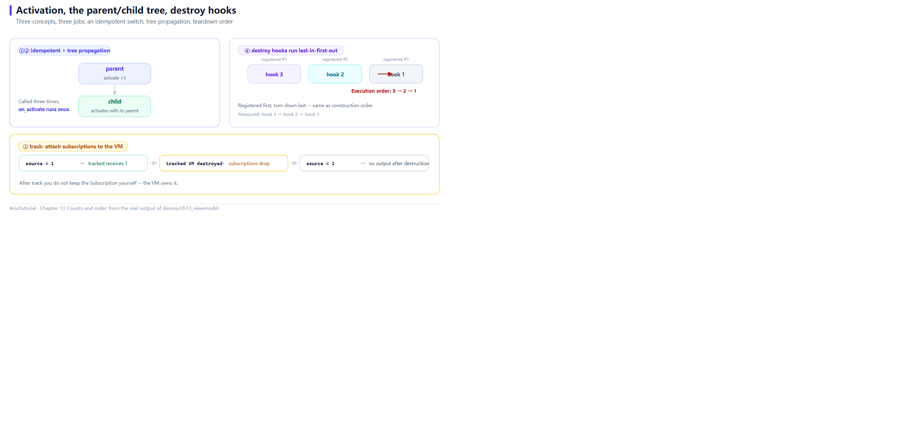

# ViewModel Lifecycle: Activation, Parent-Child, Destroy Hooks



*Activation is idempotent, the tree propagates, and destroy hooks run last-in-first-out.*

The previous twelve chapters were about *how values flow*. This one is about the **container**: whether the ViewModel holding those values has a lifecycle of its own.

It does, and it is deliberately small — no event loop, no heavy framework base class. Just three ideas: **activation, parenthood, destruction** 🧬

---

## ⚠️ A location you must remember

`ViewModel` lives in **`aria::binding`**, not `aria::`:

```cpp
using namespace aria;
using namespace aria::binding;   // ViewModel is here
```

That differs from `Property` / `Computed` (in `aria::`), because a ViewModel is a *binding-layer* concept rather than a reactive-core one.

---

## 📄 The complete program

```cpp
// ch13: ViewModel 生命周期 -- 激活、父子树、销毁钩子
//
// ViewModel 在 aria::binding 命名空间, 不是 aria:: 下的。
#include "aria/aria.hpp"
#include "aria/binding/view_model.hpp"

#include <iostream>
#include <memory>

using namespace aria;
using namespace aria::binding;

class CounterVm : public ViewModel {
public:
    Property<int> count{0};
    int           activate_count   = 0;
    int           deactivate_count = 0;
    const char*   label            = "";

    explicit CounterVm(const char* name) : label{name} {}

protected:
    void on_activate() override {
        ++activate_count;
        std::cout << "   [" << label << "] on_activate  (第 " << activate_count << " 次)\n";
    }
    void on_deactivate() override {
        ++deactivate_count;
        std::cout << "   [" << label << "] on_deactivate (第 " << deactivate_count << " 次)\n";
    }
};

int main() {
    std::cout << "== 1. activate / deactivate 是幂等的 ==\n";
    auto vm = std::make_shared<CounterVm>("counter");
    std::cout << "   初始 is_active = " << (vm->is_active().get() ? "true" : "false") << '\n';

    vm->activate();
    vm->activate();
    vm->activate();
    std::cout << "   连续 activate 三次, on_activate 实际执行 "
              << vm->activate_count << " 次\n";

    std::cout << "\n== 2. 子 VM 随父 VM 一起激活 ==\n";
    auto parent = std::make_shared<CounterVm>("parent");
    auto child  = std::make_shared<CounterVm>("child");
    parent->add_child(child);
    parent->activate();
    std::cout << "   父激活次数 = " << parent->activate_count
              << ", 子激活次数 = " << child->activate_count << '\n';

    std::cout << "\n== 3. track: 把订阅挂在 VM 上, VM 销毁时自动断开 ==\n";
    Property<int> source{0};
    auto tracked = std::make_shared<CounterVm>("tracked");
    tracked->track(source.on_changed([](const int& v) {
        std::cout << "   tracked 收到 " << v << '\n';
    }));

    std::cout << "   source = 1\n";
    source = 1;

    std::cout << "   tracked VM 销毁 ...\n";
    tracked.reset();

    std::cout << "   source = 2\n";
    source = 2;
    std::cout << "   (销毁后不再有输出)\n";

    std::cout << "\n== 4. destroy hook 按后进先出执行 ==\n";
    {
        auto hooked = std::make_shared<CounterVm>("hooked");
        hooked->add_destroy_hook([] { std::cout << "   hook 1 执行\n"; });
        hooked->add_destroy_hook([] { std::cout << "   hook 2 执行\n"; });
        hooked->add_destroy_hook([] { std::cout << "   hook 3 执行\n"; });
        std::cout << "   注册了 3 个 hook, 现在销毁 VM:\n";
    }

    return 0;
}
```

**Actual output**:

```text
== 1. activate / deactivate 是幂等的 ==
   初始 is_active = false
   [counter] on_activate  (第 1 次)
   连续 activate 三次, on_activate 实际执行 1 次

== 2. 子 VM 随父 VM 一起激活 ==
   [parent] on_activate  (第 1 次)
   [child] on_activate  (第 1 次)
   父激活次数 = 1, 子激活次数 = 1

== 3. track: 把订阅挂在 VM 上, VM 销毁时自动断开 ==
   source = 1
   tracked 收到 1
   tracked VM 销毁 ...
   source = 2
   (销毁后不再有输出)

== 4. destroy hook 按后进先出执行 ==
   注册了 3 个 hook, 现在销毁 VM:
   hook 3 执行
   hook 2 执行
   hook 1 执行
```

---

## 1️⃣ activate / deactivate are idempotent

```cpp
vm->activate();
vm->activate();
vm->activate();
```

Output: `连续 activate 三次, on_activate 实际执行 1 次`.

**Idempotence matters** in real projects. UI code often triggers "entering a page" from several places: route entry, window focus, parent relayout. If `on_activate` ran each time, you would get duplicate subscriptions, duplicate requests, doubled counters.

Aria's choice: **the framework owns the state and only notifies you on an actual transition** 🔒

`is_active()` returns a `Property<bool>`, so "is this VM active" is itself reactive state the UI can bind.

---

## 2️⃣ Parent-child: activating a whole subtree at once

```cpp
parent->add_child(child);
parent->activate();
```

Output:

```text
   [parent] on_activate  (第 1 次)
   [child] on_activate  (第 1 次)
   父激活次数 = 1, 子激活次数 = 1
```

Activating the parent activates children automatically. This mirrors real screen hierarchies: a "Settings" page containing Account / Notifications / Privacy; entering Settings should bring the subtree alive.

The parent holds a `shared_ptr` to the child, so **child lifetime needs no separate management** — when the parent goes, nothing references the child either.

---

## 3️⃣ track: hang every subscription on the VM

Chapter 6 introduced `SubscriptionBag` for "store it as a member". `ViewModel` builds that in:

```cpp
tracked->track(source.on_changed([](const int& v) {
    std::cout << "   tracked 收到 " << v << '\n';
}));
```

Output:

```text
   source = 1
   tracked 收到 1
   tracked VM 销毁 ...
   source = 2
   (销毁后不再有输出)
```

After `tracked.reset()`, `source = 2` produces nothing — **the subscription died with the VM**.

The value here: **you never have to remember how many subscriptions a VM registered or when to release each.** Everything registered through `track()` is released when the VM is destroyed.

Real usage is "register in the constructor, never clean up by hand":

```cpp
class HomeVm : public ViewModel {
public:
    HomeVm(SomeService& svc) {
        track(svc.on_data_update([this](const Data& d) { /* ... */ }));
        track(config.on_changed([this](const Config& c) { /* ... */ }));
    }
};
```

---

## 4️⃣ Destroy hooks: last in, first out

```cpp
hooked->add_destroy_hook([] { std::cout << "   hook 1 执行\n"; });
hooked->add_destroy_hook([] { std::cout << "   hook 2 执行\n"; });
hooked->add_destroy_hook([] { std::cout << "   hook 3 执行\n"; });
```

Output:

```text
   hook 3 执行
   hook 2 执行
   hook 1 执行
```

**Last in, first out** 🌀 Consistent with `SubscriptionBag`'s reverse release and with destructor intuition: later-registered things often depend on earlier ones, so they must be torn down first.

Hooks run **before members are destroyed**, which means you can still safely touch `this` inside a hook. The classic use is saving state:

```cpp
class EditorVm : public ViewModel {
public:
    EditorVm() {
        add_destroy_hook([this] { persist_draft(draft.get()); });
    }
    Property<std::string> draft;
};
```

---

## 🧭 What each concept answers

| Concept | Question it answers |
|---|---|
| `activate()` / `deactivate()` | Is this VM alive right now? (drives data loading, polling, timers) |
| `add_child()` | Who lives and dies with whom? |
| `track()` / `add_destroy_hook()` | When this VM dies, what must be torn down? |

---

## 📌 Summary

- 📍 `ViewModel` lives in **`aria::binding`** and needs an explicit include;
- 🔒 `activate()` is idempotent; `on_activate()` runs once per real transition;
- 🧬 `add_child()` builds a parent-child tree; activating the parent activates the subtree;
- 🪢 `track(subscription)` hangs subscriptions on the VM, **released together on destruction**;
- 🌀 `add_destroy_hook()` runs last-in-first-out, before members are destroyed, so `this` is safe to touch.

---

**Previous chapter** 👈 [Chapter 12 — Validator: Validation Is Reactive Too](12-validator.en.md)
**Next chapter** 👉 [Chapter 14 — BindingEngine: Wiring Properties to a UI](14-binding-engine.en.md)

> 📂 Code from `demos/ch13_viewmodel/main.cpp`. Output is the program's real stdout on Windows / MSVC 19.51.
