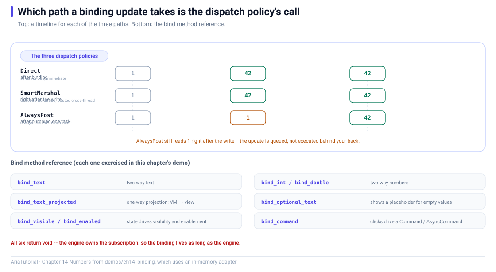

# BindingEngine: Wiring Properties to a UI



*Timelines for the three dispatch policies, plus every bind method exercised in this chapter.*

This is the turning point of the series 🔄 Everything in the previous thirteen chapters — `Property`, `Computed`, `Command`, `ObservableList`, `Validator` — was still just *data*. From here on, data starts **reaching a UI**.

Wiring goes through exactly one class: `BindingEngine`. It knows `IViewAdapter`, which is why switching platforms means switching only the adapter.

---

## 🧪 This chapter uses an invisible UI

Real widgets need Qt6 / UIKit / JNI and cannot run from a command line. So this chapter substitutes an **in-memory adapter**:

```cpp
#include "common/memory_adapter.hpp"   // tutorial in-memory adapter
```

It implements each "widget" as a plain struct:

```cpp
struct MemoryView : public aria::binding::IView {
    std::string text;      // stands in for a QLabel's text
    bool        flag   = false;
    int         integer = 0;
    double      number  = 0.0;
    bool        visible = true;
    bool        enabled = true;
    // ...
};
```

It **draws nothing**, but every binding rule executes for real. So every line of output below reflects genuine binding behaviour — the "widget" just happens to be struct fields. Chapter 16 walks through that adapter line by line.

---

## 📄 The complete program

```cpp
// ch14: BindingEngine -- 把 Property 接到界面
//
// 本章用一个"内存适配器"代替真实控件 (见 common/memory_adapter.hpp),
// 这样在命令行里就能看清绑定的每一条规则。
//
// 注意: 所有 bind_* 都返回 void。订阅由 BindingEngine 自己持有,
//       engine 活着绑定就有效, engine 析构时统一解绑。
#include "aria/aria.hpp"
#include "aria/binding/binding_engine.hpp"
#include "aria/runtime/dispatcher.hpp"

#include "common/memory_adapter.hpp"

#include <iostream>
#include <memory>
#include <optional>
#include <string>

using namespace aria;
using namespace aria::binding;
using tutorial::MemoryAdapter;
using tutorial::MemoryView;

static const char* yes_no(bool v) { return v ? "true" : "false"; }

int main() {
    auto adapter = std::make_shared<MemoryAdapter>();
    BindingEngine engine{adapter};

    std::cout << "平台: " << adapter->platform_name() << '\n';

    std::cout << "\n== 1. bind_text: 双向文本 ==\n";
    Property<std::string> name{"Aria"};
    MemoryView name_view;

    engine.bind_text(name, name_view);

    std::cout << "   绑定后 view.text = \"" << name_view.text << "\"\n";
    name = "Hello";
    std::cout << "   VM 改值   -> view.text = \"" << name_view.text << "\"\n";
    name_view.user_type("World");
    std::cout << "   用户输入  -> VM = \"" << name.get() << "\"\n";

    std::cout << "\n== 2. bind_int / bind_double: 数值双向 ==\n";
    Property<int>    count{3};
    Property<double> ratio{0.5};
    MemoryView count_view;
    MemoryView ratio_view;

    engine.bind_int(count, count_view);
    engine.bind_double(ratio, ratio_view);

    std::cout << "   count = " << count.get()
              << " -> view.integer = " << count_view.integer << '\n';
    std::cout << "   ratio = " << ratio.get()
              << " -> view.number  = " << ratio_view.number << '\n';

    count = 7;
    std::cout << "   count = 7 -> view.integer = " << count_view.integer << '\n';

    std::cout << "\n== 3. bind_text_projected: 单向投影 ==\n";
    Property<int> amount{100};
    MemoryView label_view;

    engine.bind_text_projected(amount, label_view, [](int v) {
        return std::string("¥") + std::to_string(v) + ".00";
    });

    std::cout << "   label = \"" << label_view.text << "\"\n";
    amount = 250;
    std::cout << "   amount = 250 -> label = \"" << label_view.text << "\"\n";

    std::cout << "\n== 4. bind_optional_text: 空值也要显示 ==\n";
    Property<std::optional<std::string>> nickname{std::nullopt};
    MemoryView nick_view;

    engine.bind_optional_text(
        nickname, nick_view,
        [](const std::string& s) { return std::string("你好, ") + s; },
        std::string("(还没设置昵称)"));

    std::cout << "   空值 -> \"" << nick_view.text << "\"\n";
    nickname = std::string("谦哥");
    std::cout << "   有值 -> \"" << nick_view.text << "\"\n";

    std::cout << "\n== 5. bind_visible / bind_enabled ==\n";
    Property<bool> loading{true};
    MemoryView panel_view;

    engine.bind_visible(loading, panel_view);

    std::cout << "   loading = true  -> panel.visible = " << yes_no(panel_view.visible) << '\n';
    loading = false;
    std::cout << "   loading = false -> panel.visible = " << yes_no(panel_view.visible) << '\n';

    Property<bool> can_submit{false};
    MemoryView button_view;

    engine.bind_enabled(can_submit, button_view);

    std::cout << "   can_submit = false -> button.enabled = " << yes_no(button_view.enabled) << '\n';
    can_submit = true;
    std::cout << "   can_submit = true  -> button.enabled = " << yes_no(button_view.enabled) << '\n';

    std::cout << "\n== 6. bind_command: 按钮点击 ==\n";
    int clicks = 0;
    Command<> refresh([&] { ++clicks; });
    MemoryView refresh_button;

    engine.bind_command(refresh, refresh_button);

    refresh_button.user_click();
    std::cout << "   点一次   -> clicks = " << clicks << '\n';
    refresh_button.user_click();
    std::cout << "   再点一次 -> clicks = " << clicks << '\n';

    std::cout << "\n== 7. 三种派发策略 ==\n";
    auto dispatcher = std::make_shared<runtime::SimpleDispatcher>();

    auto direct_adapter = std::make_shared<MemoryAdapter>();
    BindingEngine direct_engine{direct_adapter, dispatcher,
                                BindingEngine::DispatchPolicy::Direct};

    auto posted_adapter = std::make_shared<MemoryAdapter>();
    BindingEngine posted_engine{posted_adapter, dispatcher,
                                BindingEngine::DispatchPolicy::AlwaysPost};

    Property<int> value{1};
    MemoryView direct_view;
    MemoryView posted_view;

    direct_engine.bind_int(value, direct_view);
    posted_engine.bind_int(value, posted_view);

    std::cout << "   绑定后       : direct = " << direct_view.integer
              << ", posted = " << posted_view.integer << '\n';

    value = 42;
    std::cout << "   改值后立刻   : direct = " << direct_view.integer
              << ", posted = " << posted_view.integer
              << "   (AlwaysPost 还在队列里)\n";

    const std::size_t processed = dispatcher->pump();
    std::cout << "   pump " << processed << " 条后: posted = " << posted_view.integer << '\n';

    return 0;
}
```

**Actual output**:

```text
平台: Memory

== 1. bind_text: 双向文本 ==
   绑定后 view.text = "Aria"
   VM 改值   -> view.text = "Hello"
   用户输入  -> VM = "World"

== 2. bind_int / bind_double: 数值双向 ==
   count = 3 -> view.integer = 3
   ratio = 0.5 -> view.number  = 0.5
   count = 7 -> view.integer = 7

== 3. bind_text_projected: 单向投影 ==
   label = "¥100.00"
   amount = 250 -> label = "¥250.00"

== 4. bind_optional_text: 空值也要显示 ==
   空值 -> "(还没设置昵称)"
   有值 -> "你好, 谦哥"

== 5. bind_visible / bind_enabled ==
   loading = true  -> panel.visible = true
   loading = false -> panel.visible = false
   can_submit = false -> button.enabled = false
   can_submit = true  -> button.enabled = true

== 6. bind_command: 按钮点击 ==
   点一次   -> clicks = 1
   再点一次 -> clicks = 2

== 7. 三种派发策略 ==
   绑定后       : direct = 1, posted = 1
   改值后立刻   : direct = 42, posted = 1   (AlwaysPost 还在队列里)
   pump 1 条后: posted = 42
```

---

## ⚠️ First thing to be clear about: `bind_*` returns `void`

```cpp
engine.bind_text(name, name_view);   // no return value
```

Contrast Chapter 2's `label.bind(fn)` — that one returns a `Subscription` you must keep. **These `bind_*` calls return nothing.**

Why: ownership of the subscription sits with the `BindingEngine`. The engine lives, the binding lives; the engine dies, every binding is released.

```cpp
{
    BindingEngine engine{adapter};
    engine.bind_text(name, view);
}   // engine destroyed, binding over
```

So you neither need nor can write `auto sub = engine.bind_text(...)` — `void` cannot initialise a variable.

---

## 1️⃣ Two-way binding: change either side

```cpp
engine.bind_text(name, name_view);
```

Output:

```text
   绑定后 view.text = "Aria"         ← one immediate sync at registration
   VM 改值   -> view.text = "Hello"   ← VM → widget
   用户输入  -> VM = "World"          ← widget → VM
```

Note the first line: **the widget receives its value the moment binding completes** — the same initial-sync design as `bind`.

### How the feedback loop is avoided

A widget writing back to the VM triggers the VM's subscription, which would push to the widget again — infinite. Aria breaks it internally with a source marker: **a change that originated from the widget is not pushed back to the widget.**

That is why two-way binding is safe on a text field.

### Numeric types

`bind_int` / `bind_bool` / `bind_double` / `bind_int64` / `bind_uint64` / `bind_float` all bind both ways.

---

## 2️⃣ One-way projection: read-only display

```cpp
engine.bind_text_projected(amount, label_view, [](int v) {
    return std::string("¥") + std::to_string(v) + ".00";
});
```

The third parameter is a **projection function**: model value in, display text out. It accepts both `Property` and `Computed` sources.

⚠️ Projection is one-way by nature. `bind_text` requires a `Property` source (it must be able to write back); passing a `Computed` fails at compile time — deliberately, since a read-only derived value should never be written by a widget.

### Optional handling

```cpp
engine.bind_optional_text(nickname, nick_view,
    [](const std::string& s) { return std::string("你好, ") + s; },
    std::string("(还没设置昵称)"));
```

An `std::optional<T>` source paired with placeholder text for the empty case:

```text
   空值 -> "(还没设置昵称)"
   有值 -> "你好, 谦哥"
```

No hand-written `if (has_value())` branch.

---

## 3️⃣ visible / enabled: state driving presentation

```cpp
engine.bind_visible(loading, panel_view);      // loading = true → visible
engine.bind_enabled(can_submit, button_view);  // can_submit = true → enabled
```

Real projects usually bind a `Computed`:

```cpp
Computed<bool> show_error = [&] { return !name.get().empty() && !valid.get(); };
engine.bind_visible(show_error, error_label);
```

Now "when does the error appear" is a pure rule, independent of the widget.

---

## 4️⃣ bind_command: routing clicks to actions

```cpp
engine.bind_command(refresh, refresh_button);
refresh_button.user_click();   // simulate a user click
```

`bind_command` also **writes the widget's `enabled`** once, taken from `Command::can_execute`. That is why Chapter 20 wires a button like this:

```cpp
engine.bind_command(vm.add, add_button);       // command first
engine.bind_enabled(vm.can_add, add_button);   // state second — this one wins
```

**The later binding decides the final `enabled` value** — an ordering detail significant enough that Aria's own test suite pins it.

---

## 5️⃣ Three dispatch policies: which path binding updates take

```cpp
BindingEngine direct_engine{adapter, dispatcher, DispatchPolicy::Direct};
BindingEngine posted_engine{adapter, dispatcher, DispatchPolicy::AlwaysPost};
```

Output:

```text
   绑定后       : direct = 1, posted = 1
   改值后立刻   : direct = 42, posted = 1   (AlwaysPost 还在队列里)
   pump 1 条后: posted = 42
```

After the write and before `pump()`, `direct` is already 42 while `posted` is still 1 — **`AlwaysPost` put the update on a queue**, to be executed when the host thread pumps.

| Policy | Behaviour | When to use |
|---|---|---|
| `Direct` | Write the widget immediately on the calling thread | Single-threaded, provably same thread |
| `SmartMarshal` (default) | Write directly on the same thread; post only when crossing threads | The right default |
| `AlwaysPost` | Always queue, executed by the host thread | Force UI-thread serialisation, most conservative |

`SmartMarshal` is the default because it balances performance and thread safety: **write directly when it is safe, queue only when it is not**.

---

## 🧭 Bind method reference

| Method | Direction | Notes |
|---|---|---|
| `bind_text` / `bind_int` / `bind_bool` / `bind_double` / `bind_int64` / `bind_uint64` / `bind_float` | Two-way | Source must be a `Property` |
| `bind_*_oneway` (e.g. `bind_text_oneway`) | One-way | Source may be a `Computed` |
| `bind_text_projected` | One-way | With a projection function — the most used |
| `bind_optional_text` | One-way | `optional` source with a placeholder |
| `bind_text_converted` / `bind_int_converted` | Two-way | Round-trips through a `Converter` |
| `bind_visible` / `bind_enabled` | One-way | Boolean drives presentation |
| `bind_command` | — | Click binding; also writes `enabled` once |

---

## 📌 Summary

- 🔌 Wiring is three steps: create an adapter → create a `BindingEngine` → `bind_*`;
- 🚫 **`bind_*` returns `void`**; the engine owns the subscriptions and releases them on destruction;
- ↔️ Two-way binding suppresses feedback loops, so widget writes are not pushed back;
- 📊 `bind_text_projected` is the workhorse: one-way plus a projection function;
- 🎯 `bind_command` also writes `enabled` once — mind the **order** relative to `bind_enabled`;
- 🚚 Of the three dispatch policies, the default `SmartMarshal` balances performance and thread safety.

---

**Previous chapter** 👈 [Chapter 13 — ViewModel Lifecycle: Activation, Parent-Child, Destroy Hooks](13-viewmodel-lifecycle.en.md)
**Next chapter** 👉 [Chapter 15 — The Adapter Layer: One ViewModel, Five UIs](15-adapter-layer.en.md)

> 📂 Code from `demos/ch14_binding/main.cpp`. Output is the program's real stdout on Windows / MSVC 19.51.
