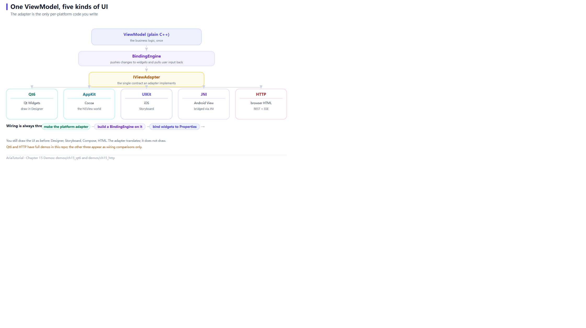

# The Adapter Layer: One ViewModel, Five UIs



*One ViewModel to five kinds of UI, with only BindingEngine and IViewAdapter in between.*

By now two of Aria's three layers are covered: the **reactive core** (Chapters 3-8) and the **binding layer** (Chapter 14). The last one is the **adapter** 🔌

The adapter is Aria's only contact surface with the outside world. It translates "set this text", "read that checkbox", "listen for a click" into a specific platform's API — and `BindingEngine` knows only one interface: `IViewAdapter`.

---

## 🗺️ Five adapters at a glance

| Platform | Adapter | UI written with | Status |
|---|---|---|---|
| Windows / macOS / Linux | `aria::adapters::qt6::QtAdapter` | Qt Designer / code | Available |
| macOS native | `aria::adapters::appkit::AppKitAdapter` | Storyboard / XIB | Available |
| iOS | `aria::adapters::uikit::UIKitAdapter` | Storyboard / SwiftUI host | Available |
| Android | `aria::adapters::jni::JniAdapter` | Kotlin / Compose | Available |
| Web (server-driven) | `aria::adapters::http::HttpAdapter` | Plain HTML / JS | Available |

**Wiring is always the same three steps:**

```
① create the platform adapter → ② build a BindingEngine with it → ③ bind widgets to Properties
```

Below are the two that are easiest to get running: Qt6 and HTTP.

> ⚠️ **Both demos need extra dependencies and are excluded from the default build.** This tutorial's automated checks do not cover their runtime output either. See the end of this chapter for how to enable them.

---

## 🖥️ Qt6: still drag your UI in Designer

```cpp
// ch15: Qt6 适配器 -- 界面照旧用 Designer 拖, C++ 只负责接线
//
// 本示例需要 Qt6, 默认不参与构建。开启方式:
//
//   cmake -S . -B build -DARIA_ROOT=<Aria 源码树> \
//         -DARIA_TUTORIAL_QT6=ON \
//         -DCMAKE_PREFIX_PATH=<Qt6 安装路径>
//   cmake --build build
//
// 界面部分就是普通的 Qt 控件, 和 Aria 没有任何关系。Aria 只做一件事:
// 把已经存在的控件交给 BindingEngine。
#include "aria/adapters/qt6/qt_adapter.hpp"
#include "aria/aria.hpp"
#include "aria/binding/binding_engine.hpp"

#include <QApplication>
#include <QLabel>
#include <QPushButton>
#include <QVBoxLayout>
#include <QWidget>

#include <iostream>
#include <memory>
#include <string>

using namespace aria;
using namespace aria::adapters::qt6;

// ---------------------------------------------------------------------------
// 业务逻辑: 纯 C++, 不认识 Qt
// ---------------------------------------------------------------------------
struct TipViewModel {
    Property<double> bill{200.0};    // 账单总额
    Property<int>    people{2};      // 分摊人数

    Computed<double> per_person{[&] { return bill.get() / people.get(); }};
    Computed<bool>   can_settle{[&] { return people.get() > 0; }};   // 除零保护
};

int main(int argc, char** argv) {
    QApplication app(argc, argv);

    // ---- 上半: 界面。和写普通 Qt 程序完全一样 ----
    QWidget window;
    auto* layout     = new QVBoxLayout{&window};
    auto* title      = new QLabel{QString::fromUtf8("AA 制摊分"), &window};
    auto* per_person = new QLabel{&window};
    auto* settle     = new QPushButton{QString::fromUtf8("摊分"), &window};

    layout->addWidget(title);
    layout->addWidget(per_person);
    layout->addWidget(settle);
    window.resize(320, 160);

    // ---- 下半: 接线。三步, 每个平台都一样 ----
    // 1) 造平台适配器
    auto adapter = std::make_shared<QtAdapter>();
    // 2) 用它造 BindingEngine
    binding::BindingEngine engine{adapter};

    TipViewModel vm;
    int settles = 0;
    Command<> do_settle{[&] { ++settles; }};

    // 3) 把控件和 Property 绑上
    engine.bind_text_projected(vm.per_person, adapter->view_for(per_person),
        [](double v) {
            return QString::fromUtf8("每人付: ¥ %1").arg(v, 0, 'f', 2).toStdString();
        });
    engine.bind_enabled(vm.can_settle, adapter->view_for(settle));
    engine.bind_command(do_settle, adapter->view_for(settle));

    // ---- 之后只改数据, 界面自己跟着变 ----
    vm.people = 4;      // 标签 -> 每人付: ¥ 50.00
    vm.bill   = 90.0;   // 标签 -> 每人付: ¥ 22.50

    std::cout << "窗口已显示。当前每人应付 "
              << vm.per_person.get() << " 元。关掉窗口结束程序。\n";

    window.show();
    return app.exec();
}
```

### Three details worth noting

**1. `adapter->view_for(qobject)` is the only new thing**

```cpp
engine.bind_text_projected(vm.per_person, adapter->view_for(per_person), ...);
```

`view_for` wraps a `QObject*` into an `IView` Aria understands. **Repeated calls on the same QObject return the same wrapper**, so you can reuse it across bindings.

**2. The UI code is completely unchanged**

```cpp
auto* settle = new QPushButton{QString::fromUtf8("摊分"), &window};
```

That line is ordinary Qt. **Aria never asks you to change how widgets are created** — only to hand them to the engine once they exist.

**3. No Qt anywhere in the business logic**

```cpp
struct TipViewModel {
    Property<double> bill{200.0};
    Property<int>    people{2};
    Computed<double> per_person{[&] { return bill.get() / people.get(); }};
    Computed<bool>   can_settle{[&] { return people.get() > 0; }};
};
```

This struct compiles and tests without Qt. `can_settle` is the divide-by-zero guard — and it is also bound to the button's `enabled`, so the rule "cannot settle when headcount is zero" is expressed **in the ViewModel**, with the UI merely reflecting it.

---

## 🌐 HTTP: the browser as the UI

This is Aria's most unusual adapter. There is no C++ in the browser; the front end is plain HTML/JS and **C++ runs on the server**. Changes go out over SSE, user input comes back over REST.

```cpp
// ch15: HTTP 适配器 -- 把浏览器当界面
//
// 本示例需要启用 Aria 的 HTTP 适配器, 默认不参与构建:
//
//   cmake -S . -B build -DARIA_ROOT=<Aria 源码树> -DARIA_TUTORIAL_HTTP=ON
//   cmake --build build
//
// 这是 Aria 最特别的一个适配器: 浏览器里没有 C++, 前端就是普通 HTML/JS,
// C++ 跑在服务端。Property 的变化经 SSE 推给浏览器, 用户操作经 REST 回来。
#include "aria/adapters/http/http_adapter.hpp"
#include "aria/aria.hpp"
#include "aria/binding/binding_engine.hpp"
#include "aria/runtime/dispatcher.hpp"

#include <iostream>
#include <memory>
#include <string>

using namespace aria;
using namespace aria::adapters::http;

int main() {
    HttpAdapterConfig config;
    config.port           = 9090;   // 0 表示让系统分配一个空闲端口
    config.worker_threads = 4;

    auto http       = std::make_shared<HttpAdapter>(config);
    auto dispatcher = std::make_shared<runtime::SimpleDispatcher>();

    // ---- 业务逻辑: 依然是纯 C++ ----
    Property<std::string> message{"你好, Aria"};

    // ---- 接线 ----
    binding::BindingEngine engine{http, dispatcher,
        binding::BindingEngine::DispatchPolicy::SmartMarshal};

    // 浏览器里的"控件"在这里是字符串 ID, 对应前端页面上 id="title" 的元素
    auto& title = http->register_view("title", "text");
    engine.bind_text(message, title);

    if (!http->start()) {
        std::cerr << "服务启动失败\n";
        return 1;
    }

    std::cout << "服务已启动。\n";
    std::cout << "在浏览器打开: http://127.0.0.1:" << http->actual_port() << "\n";
    std::cout << "\n";
    std::cout << "在下面输入新内容并回车, 页面会立刻更新 (走 SSE 推送):\n";

    std::string line;
    while (std::getline(std::cin, line)) {
        if (line.empty()) {
            break;
        }
        message = line;                       // 只改数据, 推送由框架完成
        dispatcher->pump();                   // 宿主负责在 graph 线程上泵消息
        std::cout << "已推送: " << message.get() << '\n';
    }

    http->stop();
    std::cout << "服务已停止。\n";
    return 0;
}
```

### Three points

**1. A "widget" is a string id**

```cpp
auto& title = http->register_view("title", "text");
```

There are no C++ objects in the browser, so a widget's identity is a string matching an element with `id="title"` on the page. The second argument declares which channel it supports.

**2. The host pumps**

```cpp
message = line;
dispatcher->pump();
```

The reactive graph is single-threaded (Chapter 3's hard constraint), so the host must provide a graph thread — here, the `pump()` call in the main loop. In a GUI program that is the event loop; on a server it is the host dispatch loop.

**3. The browser side knows nothing about Aria**

The front end is plain HTML plus a small SSE handler. Aria pushes changes from the server; the page has no idea what a `Property` is.

> 💡 The value here: **for demos, internal tools, or a web front end backed by C++ compute, you write no front-end framework code at all.**

---

## 📱 AppKit / UIKit / JNI: what the wiring looks like

These three are outside this tutorial's runtime verification (the machine is Windows), but their wiring is **structurally identical to Qt6** — only the wrapper types differ:

**macOS / AppKit**

```cpp
auto adapter = std::make_shared<aria::adapters::appkit::AppKitAdapter>();
aria::binding::BindingEngine engine(adapter, ui_dispatcher,
    aria::binding::BindingEngine::DispatchPolicy::SmartMarshal);

auto label = std::make_shared<aria::adapters::appkit::AppKitView>(self.totalField);
engine.bind_text_projected(vm.per_person, *label,
    [](double v) { return std::format("¥{:.2f}", v); });
```

**iOS / UIKit**

```cpp
auto adapter = std::make_shared<aria::adapters::uikit::UIKitAdapter>();
aria::binding::BindingEngine engine(adapter, ui_dispatcher,
    aria::binding::BindingEngine::DispatchPolicy::SmartMarshal);

auto label = std::make_shared<aria::adapters::uikit::UIKitView>(self.totalLabel);
engine.bind_text_projected(vm.per_person, *label,
    [](double v) { return std::format("¥{:.2f}", v); });
```

**Android / JNI**

```cpp
auto adapter = std::make_shared<aria::adapters::jni::JniAdapter>(env);
aria::binding::BindingEngine engine(adapter);

aria::adapters::jni::JniView total_view(env, total_text_view);
engine.bind_text_projected(vm.per_person, total_view,
    [](double v) { return std::format("¥{:.2f}", v); });
```

Put side by side, **only the type names differ**:

| Platform | Adapter type | Wrap function | Needs a dispatcher |
|---|---|---|---|
| Qt6 | `QtAdapter` | `view_for(QObject*)` | No (same thread by default) |
| AppKit | `AppKitAdapter` | `AppKitView(NSView*)` | Yes (`SmartMarshal`) |
| UIKit | `UIKitAdapter` | `UIKitView(UIView*)` | Yes (`SmartMarshal`) |
| JNI | `JniAdapter(env)` | `JniView(env, View)` | No (already on the UI thread) |
| HTTP | `HttpAdapter(config)` | `register_view(id, kind)` | Yes (hosts the graph thread) |

And those `TipViewModel` / `BillViewModel` structs **do not change a single character** ✅

### Why this tutorial does not expand each one

AppKit, UIKit, and JNI require building on their respective platforms. This tutorial's rule is "**every chapter has a demo that actually runs**", so:

- Verifiable on Windows (core, binding, and HTTP beyond Qt6) → a complete runnable demo;
- Verifiable only on macOS / iOS / Android → wiring code and a comparison table, **without pretending it was verified**.

Full usage for those three lives in Aria's official `docs/guide/adapters/`.

---

## 🔌 IViewAdapter: the single contract

All five implement one interface. Its methods fall into groups:

| Group | Methods |
|---|---|
| Text | `set_text` / `get_text` / `on_text_changed` |
| Numeric | `set_bool` / `set_int` / `set_int64` / `set_uint64` / `set_float` / `set_double`, each with `get_*` / `on_*_changed` |
| Presentation | `set_visible` / `set_enabled` |
| Events | `on_click` |
| Identity | `platform_name` |

That is **25 pure virtual functions** — the right width for the first-party adapters that support everything. If you only need a few, derive from `ViewAdapterBase` instead, which is Chapter 16's subject.

---

## 🛠️ Enabling this chapter's two demos

Both are excluded from the default build and must be turned on explicitly:

**Qt6**

```bash
cmake -S . -B build -DARIA_ROOT=../Aria \
      -DARIA_TUTORIAL_QT6=ON \
      -DCMAKE_PREFIX_PATH=/path/to/Qt/6.x.x/msvc2022_64
cmake --build build
./build/bin/ch15_qt6
```

**HTTP**

```bash
cmake -S . -B build -DARIA_ROOT=../Aria -DARIA_TUTORIAL_HTTP=ON
cmake --build build
./build/bin/ch15_http      # then open http://127.0.0.1:9090
```

Configure prints which chapter is enabled and which is skipped:

```text
-- AriaTutorial: 第 15 章 Qt6 示例已启用
-- AriaTutorial: 跳过 ch15_http -- 需要 -DARIA_TUTORIAL_HTTP=ON
```

---

## 📌 Summary

- 🔌 Wiring is always three steps; switching platforms touches only the first;
- 🖥️ Qt6's `view_for(QObject*)` hands existing widgets to the engine — **no UI code changes**;
- 🌐 The HTTP adapter turns "widgets" into string ids; the browser side is plain HTML/JS with C++ on the server;
- 📱 AppKit / UIKit / JNI wiring is structurally identical to Qt6; only the wrapper type names differ;
- 🎯 `IViewAdapter` is the single contract (25 pure virtuals); implement fewer via `ViewAdapterBase` (next chapter).

---

**Previous chapter** 👈 [Chapter 14 — BindingEngine: Wiring Properties to a UI](14-binding-engine.en.md)
**Next chapter** 👉 [Chapter 16 — Writing Your Own IViewAdapter: From 25 Pure Virtuals to 5](16-writing-an-adapter.en.md)

> 📂 Code from `demos/ch15_qt6/main.cpp` and `demos/ch15_http/main.cpp`. Both need Qt6 / the Aria HTTP module and are excluded from the default build, so this chapter provides no runtime output.
