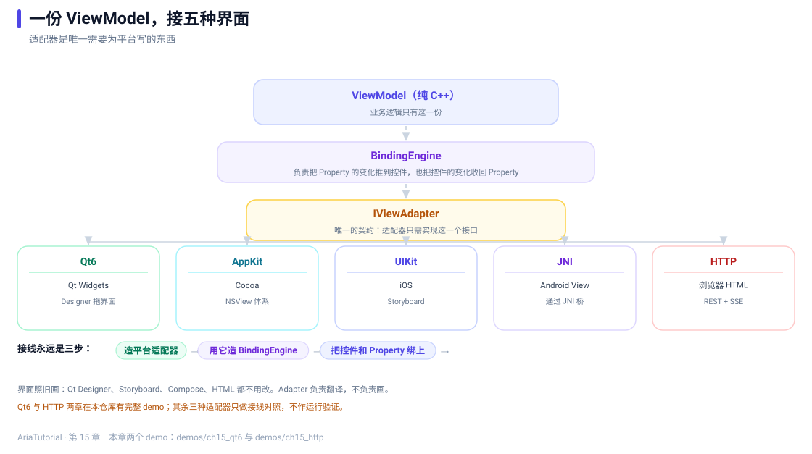

# 适配器体系：一份 ViewModel 接五种界面



*一份 ViewModel 到五种界面：中间只有 BindingEngine 和 IViewAdapter 两站。*

到这里，Aria 的三层已经讲完两层：**响应式核心**（第 3-8 章）和**绑定层**（第 14 章）。剩下最后一层：**适配器** 🔌

适配器是 Aria 与外界唯一的接触面。它把"设置文本""读取勾选状态""监听点击"这些动作翻译成具体平台的 API —— 而 `BindingEngine` 只认 `IViewAdapter` 这一个接口。

---

## 🗺️ 五种适配器一览

| 平台 | 适配器 | 界面用什么写 | 状态 |
|---|---|---|---|
| Windows / macOS / Linux | `aria::adapters::qt6::QtAdapter` | Qt Designer / 代码 | 可用 |
| macOS 原生 | `aria::adapters::appkit::AppKitAdapter` | Storyboard / XIB | 可用 |
| iOS | `aria::adapters::uikit::UIKitAdapter` | Storyboard / SwiftUI 宿主 | 可用 |
| Android | `aria::adapters::jni::JniAdapter` | Kotlin / Compose | 可用 |
| Web（服务端驱动） | `aria::adapters::http::HttpAdapter` | 普通 HTML / JS | 可用 |

**接线永远是同样的三步**：

```
① 造平台适配器 → ② 用它造 BindingEngine → ③ 把控件和 Property 绑上
```

下面分别看两个能实际跑起来、也最容易上手的：Qt6 和 HTTP。

> ⚠️ **本章的两个示例需要额外依赖，默认不参与构建**，本教程的自动校验也未覆盖它们的运行输出。启用方式见文末。

---

## 🖥️ Qt6：界面照旧用 Designer 拖

```cpp
// ch15: Qt6 适配器 -- 界面照旧用 Designer 拖, C++ 只负责接线
//
// 本示例需要 Qt6, 默认不参与构建。开启方式:
//
//   cmake -S . -B build -DARIA_ROOT=<Aria 源码树> \
//         -DARIA_TUTORIAL_QT6=ON \
//         -DCMAKE_PREFIX_PATH=<Qt6 安装路径>
//   cmake --build build
//
// 界面部分就是普通的 Qt 控件, 和 Aria 没有任何关系。Aria 只做一件事:
// 把已经存在的控件交给 BindingEngine。
#include "aria/adapters/qt6/qt_adapter.hpp"
#include "aria/aria.hpp"
#include "aria/binding/binding_engine.hpp"

#include <QApplication>
#include <QLabel>
#include <QPushButton>
#include <QVBoxLayout>
#include <QWidget>

#include <iostream>
#include <memory>
#include <string>

using namespace aria;
using namespace aria::adapters::qt6;

// ---------------------------------------------------------------------------
// 业务逻辑: 纯 C++, 不认识 Qt
// ---------------------------------------------------------------------------
struct TipViewModel {
    Property<double> bill{200.0};    // 账单总额
    Property<int>    people{2};      // 分摊人数

    Computed<double> per_person{[&] { return bill.get() / people.get(); }};
    Computed<bool>   can_settle{[&] { return people.get() > 0; }};   // 除零保护
};

int main(int argc, char** argv) {
    QApplication app(argc, argv);

    // ---- 上半: 界面。和写普通 Qt 程序完全一样 ----
    QWidget window;
    auto* layout     = new QVBoxLayout{&window};
    auto* title      = new QLabel{QString::fromUtf8("AA 制摊分"), &window};
    auto* per_person = new QLabel{&window};
    auto* settle     = new QPushButton{QString::fromUtf8("摊分"), &window};

    layout->addWidget(title);
    layout->addWidget(per_person);
    layout->addWidget(settle);
    window.resize(320, 160);

    // ---- 下半: 接线。三步, 每个平台都一样 ----
    // 1) 造平台适配器
    auto adapter = std::make_shared<QtAdapter>();
    // 2) 用它造 BindingEngine
    binding::BindingEngine engine{adapter};

    TipViewModel vm;
    int settles = 0;
    Command<> do_settle{[&] { ++settles; }};

    // 3) 把控件和 Property 绑上
    engine.bind_text_projected(vm.per_person, adapter->view_for(per_person),
        [](double v) {
            return QString::fromUtf8("每人付: ¥ %1").arg(v, 0, 'f', 2).toStdString();
        });
    engine.bind_enabled(vm.can_settle, adapter->view_for(settle));
    engine.bind_command(do_settle, adapter->view_for(settle));

    // ---- 之后只改数据, 界面自己跟着变 ----
    vm.people = 4;      // 标签 -> 每人付: ¥ 50.00
    vm.bill   = 90.0;   // 标签 -> 每人付: ¥ 22.50

    std::cout << "窗口已显示。当前每人应付 "
              << vm.per_person.get() << " 元。关掉窗口结束程序。\n";

    window.show();
    return app.exec();
}
```

### 三个值得注意的细节

**1. `adapter->view_for(qobject)` 是唯一的新东西**

```cpp
engine.bind_text_projected(vm.per_person, adapter->view_for(per_person), ...);
```

`view_for` 把一个 `QObject*` 包成 Aria 能识别的 `IView`。**同一个 QObject 重复调用返回同一个包装**，所以你可以在多个绑定里复用。

**2. 界面部分完全没变**

```cpp
auto* settle = new QPushButton{QString::fromUtf8("摊分"), &window};
```

这行和写普通 Qt 程序一模一样。**Aria 不要求你换控件的创建方式** —— 它只要求你在控件建好之后，把它交给 engine。

**3. 业务逻辑里没有一行 Qt**

```cpp
struct TipViewModel {
    Property<double> bill{200.0};
    Property<int>    people{2};
    Computed<double> per_person{[&] { return bill.get() / people.get(); }};
    Computed<bool>   can_settle{[&] { return people.get() > 0; }};
};
```

这个 struct 可以脱离 Qt 编译和测试。`can_settle` 是除零保护 —— 它同时也绑到了按钮的 `enabled` 上，所以"人数为 0 时不能点摊分"这条业务规则**在 ViewModel 里就表达完了**，界面只是反映它。

---

## 🌐 HTTP：把浏览器当界面

这是 Aria 最特别的一个适配器。浏览器里没有 C++，前端就是普通 HTML/JS，**C++ 跑在服务端**。数据变化经 SSE 推给浏览器，用户操作经 REST 回来。

```cpp
// ch15: HTTP 适配器 -- 把浏览器当界面
//
// 本示例需要启用 Aria 的 HTTP 适配器, 默认不参与构建:
//
//   cmake -S . -B build -DARIA_ROOT=<Aria 源码树> -DARIA_TUTORIAL_HTTP=ON
//   cmake --build build
//
// 这是 Aria 最特别的一个适配器: 浏览器里没有 C++, 前端就是普通 HTML/JS,
// C++ 跑在服务端。Property 的变化经 SSE 推给浏览器, 用户操作经 REST 回来。
#include "aria/adapters/http/http_adapter.hpp"
#include "aria/aria.hpp"
#include "aria/binding/binding_engine.hpp"
#include "aria/runtime/dispatcher.hpp"

#include <iostream>
#include <memory>
#include <string>

using namespace aria;
using namespace aria::adapters::http;

int main() {
    HttpAdapterConfig config;
    config.port           = 9090;   // 0 表示让系统分配一个空闲端口
    config.worker_threads = 4;

    auto http       = std::make_shared<HttpAdapter>(config);
    auto dispatcher = std::make_shared<runtime::SimpleDispatcher>();

    // ---- 业务逻辑: 依然是纯 C++ ----
    Property<std::string> message{"你好, Aria"};

    // ---- 接线 ----
    binding::BindingEngine engine{http, dispatcher,
        binding::BindingEngine::DispatchPolicy::SmartMarshal};

    // 浏览器里的"控件"在这里是字符串 ID, 对应前端页面上 id="title" 的元素
    auto& title = http->register_view("title", "text");
    engine.bind_text(message, title);

    if (!http->start()) {
        std::cerr << "服务启动失败\n";
        return 1;
    }

    std::cout << "服务已启动。\n";
    std::cout << "在浏览器打开: http://127.0.0.1:" << http->actual_port() << "\n";
    std::cout << "\n";
    std::cout << "在下面输入新内容并回车, 页面会立刻更新 (走 SSE 推送):\n";

    std::string line;
    while (std::getline(std::cin, line)) {
        if (line.empty()) {
            break;
        }
        message = line;                       // 只改数据, 推送由框架完成
        dispatcher->pump();                   // 宿主负责在 graph 线程上泵消息
        std::cout << "已推送: " << message.get() << '\n';
    }

    http->stop();
    std::cout << "服务已停止。\n";
    return 0;
}
```

### 三个要点

**1. "控件"是一个字符串 ID**

```cpp
auto& title = http->register_view("title", "text");
```

浏览器里没有 C++ 对象，所以控件的身份用字符串表达，对应前端页面上 `id="title"` 的元素。第二个参数 `"text"` 声明这个"控件"支持文本通道。

**2. 宿主负责 pump**

```cpp
message = line;
dispatcher->pump();
```

响应式图是单线程的（第 3 章的硬约束），所以宿主必须提供一个"图线程"，在这里就是主循环里的 `pump()`。真实程序里它可能是 Qt 的事件循环、或者是专门的循环线程。

**3. 浏览器侧不需要任何 Aria 概念**

前端就是普通 HTML + 一段接收 SSE 的 JS。Aria 在服务端把变化推下去 —— 前端不知道 `Property` 是什么。

> 💡 这个适配器的价值在于：**你用它做演示、做内部工具、做需要 C++ 算力的 Web 前端时，不需要写一行前端框架代码。**

---

## 📱 AppKit / UIKit / JNI：接线长什么样

这三个平台不在本教程的运行验证范围内（本机是 Windows），但它们的接线代码**结构上与 Qt6 完全一致**，区别只在包装函数名：

**macOS / AppKit**

```cpp
auto adapter = std::make_shared<aria::adapters::appkit::AppKitAdapter>();
aria::binding::BindingEngine engine(adapter, ui_dispatcher,
    aria::binding::BindingEngine::DispatchPolicy::SmartMarshal);

auto label = std::make_shared<aria::adapters::appkit::AppKitView>(self.totalField);
engine.bind_text_projected(vm.per_person, *label,
    [](double v) { return std::format("¥{:.2f}", v); });
```

**iOS / UIKit**

```cpp
auto adapter = std::make_shared<aria::adapters::uikit::UIKitAdapter>();
aria::binding::BindingEngine engine(adapter, ui_dispatcher,
    aria::binding::BindingEngine::DispatchPolicy::SmartMarshal);

auto label = std::make_shared<aria::adapters::uikit::UIKitView>(self.totalLabel);
engine.bind_text_projected(vm.per_person, *label,
    [](double v) { return std::format("¥{:.2f}", v); });
```

**Android / JNI**

```cpp
auto adapter = std::make_shared<aria::adapters::jni::JniAdapter>(env);
aria::binding::BindingEngine engine(adapter);

aria::adapters::jni::JniView total_view(env, total_text_view);
engine.bind_text_projected(vm.per_person, total_view,
    [](double v) { return std::format("¥{:.2f}", v); });
```

把三段代码放在一起看，会发现**只有类型名不同**：

| 平台 | 适配器类型 | 包装函数 | 是否要 dispatcher |
|---|---|---|---|
| Qt6 | `QtAdapter` | `view_for(QObject*)` | 不需要（默认同线程） |
| AppKit | `AppKitAdapter` | `AppKitView(NSView*)` | 需要（`SmartMarshal`） |
| UIKit | `UIKitAdapter` | `UIKitView(UIView*)` | 需要（`SmartMarshal`） |
| JNI | `JniAdapter(env)` | `JniView(env, View)` | 不需要（已在 UI 线程） |
| HTTP | `HttpAdapter(config)` | `register_view(id, kind)` | 需要（承载图线程） |

而上面那些 `TipViewModel` / `BillViewModel`，**一个字都不用改** ✅

### 为什么本教程不逐个展开

AppKit、UIKit、JNI 都需要在对应平台上构建才能验证。本教程的原则是"**每一章都有能跑起来的 demo**"，所以：

- 能用 Windows 验证的（核心、绑定、Qt6 之外的 HTTP）→ 给出完整可运行 demo；
- 只能在 macOS / iOS / Android 上验证的 → 给出接线代码与对照表，**不假装它们被验证过**。

这三个适配器的完整用法在 Aria 官方的 `docs/guide/adapters/` 下有专门文档。

---

## 🔌 IViewAdapter：唯一的契约

五个适配器都实现同一个接口。它的方法分成四组：

| 组别 | 方法 |
|---|---|
| 文本 | `set_text` / `get_text` / `on_text_changed` |
| 数值 | `set_bool` / `set_int` / `set_int64` / `set_uint64` / `set_float` / `set_double` 及各 `get_*` / `on_*_changed` |
| 状态 | `set_visible` / `set_enabled` |
| 事件 | `on_click` |
| 标识 | `platform_name` |

加起来 **25 个纯虚函数** —— 这个宽度是给"什么都支持"的官方适配器准备的。如果只想支持其中几个，用 `ViewAdapterBase` 就够了 —— 这正是第 16 章的主题。

---

## 🛠️ 怎么启用本章的两个 demo

两个示例默认不参与构建，需要显式开启：

**Qt6**

```bash
cmake -S . -B build -DARIA_ROOT=../Aria \
      -DARIA_TUTORIAL_QT6=ON \
      -DCMAKE_PREFIX_PATH=/path/to/Qt/6.x.x/msvc2022_64
cmake --build build
./build/bin/ch15_qt6
```

**HTTP**

```bash
cmake -S . -B build -DARIA_ROOT=../Aria -DARIA_TUTORIAL_HTTP=ON
cmake --build build
./build/bin/ch15_http      # 然后浏览器打开 http://127.0.0.1:9090
```

配置阶段会打印哪一章被启用、哪一章被跳过：

```text
-- AriaTutorial: 第 15 章 Qt6 示例已启用
-- AriaTutorial: 跳过 ch15_http -- 需要 -DARIA_TUTORIAL_HTTP=ON
```

---

## 📌 小结

- 🔌 接线三步固定：造适配器 → 造引擎 → `bind_*`，换平台只换第一步；
- 🖥️ Qt6 的 `view_for(QObject*)` 把已有控件交给引擎，**界面代码一行不改**；
- 🌐 HTTP 适配器让"控件"变成字符串 ID，浏览器侧是纯 HTML/JS，C++ 在服务端；
- 📱 AppKit / UIKit / JNI 的接线结构与 Qt6 完全一致，只有包装类型名不同；
- 🎯 `IViewAdapter` 是唯一契约（25 个纯虚方法），想少实现几个就用 `ViewAdapterBase`（下一章）。

---

**上一章** 👈 [第 14 章 BindingEngine：把 Property 接到界面](14-BindingEngine.md)
**下一章** 👉 [第 16 章 自己动手写一个 IViewAdapter](16-自己写适配器.md)

> 📂 本章代码来自本仓库 `demos/ch15_qt6/main.cpp` 与 `demos/ch15_http/main.cpp`。这两个示例需要 Qt6 / Aria HTTP 模块，默认不参与构建，因此本章不提供运行输出。
