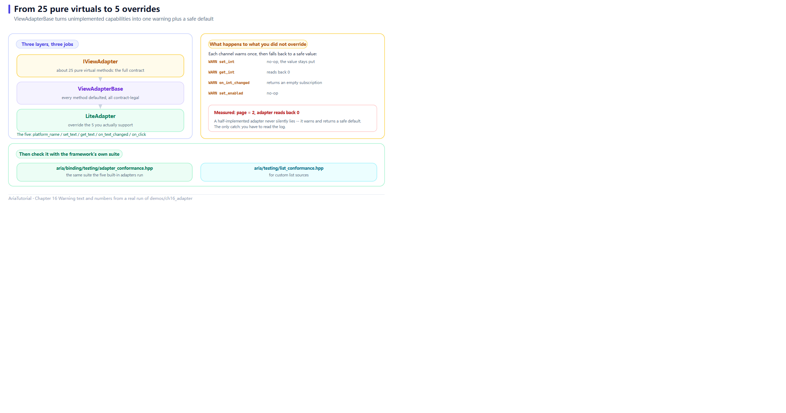

# Writing Your Own IViewAdapter: From 25 Pure Virtuals to 5



*What each of the three layers does, and the fallback path for capabilities you do not override.*

Chapter 15 listed `IViewAdapter`'s methods: text, seven numeric types, visibility, enabled, click, platform name — **25 pure virtual functions in total**.

That width is reasonable for the first-party adapters (they really do support everything), but for "I just want to wire up a simple custom widget library" it is a high wall 🧱

`ViewAdapterBase` exists to tear that wall down.

---

## 🎯 What ViewAdapterBase does

It implements every operation as the contract-required **"unsupported" path**:

```
warn once → return a safe default (set becomes a no-op, get returns 0/empty, on_* returns an empty Subscription)
```

So you override **only the methods the platform genuinely supports**.

---

## 📄 The complete program

```cpp
// ch16: 自己写一个 IViewAdapter -- 从 25 个纯虚方法到 5 个
//
// IViewAdapter 是个"宽接口": text / bool / int / int64 / uint64 / float /
// double 各三个方法, 再加 visible / enabled / click / platform_name, 一共
// 25 个纯虚函数。新写一个适配器不该被逼着全部实现。
//
// ViewAdapterBase 把每个操作都实现成契约要求的"不支持"路径 (告警一次 +
// 返回安全默认值), 作者只重写平台真正支持的那几个。
#include "aria/aria.hpp"
#include "aria/binding/binding_engine.hpp"
#include "aria/binding/view_adapter_base.hpp"

#include "common/memory_adapter.hpp"   // 复用其中的教程用 Signal

#include <iostream>
#include <memory>
#include <string>

using namespace aria;
using namespace aria::binding;

namespace {

/// 一个只有"文本"和"点击"两种能力的极简控件。
struct LiteView : public IView {
    std::string text;

    tutorial::Signal<std::string_view> text_signal;
    tutorial::Signal<>                 click_signal;

    [[nodiscard]] std::string_view kind() const noexcept override { return "lite"; }

    void user_type(std::string value) {
        text = std::move(value);
        text_signal.emit(text);
    }
    void user_click() { click_signal.emit(); }
};

/// 只重写 5 个方法的适配器。其余 20 个继承自 ViewAdapterBase。
class LiteAdapter final : public ViewAdapterBase {
public:
    [[nodiscard]] std::string_view platform_name() const noexcept override {
        return "Lite";          // 这个没有合理默认值, 必须重写
    }

    void set_text(IView& v, std::string_view t) override {
        static_cast<LiteView&>(v).text = std::string(t);
    }
    std::string get_text(IView& v) override {
        return static_cast<LiteView&>(v).text;
    }
    Subscription on_text_changed(IView& v,
                                 std::function<void(std::string_view)> cb) override {
        return static_cast<LiteView&>(v).text_signal.connect(std::move(cb));
    }
    Subscription on_click(IView& v, std::function<void()> cb) override {
        return static_cast<LiteView&>(v).click_signal.connect(std::move(cb));
    }
};

}  // namespace

int main() {
    auto adapter = std::make_shared<LiteAdapter>();
    BindingEngine engine{adapter};

    std::cout << "平台 = " << adapter->platform_name() << '\n';

    std::cout << "\n== 1. 重写过的能力: 文本双向 ==\n";
    Property<std::string> keyword{"aria"};
    LiteView search_box;

    engine.bind_text(keyword, search_box);

    std::cout << "   绑定后 view.text = \"" << search_box.text << "\"\n";
    search_box.user_type("mvvm");
    std::cout << "   用户输入 -> VM = \"" << keyword.get() << "\"\n";

    std::cout << "\n== 2. 重写过的能力: 点击 -> Command ==\n";
    int clicks = 0;
    Command<> go([&] { ++clicks; });
    LiteView go_button;

    engine.bind_command(go, go_button);

    go_button.user_click();
    std::cout << "   点一次   -> clicks = " << clicks << '\n';
    go_button.user_click();
    std::cout << "   再点一次 -> clicks = " << clicks << '\n';

    std::cout << "\n== 3. 没重写的能力: 走安全的降级路径 ==\n";
    Property<int> page{1};
    LiteView page_box;

    // LiteView 没有整型通道。ViewAdapterBase 会告警, set 变空操作,
    // get 返回 0 -- 不会崩, 也不会静默写坏数据。
    engine.bind_int(page, page_box);
    page = 2;

    std::cout << "   page 实际值      = " << page.get() << '\n';
    std::cout << "   adapter 读回控件 = " << adapter->get_int(page_box) << '\n';
    std::cout << "   (整型通道未实现, 读回 0)\n";

    std::cout << "\n== 4. 契约自检 ==\n";
    std::cout << "   框架自带一致性测试套件, 第三方适配器可以拿它自查:\n";
    std::cout << "   aria/binding/testing/adapter_conformance.hpp\n";

    return 0;
}
```

**Actual output**:

```text
平台 = Lite

== 1. 重写过的能力: 文本双向 ==
   绑定后 view.text = "aria"
   用户输入 -> VM = "mvvm"

== 2. 重写过的能力: 点击 -> Command ==
   点一次   -> clicks = 1
   再点一次 -> clicks = 2

== 3. 没重写的能力: 走安全的降级路径 ==
   page 实际值      = 2
   adapter 读回控件 = 0
   (整型通道未实现, 读回 0)

== 4. 契约自检 ==
   框架自带一致性测试套件, 第三方适配器可以拿它自查:
   aria/binding/testing/adapter_conformance.hpp

[stderr]
[WARN ][Lite_adapter] set_enabled: no binding path for view kind 'lite'
[WARN ][Lite_adapter] set_int: no binding path for view kind 'lite'
[WARN ][Lite_adapter] on_int_changed: no binding path for view kind 'lite'
[WARN ][Lite_adapter] set_int: no binding path for view kind 'lite'
[WARN ][Lite_adapter] get_int: no binding path for view kind 'lite'
```

---

## 1️⃣ Only five overrides

```cpp
class LiteAdapter final : public ViewAdapterBase {
public:
    std::string_view platform_name() const noexcept override;   // required
    void set_text(IView&, std::string_view) override;
    std::string get_text(IView&) override;
    Subscription on_text_changed(IView&, std::function<void(std::string_view)>) override;
    Subscription on_click(IView&, std::function<void()>) override;
};
```

Five in total. The other twenty inherit default implementations.

`platform_name()` is the only one **without a sane default** — the author must supply it, because the framework compares it against `IView::kind()`.

And those five really are enough:

```text
   绑定后 view.text = "aria"      ← set_text works
   用户输入 -> VM = "mvvm"        ← on_text_changed works
   点一次   -> clicks = 1         ← on_click works
```

**Two-way text plus click binding** — a search box and a button, handled entirely by five methods 💡

---

## 2️⃣ Unimplemented capabilities: warn, then degrade safely

This is the most instructive part. `LiteView` has no integer channel, yet the binding is written anyway:

```cpp
engine.bind_int(page, page_box);   // compiles, and does not crash
page = 2;
```

Output:

```text
   page 实际值      = 2      ← the VM value really changed
   adapter 读回控件 = 0      ← but the widget reads back 0
```

Meanwhile stderr shows a batch of warnings:

```text
[WARN ][Lite_adapter] set_enabled: no binding path for view kind 'lite'
[WARN ][Lite_adapter] set_int: no binding path for view kind 'lite'
[WARN ][Lite_adapter] on_int_changed: no binding path for view kind 'lite'
[WARN ][Lite_adapter] get_int: no binding path for view kind 'lite'
```

Those warnings are worth reading closely, because each reveals which channels a binding actually touches:

| Warning | What it tells you |
|---|---|
| `on_int_changed` | Two-way binding listens for widget changes |
| `set_int` | Two-way binding writes the VM value down |
| `get_int` | Binding reads the widget's current value once |
| `set_enabled` | `bind_command` writes `enabled` once (as Chapter 14 noted) |
| `set_int` (second) | The actual push after `page = 2` |

### Why this design matters

Three "nots":

- **Does not crash** — unimplemented methods have safe defaults; no null dereference, no out-of-bounds;
- **Does not fail silently** — every degraded call warns once, so you immediately see "this capability is not wired up";
- **Does not corrupt** — `set_int` is a no-op rather than pushing a value into a widget that cannot hold it.

> ⚠️ Note the `set_enabled` warning — even without an explicit `bind_enabled`, `bind_command` calls it. So **an adapter implementing only text and click has a non-functional disabled state on buttons.** That is a design trade-off, not a bug.

---

## 3️⃣ Conformance self-check

Aria publishes the same test suite its built-in adapters run:

```cpp
#include "aria/binding/testing/adapter_conformance.hpp"
```

A third-party adapter can check itself against it. These tests cover **contract-level invariants** (not "is every feature implemented"), such as:

- Whether the wrapper for a given view is stable;
- Whether setting an equal value avoids a duplicate emit;
- Whether subscription lifetimes behave;
- Whether `platform_name()` matches `IView::kind()`.

List sources have a matching suite:

```cpp
#include "aria/testing/list_conformance.hpp"
```

These are **the very tests the built-in implementations run** — your adapter is held to the same acceptance criteria as the official ones.

---

## 🧭 When an adapter is worth writing

| Situation | Recommendation |
|---|---|
| Wiring a custom-drawn UI library (ImGui, Nuklear, your own renderer) | ✅ Worth it — this is what the layer is for |
| Wiring a legacy MFC / Win32 widget set | ✅ Worth it; use `ViewAdapterBase` and implement only what is needed |
| Just wiring a VM into test code | ✅ Worth it — the tutorial's `MemoryAdapter` is exactly this |
| One platform only, and the UI will never be reused | 🤔 The platform's native approach may be simpler |

---

## 📌 Summary

- 🧱 `IViewAdapter` has 25 pure virtuals, but **deriving from `ViewAdapterBase` means overriding only what you care about**;
- ✅ A minimal adapter = `platform_name()` plus a few capabilities; this example needed five;
- 🔔 Unimplemented capabilities take the "warn + safe default" path: no crash, no silence, no corruption;
- ⚠️ `bind_command` calls `set_enabled`, so a text/click-only adapter has a non-functional disabled state;
- 🧪 The conformance suites (`adapter_conformance.hpp` / `list_conformance.hpp`) are available for self-checking.

---

**Previous chapter** 👈 [Chapter 15 — The Adapter Layer: One ViewModel, Five UIs](15-adapter-layer.en.md)
**Next chapter** 👉 [Chapter 17 — Coroutines, Concurrency, and Cancellation](17-coroutines-and-cancellation.en.md)

> 📂 Code from `demos/ch16_adapter/main.cpp`. Output is the program's real stdout on Windows / MSVC 19.51, including the degradation warnings on stderr.
