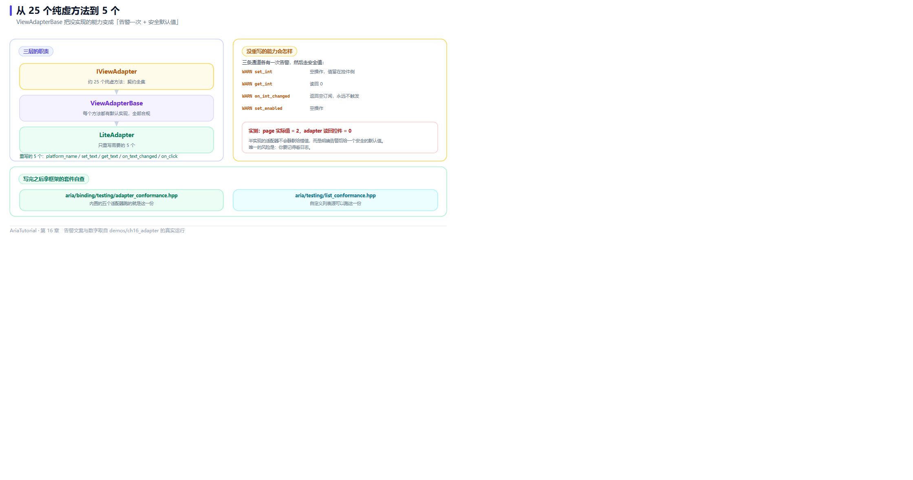

# 自己动手写一个 IViewAdapter：从 25 个纯虚方法到 5 个



*三层的职责分工，以及没重写的能力会走什么降级路径。*

第 15 章列了 `IViewAdapter` 的方法表：文本、七种数值类型、可见性、启用状态、点击、平台名 —— **总共 25 个纯虚函数**。

这个宽度对官方适配器是合理的（它们确实什么都支持），但对"我只想接一个简单的自绘控件库"来说，25 个方法是道高墙 🧱

`ViewAdapterBase` 就是来拆这道墙的。

---

## 🎯 ViewAdapterBase 做了什么

它把每一个操作都实现成契约要求的**"不支持"路径**：

```
告警一次 → 返回安全默认值（set 变空操作，get 返回 0/空，on_* 返回空 Subscription）
```

于是你只需要重写**平台真正支持的那几个方法**。

---

## 📄 完整程序

```cpp
// ch16: 自己写一个 IViewAdapter -- 从 25 个纯虚方法到 5 个
//
// IViewAdapter 是个"宽接口": text / bool / int / int64 / uint64 / float /
// double 各三个方法, 再加 visible / enabled / click / platform_name, 一共
// 25 个纯虚函数。新写一个适配器不该被逼着全部实现。
//
// ViewAdapterBase 把每个操作都实现成契约要求的"不支持"路径 (告警一次 +
// 返回安全默认值), 作者只重写平台真正支持的那几个。
#include "aria/aria.hpp"
#include "aria/binding/binding_engine.hpp"
#include "aria/binding/view_adapter_base.hpp"

#include "common/memory_adapter.hpp"   // 复用其中的教程用 Signal

#include <iostream>
#include <memory>
#include <string>

using namespace aria;
using namespace aria::binding;

namespace {

/// 一个只有"文本"和"点击"两种能力的极简控件。
struct LiteView : public IView {
    std::string text;

    tutorial::Signal<std::string_view> text_signal;
    tutorial::Signal<>                 click_signal;

    [[nodiscard]] std::string_view kind() const noexcept override { return "lite"; }

    void user_type(std::string value) {
        text = std::move(value);
        text_signal.emit(text);
    }
    void user_click() { click_signal.emit(); }
};

/// 只重写 5 个方法的适配器。其余 20 个继承自 ViewAdapterBase。
class LiteAdapter final : public ViewAdapterBase {
public:
    [[nodiscard]] std::string_view platform_name() const noexcept override {
        return "Lite";          // 这个没有合理默认值, 必须重写
    }

    void set_text(IView& v, std::string_view t) override {
        static_cast<LiteView&>(v).text = std::string(t);
    }
    std::string get_text(IView& v) override {
        return static_cast<LiteView&>(v).text;
    }
    Subscription on_text_changed(IView& v,
                                 std::function<void(std::string_view)> cb) override {
        return static_cast<LiteView&>(v).text_signal.connect(std::move(cb));
    }
    Subscription on_click(IView& v, std::function<void()> cb) override {
        return static_cast<LiteView&>(v).click_signal.connect(std::move(cb));
    }
};

}  // namespace

int main() {
    auto adapter = std::make_shared<LiteAdapter>();
    BindingEngine engine{adapter};

    std::cout << "平台 = " << adapter->platform_name() << '\n';

    std::cout << "\n== 1. 重写过的能力: 文本双向 ==\n";
    Property<std::string> keyword{"aria"};
    LiteView search_box;

    engine.bind_text(keyword, search_box);

    std::cout << "   绑定后 view.text = \"" << search_box.text << "\"\n";
    search_box.user_type("mvvm");
    std::cout << "   用户输入 -> VM = \"" << keyword.get() << "\"\n";

    std::cout << "\n== 2. 重写过的能力: 点击 -> Command ==\n";
    int clicks = 0;
    Command<> go([&] { ++clicks; });
    LiteView go_button;

    engine.bind_command(go, go_button);

    go_button.user_click();
    std::cout << "   点一次   -> clicks = " << clicks << '\n';
    go_button.user_click();
    std::cout << "   再点一次 -> clicks = " << clicks << '\n';

    std::cout << "\n== 3. 没重写的能力: 走安全的降级路径 ==\n";
    Property<int> page{1};
    LiteView page_box;

    // LiteView 没有整型通道。ViewAdapterBase 会告警, set 变空操作,
    // get 返回 0 -- 不会崩, 也不会静默写坏数据。
    engine.bind_int(page, page_box);
    page = 2;

    std::cout << "   page 实际值      = " << page.get() << '\n';
    std::cout << "   adapter 读回控件 = " << adapter->get_int(page_box) << '\n';
    std::cout << "   (整型通道未实现, 读回 0)\n";

    std::cout << "\n== 4. 契约自检 ==\n";
    std::cout << "   框架自带一致性测试套件, 第三方适配器可以拿它自查:\n";
    std::cout << "   aria/binding/testing/adapter_conformance.hpp\n";

    return 0;
}
```

**真实运行结果**：

```text
平台 = Lite

== 1. 重写过的能力: 文本双向 ==
   绑定后 view.text = "aria"
   用户输入 -> VM = "mvvm"

== 2. 重写过的能力: 点击 -> Command ==
   点一次   -> clicks = 1
   再点一次 -> clicks = 2

== 3. 没重写的能力: 走安全的降级路径 ==
   page 实际值      = 2
   adapter 读回控件 = 0
   (整型通道未实现, 读回 0)

== 4. 契约自检 ==
   框架自带一致性测试套件, 第三方适配器可以拿它自查:
   aria/binding/testing/adapter_conformance.hpp

[stderr]
[WARN ][Lite_adapter] set_enabled: no binding path for view kind 'lite'
[WARN ][Lite_adapter] set_int: no binding path for view kind 'lite'
[WARN ][Lite_adapter] on_int_changed: no binding path for view kind 'lite'
[WARN ][Lite_adapter] set_int: no binding path for view kind 'lite'
[WARN ][Lite_adapter] get_int: no binding path for view kind 'lite'
```

---

## 1️⃣ 只重写 5 个方法

```cpp
class LiteAdapter final : public ViewAdapterBase {
public:
    std::string_view platform_name() const noexcept override;   // 必须
    void set_text(IView&, std::string_view) override;
    std::string get_text(IView&) override;
    Subscription on_text_changed(IView&, std::function<void(std::string_view)>) override;
    Subscription on_click(IView&, std::function<void()>) override;
};
```

一共 5 个。其余 20 个继承默认实现。

`platform_name()` 是唯一**没有默认值**的 —— 它必须由作者提供，因为框架要拿它和 `IView::kind()` 对照。

看输出，这 5 个方法真的够用：

```text
   绑定后 view.text = "aria"      ← set_text 生效
   用户输入 -> VM = "mvvm"        ← on_text_changed 生效
   点一次   -> clicks = 1         ← on_click 生效
```

**文本双向 + 点击绑定** —— 一个搜索框加一个按钮的界面，就这 5 个方法全搞定了 💡

---

## 2️⃣ 没实现的能力：告警 + 安全默认值

这是最值得看的部分。`LiteView` 没有整型通道，但绑定代码照样写：

```cpp
engine.bind_int(page, page_box);   // 编译通过, 运行也不会崩
page = 2;
```

看输出：

```text
   page 实际值      = 2      ← VM 的值真的变了
   adapter 读回控件 = 0      ← 但控件里读回来是 0
```

同时 stderr 里出现了一批告警：

```text
[WARN ][Lite_adapter] set_enabled: no binding path for view kind 'lite'
[WARN ][Lite_adapter] set_int: no binding path for view kind 'lite'
[WARN ][Lite_adapter] on_int_changed: no binding path for view kind 'lite'
[WARN ][Lite_adapter] get_int: no binding path for view kind 'lite'
```

这些告警值得逐条读，因为它们揭示了一个绑定实际调用了哪些通道：

| 告警 | 说明 |
|---|---|
| `on_int_changed` | 双向绑定要监听控件的变化 |
| `set_int` | 双向绑定要把 VM 的值写下去 |
| `get_int` | 绑定时会读一次控件当前值 |
| `set_enabled` | `bind_command` 顺带写了一次 enabled（第 14 章提过） |
| `set_int`（第二次） | `page = 2` 后的实际推送 |

### 为什么这个设计重要

三个"不"：

- **不崩** —— 未实现的方法有安全默认值，不会空指针或越界；
- **不静默** —— 每次走降级路径都会告警一次，你能立刻发现"这个能力没接上"；
- **不写坏** —— `set_int` 是空操作，不会往一个不支持的控件里硬塞值。

> ⚠️ 注意 `set_enabled` 那条告警 —— 即使你没写 `bind_enabled`，`bind_command` 也会调用它。所以**只实现文本和点击的适配器，按钮的可禁用状态是无效的**。这是设计取舍，不是 bug。

---

## 3️⃣ 契约自检：用框架自己的套件验你的适配器

Aria 把内置适配器自己跑的测试套件一并发布了：

```cpp
#include "aria/binding/testing/adapter_conformance.hpp"
```

自定义适配器可以拿它自查，检查的是**契约层面的不变量**（而不是"功能是否齐全"），比如：

- 同一个 view 的包装是否稳定；
- 设置相同值是否不重复触发；
- 订阅的生命周期是否正确；
- `platform_name()` 与 `IView::kind()` 是否一致。

列表源也有对应的一套：

```cpp
#include "aria/testing/list_conformance.hpp"
```

这两套是**内置实现自己也在跑的同一份测试** —— 意味着你的适配器和官方适配器接受同样的验收标准。

---

## 🧭 什么时候值得写一个适配器

| 场景 | 建议 |
|---|---|
| 接一个自绘 UI 库（ImGui、Nuklear、自研渲染器） | ✅ 值得。这就是适配器层的设计目标 |
| 接一个老项目的 MFC / Win32 控件 | ✅ 值得。用 `ViewAdapterBase` 只实现必要通道 |
| 只想把 VM 接到测试代码上 | ✅ 值得。教程里的 `MemoryAdapter` 就是这个用途 |
| 只想要一个平台，界面也不打算复用 | 🤔 可能直接用该平台的原生方案更省事 |

---

## 📌 小结

- 🧱 `IViewAdapter` 有 25 个纯虚方法，但**从 `ViewAdapterBase` 继承只需重写关心的那几个**；
- ✅ 最小可用适配器 = `platform_name()` + 若干具体能力，本例只用了 5 个；
- 🔔 未实现的能力走"告警 + 安全默认值"路径：不崩、不静默、不写坏；
- ⚠️ `bind_command` 会调用 `set_enabled`，只做文本/点击的适配器按钮禁用态无效；
- 🧪 一致性套件（`adapter_conformance.hpp` / `list_conformance.hpp`）可以拿来自查。

---

**上一章** 👈 [第 15 章 适配器体系：一份 ViewModel 接五种界面](15-适配器体系.md)
**下一章** 👉 [第 17 章 协程、并发与取消](17-协程与取消.md)

> 📂 本章代码来自本仓库 `demos/ch16_adapter/main.cpp`，输出为该程序在 Windows / MSVC 19.51 下的真实打印结果（含 stderr 中的降级告警）。
