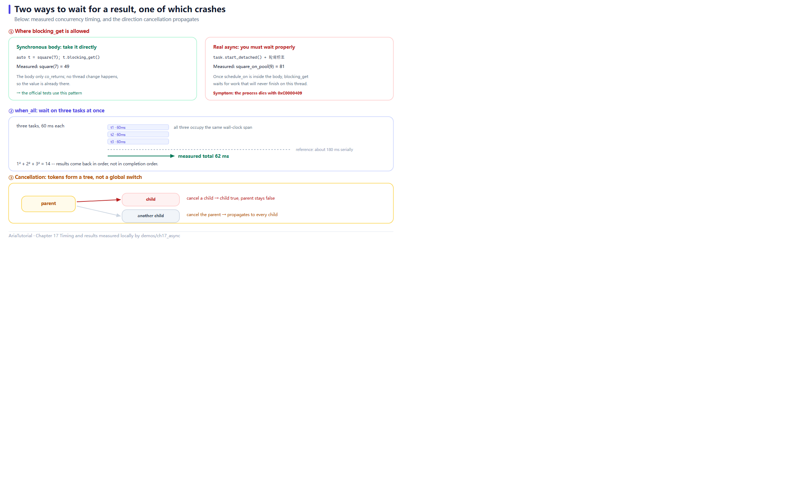

# Coroutines, Concurrency, and Cancellation



*Where blocking_get is allowed, measured when_all concurrency, and the direction cancellation propagates.*

Async code used to mean callback hell, then `async` / `await`. Aria's async layer is **C++20 coroutines**: `Task<T>` makes asynchronous code read like synchronous code ⚡

This chapter also documents one **boundary you must respect** — it crashed a program for real while this chapter was being written.

---

## 📄 The complete program

```cpp
// ch17: 协程、并发与取消
//
// 一个关键区分:
//   同步任务体 (没有真正切线程) -> 可以直接 blocking_get()
//   真异步任务体 (schedule_on 切了线程) -> 必须 start_detached() + 自己等
// blocking_get 的注释里写得很明白: "only safe if the task body is
// synchronous (no real async)"。混用会直接崩。
#include "aria/aria.hpp"
#include "aria/async/cancellation.hpp"
#include "aria/async/executor.hpp"
#include "aria/async/task.hpp"
#include "aria/async/when_all.hpp"

#include <atomic>
#include <chrono>
#include <iostream>
#include <thread>

using namespace aria;
using namespace aria::async;

/// 同步任务体: 不切线程, 直接就能取出结果。
Task<int> square(int x) {
    co_return x * x;
}

/// 真异步: 先切到线程池再干活。
Task<int> square_on_pool(ThreadPoolExecutor& pool, int x, int delay_ms) {
    co_await schedule_on(pool);
    std::this_thread::sleep_for(std::chrono::milliseconds{delay_ms});
    co_return x * x;
}

/// 轮询等待一个原子标志, 模拟真实程序里的主循环。
static void wait_for(const std::atomic<bool>& flag) {
    while (!flag.load()) {
        std::this_thread::sleep_for(std::chrono::milliseconds{2});
    }
}

int main() {
    std::cout << "== 1. 同步任务体: blocking_get 直接取结果 ==\n";
    std::cout << "   square(7) = " << square(7).blocking_get() << '\n';

    std::cout << "\n== 2. 真异步: start_detached + 自己等 ==\n";
    ThreadPoolExecutor pool{4};

    std::atomic<int>  single{0};
    std::atomic<bool> single_done{false};

    auto one = [&]() -> Task<void> {
        single = co_await square_on_pool(pool, 9, 10);
        single_done = true;
    }();
    std::move(one).start_detached();

    wait_for(single_done);
    std::cout << "   square_on_pool(9) = " << single.load() << '\n';

    std::cout << "\n== 3. when_all: 三个子任务一起等 ==\n";
    std::atomic<int>  total{0};
    std::atomic<bool> parallel_done{false};

    const auto started = std::chrono::steady_clock::now();

    auto parallel = [&]() -> Task<void> {
        auto [a, b, c] = co_await when_all(
            square_on_pool(pool, 1, 60),
            square_on_pool(pool, 2, 60),
            square_on_pool(pool, 3, 60));
        total = a + b + c;
        parallel_done = true;
    }();
    std::move(parallel).start_detached();

    wait_for(parallel_done);
    const auto elapsed = std::chrono::duration_cast<std::chrono::milliseconds>(
        std::chrono::steady_clock::now() - started).count();

    std::cout << "   1^2 + 2^2 + 3^2 = " << total.load() << '\n';
    std::cout << "   三个各睡 60ms 的任务, 实测总耗时 " << elapsed
              << "ms (并发执行; 串行的话约 180ms)\n";

    std::cout << "\n== 4. 取消令牌 ==\n";
    CancellationSource source;
    auto token = source.token();

    std::cout << "   初始   is_cancelled = "
              << (token.is_cancelled() ? "true" : "false") << '\n';

    source.cancel();
    std::cout << "   取消后 is_cancelled = "
              << (token.is_cancelled() ? "true" : "false") << '\n';

    try {
        token.throw_if_cancelled();
        std::cout << "   throw_if_cancelled 没有抛异常\n";
    } catch (const OperationCancelled&) {
        std::cout << "   throw_if_cancelled 抛出 OperationCancelled\n";
    }

    std::cout << "\n== 5. 两个独立令牌互不影响 ==\n";
    CancellationSource parent;
    CancellationSource child;

    child.cancel();
    std::cout << "   子令牌已取消 = " << (child.token().is_cancelled() ? "true" : "false") << '\n';
    std::cout << "   父令牌已取消 = " << (parent.token().is_cancelled() ? "true" : "false")
              << " (父没被波及)\n";

    parent.cancel();
    std::cout << "   父令牌取消后 = " << (parent.token().is_cancelled() ? "true" : "false") << '\n';

    // 给线程池一点时间收尾, 再让它析构。
    std::this_thread::sleep_for(std::chrono::milliseconds{50});

    return 0;
}
```

**Actual output**:

```text
== 1. 同步任务体: blocking_get 直接取结果 ==
   square(7) = 49

== 2. 真异步: start_detached + 自己等 ==
   square_on_pool(9) = 81

== 3. when_all: 三个子任务一起等 ==
   1^2 + 2^2 + 3^2 = 14
   三个各睡 60ms 的任务, 实测总耗时 62ms (并发执行; 串行的话约 180ms)

== 4. 取消令牌 ==
   初始   is_cancelled = false
   取消后 is_cancelled = true
   throw_if_cancelled 抛出 OperationCancelled

== 5. 两个独立令牌互不影响 ==
   子令牌已取消 = true
   父令牌已取消 = false (父没被波及)
   父令牌取消后 = true
```

---

## ⚠️ The most important boundary: `blocking_get()` is for synchronous task bodies only

The source comment on `Task<T>::blocking_get()` is blunt:

> Blocking accessor — **only safe if the task body is synchronous (no real async)**.
> For real async use `co_await` or a Scheduler.

In plain words: **if your coroutine contains `co_await schedule_on(...)` or anything else that genuinely switches threads, do not call `blocking_get()`.**

### What mixing them costs

It does not fail to compile — it **crashes at runtime**. The first version of this chapter did exactly that, and on Windows returned:

```text
EXITCODE = 3221226505     # 0xC0000409, MSVC's __fastfail
```

The reason is not hard to follow: `blocking_get()` means "run this coroutine to completion right here, synchronously". If the coroutine hands execution to a thread pool midway, "completion" happens on **another thread** while the caller is still blocked on the original one — and the two sides no longer share a consistent assumption about the same coroutine frame.

### The two correct patterns

| Task body | Correct form |
|---|---|
| Synchronous (`co_return` immediately, no thread switch) | `task.blocking_get()` |
| Genuinely async (`schedule_on` inside) | `std::move(task).start_detached()` + wait for a completion signal yourself |

Blocks 2 and 3 use the second form:

```cpp
auto one = [&]() -> Task<void> {
    single = co_await square_on_pool(pool, 9, 10);
    single_done = true;                 // completion signal
}();
std::move(one).start_detached();        // start without awaiting

wait_for(single_done);                  // poll in the main loop
```

`wait_for` simply checks a flag every 2 ms — standing in for a real program's main loop. In a GUI program that loop is the event loop; on a server it is the host dispatch loop.

---

## 1️⃣ `Task<T>`: lazy and single-shot

```cpp
Task<int> square(int x) {
    co_return x * x;      // no `return`, only `co_return`
}
```

`Task<T>` is **lazy**: constructing one does not execute anything. It needs `start()` / `start_detached()` / `blocking_get()` / `co_await` to drive it.

That matters: **constructing a `Task` has no side effects**, so it is safe to store in a variable or return from a function.

`Task<void>` has a specialisation for "I only care that it finished" — used by blocks 2 and 3.

---

## 2️⃣ `schedule_on`: moving execution to a chosen executor

```cpp
Task<int> square_on_pool(ThreadPoolExecutor& pool, int x, int delay_ms) {
    co_await schedule_on(pool);        // after this line, running on a pool thread
    std::this_thread::sleep_for(std::chrono::milliseconds{delay_ms});
    co_return x * x;
}
```

Before the `co_await`, code runs on the caller's thread; after it, on the pool. **The coroutine expresses a thread switch as an await point** — no manual post/marshal.

That is also why it counts as "genuinely async": execution really does change threads.

Three common executors:

| Executor | Purpose |
|---|---|
| `InlineExecutor` | Run on the current thread, no switch |
| `ThreadPoolExecutor` | Background pool for real work |
| `MainThreadExecutor` | Main-thread queue driven by `pump_until()` (used in Chapter 8) |

---

## 3️⃣ `when_all`: awaiting a group concurrently

```cpp
auto [a, b, c] = co_await when_all(
    square_on_pool(pool, 1, 60),
    square_on_pool(pool, 2, 60),
    square_on_pool(pool, 3, 60));
total = a + b + c;
```

All three children start **at the same time**, and one structured binding collects their results once all finish.

```text
   1^2 + 2^2 + 3^2 = 14
   三个各睡 60ms 的任务, 实测总耗时 62ms (并发执行; 串行的话约 180ms)
```

62 ms versus 180 ms — the three 60 ms sleeps clearly overlapped. The returned tuple order matches the argument order.

`when_all` supports heterogeneous types and works with `Task<void>`.

> 💡 Measured duration varies with machine load; treat it here as corroboration, not proof. To assert concurrency rigorously, **observe the concurrency high-water mark directly** rather than timing — the lesson Aria's own test comments spell out.

---

## 4️⃣ Cancellation: `CancellationToken`

```cpp
CancellationSource source;
auto token = source.token();

source.cancel();
token.is_cancelled();      // → true
token.throw_if_cancelled(); // throws OperationCancelled
```

Two roles, clearly split:

| Type | Responsibility |
|---|---|
| `CancellationSource` | **The trigger**, calls `cancel()` |
| `CancellationToken` | **The observer**, handed to your coroutine to check state and register callbacks |

The design mirrors `std::stop_source` / `std::stop_token`, with the addition that a coroutine can `co_await token` — suspending until cancellation.

`throw_if_cancelled()` is the usual landing point for cooperative cancellation:

```cpp
Task<void> long_job(CancellationToken token) {
    for (int i = 0; i < 1000; ++i) {
        token.throw_if_cancelled();     // check once per iteration
        do_chunk(i);
    }
}
```

> 💡 **Cooperative** means cancellation is "tell the coroutine to wrap up", not "kill the thread". The coroutine decides where to check and how to clean up.

---

## 5️⃣ Tokens are independent

```cpp
CancellationSource parent;
CancellationSource child;

child.cancel();
// 子令牌已取消 = true
// 父令牌已取消 = false (父没被波及)
```

Cancellation is **one-directional**: cancelling a child token does not touch the parent ✅

That enables layered cancellation — a page has its own token, a specific request has a finer one, and cancelling the request does not cancel the page. `with_timeout` is built on exactly this model (a timeout flips only the inner token).

---

## 🔗 How this ties back

| Earlier convention | Landing here |
|---|---|
| Chapter 3: write `Property` only on the graph thread | `co_await schedule_on(main_dispatcher)` to hop back |
| Chapter 8: `AsyncCommand` needs ui/worker executors | ui is usually `MainThreadExecutor`, worker a thread pool |
| Chapter 13: `ViewModelScope` cancels associated work | Internally the `CancellationToken` mechanism |

---

## 📌 Summary

- 🚫 **`blocking_get()` is safe only for synchronous task bodies**; coroutines with `schedule_on` must use `start_detached()` plus your own wait;
- ⚡ `Task<T>` is lazy — construction does not execute; it must be started explicitly;
- 🔀 `co_await schedule_on(executor)` expresses a thread switch as an await point;
- 🤝 `when_all` awaits a group concurrently, returning a tuple in argument order;
- 🛑 Cancellation is **cooperative**: `CancellationSource` triggers, `CancellationToken` observes, `throw_if_cancelled()` lands it;
- 🔒 Cancellation propagates one way; a child's cancellation does not affect its parent.

---

**Previous chapter** 👈 [Chapter 16 — Writing Your Own IViewAdapter: From 25 Pure Virtuals to 5](16-writing-an-adapter.en.md)
**Next chapter** 👉 [Chapter 18 — Diagnostics: Exporting the Reactive Graph](18-diagnostics.en.md)

> 📂 Code from `demos/ch17_async/main.cpp`. Output is the program's real stdout on Windows / MSVC 19.51.
