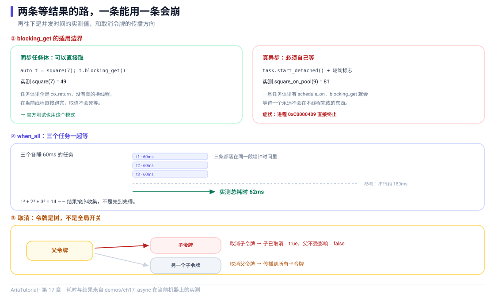

# 协程、并发与取消



*blocking_get 的适用边界、when_all 的并发实测、取消令牌的传播方向。*

异步代码的传统写法是回调地狱，现代写法是 `async` / `await`。Aria 的异步层是 **C++20 协程**：`Task<T>` 让异步代码看起来像同步代码 ⚡

这一章还有一条**必须记住的边界** —— 它让我在写这一章时真的崩过一次程序。

---

## 📄 完整程序

```cpp
// ch17: 协程、并发与取消
//
// 一个关键区分:
//   同步任务体 (没有真正切线程) -> 可以直接 blocking_get()
//   真异步任务体 (schedule_on 切了线程) -> 必须 start_detached() + 自己等
// blocking_get 的注释里写得很明白: "only safe if the task body is
// synchronous (no real async)"。混用会直接崩。
#include "aria/aria.hpp"
#include "aria/async/cancellation.hpp"
#include "aria/async/executor.hpp"
#include "aria/async/task.hpp"
#include "aria/async/when_all.hpp"

#include <atomic>
#include <chrono>
#include <iostream>
#include <thread>

using namespace aria;
using namespace aria::async;

/// 同步任务体: 不切线程, 直接就能取出结果。
Task<int> square(int x) {
    co_return x * x;
}

/// 真异步: 先切到线程池再干活。
Task<int> square_on_pool(ThreadPoolExecutor& pool, int x, int delay_ms) {
    co_await schedule_on(pool);
    std::this_thread::sleep_for(std::chrono::milliseconds{delay_ms});
    co_return x * x;
}

/// 轮询等待一个原子标志, 模拟真实程序里的主循环。
static void wait_for(const std::atomic<bool>& flag) {
    while (!flag.load()) {
        std::this_thread::sleep_for(std::chrono::milliseconds{2});
    }
}

int main() {
    std::cout << "== 1. 同步任务体: blocking_get 直接取结果 ==\n";
    std::cout << "   square(7) = " << square(7).blocking_get() << '\n';

    std::cout << "\n== 2. 真异步: start_detached + 自己等 ==\n";
    ThreadPoolExecutor pool{4};

    std::atomic<int>  single{0};
    std::atomic<bool> single_done{false};

    // 注意: 协程 lambda 绝不按引用捕获 [&]。闭包对象在语句结束就销毁,
    // 而协程帧活得比它久, resume 时通过悬垂引用访问捕获变量是 UB
    // (GCC -O2 直接崩, clang 只是碰巧能跑)。状态一律走参数传引用,
    // 引用本身拷贝进协程帧, 指向 main 的栈, 生命周期由 main 保证。
    auto one = [](std::atomic<int>& out, std::atomic<bool>& done,
                  ThreadPoolExecutor& pool) -> Task<void> {
        out = co_await square_on_pool(pool, 9, 10);
        done = true;
    }(single, single_done, pool);
    std::move(one).start_detached();

    wait_for(single_done);
    std::cout << "   square_on_pool(9) = " << single.load() << '\n';

    std::cout << "\n== 3. when_all: 三个子任务一起等 ==\n";
    std::atomic<int>  total{0};
    std::atomic<bool> parallel_done{false};

    const auto started = std::chrono::steady_clock::now();

    auto parallel = [](std::atomic<int>& out, std::atomic<bool>& done,
                       ThreadPoolExecutor& pool) -> Task<void> {
        auto [a, b, c] = co_await when_all(
            square_on_pool(pool, 1, 60),
            square_on_pool(pool, 2, 60),
            square_on_pool(pool, 3, 60));
        out = a + b + c;
        done = true;
    }(total, parallel_done, pool);
    std::move(parallel).start_detached();

    wait_for(parallel_done);
    const auto elapsed = std::chrono::duration_cast<std::chrono::milliseconds>(
        std::chrono::steady_clock::now() - started).count();

    std::cout << "   1^2 + 2^2 + 3^2 = " << total.load() << '\n';
    std::cout << "   三个各睡 60ms 的任务, 实测总耗时 " << elapsed
              << "ms (并发执行; 串行的话约 180ms)\n";

    std::cout << "\n== 4. 取消令牌 ==\n";
    CancellationSource source;
    auto token = source.token();

    std::cout << "   初始   is_cancelled = "
              << (token.is_cancelled() ? "true" : "false") << '\n';

    source.cancel();
    std::cout << "   取消后 is_cancelled = "
              << (token.is_cancelled() ? "true" : "false") << '\n';

    try {
        token.throw_if_cancelled();
        std::cout << "   throw_if_cancelled 没有抛异常\n";
    } catch (const OperationCancelled&) {
        std::cout << "   throw_if_cancelled 抛出 OperationCancelled\n";
    }

    std::cout << "\n== 5. 两个独立令牌互不影响 ==\n";
    CancellationSource parent;
    CancellationSource child;

    child.cancel();
    std::cout << "   子令牌已取消 = " << (child.token().is_cancelled() ? "true" : "false") << '\n';
    std::cout << "   父令牌已取消 = " << (parent.token().is_cancelled() ? "true" : "false")
              << " (父没被波及)\n";

    parent.cancel();
    std::cout << "   父令牌取消后 = " << (parent.token().is_cancelled() ? "true" : "false") << '\n';

    // 给线程池一点时间收尾, 再让它析构。
    std::this_thread::sleep_for(std::chrono::milliseconds{50});

    return 0;
}
```

**真实运行结果**：

```text
== 1. 同步任务体: blocking_get 直接取结果 ==
   square(7) = 49

== 2. 真异步: start_detached + 自己等 ==
   square_on_pool(9) = 81

== 3. when_all: 三个子任务一起等 ==
   1^2 + 2^2 + 3^2 = 14
   三个各睡 60ms 的任务, 实测总耗时 62ms (并发执行; 串行的话约 180ms)

== 4. 取消令牌 ==
   初始   is_cancelled = false
   取消后 is_cancelled = true
   throw_if_cancelled 抛出 OperationCancelled

== 5. 两个独立令牌互不影响 ==
   子令牌已取消 = true
   父令牌已取消 = false (父没被波及)
   父令牌取消后 = true
```

---

## ⚠️ 最重要的边界：`blocking_get()` 只能用于同步任务体

`Task<T>::blocking_get()` 的源码注释写得很直白：

> Blocking accessor — **only safe if the task body is synchronous (no real async)**.
> For real async use `co_await` or a Scheduler.

翻译成人话：**如果你的协程里有 `co_await schedule_on(...)` 这类真正切线程的操作，就别用 `blocking_get()`。**

### 混用会怎样

不会编译报错，而是**运行时崩溃**。我最初写的版本就是"真异步 + `blocking_get()`"，在 Windows 上直接返回：

```text
EXITCODE = 3221226505     # 0xC0000409, MSVC 下的 __fastfail
```

原因不难理解：`blocking_get()` 的语义是"在这里同步地把协程跑完"。如果协程中途把执行权交给了线程池，那么"跑完"这个动作发生在**另一个线程**上，而调用方还阻塞在原来的线程 —— 两边对同一个协程栈帧的假设不再成立。

### 正确的两种写法

| 任务体 | 正确写法 |
|---|---|
| 同步（`co_return` 直接返回，不切线程） | `task.blocking_get()` |
| 真异步（含 `schedule_on`） | `std::move(task).start_detached()` + 自己等完成信号 |

本例第 2、3 段就是用第二种：

```cpp
auto one = [](std::atomic<int>& out, std::atomic<bool>& done,
              ThreadPoolExecutor& pool) -> Task<void> {
    out = co_await square_on_pool(pool, 9, 10);
    done = true;                         // 完成信号
}(single, single_done, pool);
std::move(one).start_detached();        // 启动, 不等待

wait_for(single_done);                  // 主循环里轮询
```

`wait_for` 里就是"每 2ms 检查一次标志位" —— 这模拟真实程序的主循环。在 GUI 程序里，这个循环通常是事件循环本身；在服务端就是宿主的 dispatch loop。

---

## 1️⃣ `Task<T>`：惰性 + 单次

```cpp
Task<int> square(int x) {
    co_return x * x;      // 没有 return, 只有 co_return
}
```

`Task<T>` 是**惰性**的：创建出来不会立刻执行，需要 `start()` / `start_detached()` / `blocking_get()` / `co_await` 其中之一来驱动。

这一点很重要：**构造 `Task` 对象不会产生任何副作用**，所以你可以安全地把它存在变量里、作为返回值传递。

`Task<void>` 有特化，用于"只关心完成，不关心返回值"的场景 —— 本例第 2、3 段用的就是它。

---

## 2️⃣ `schedule_on`：把执行搬到指定执行器

```cpp
Task<int> square_on_pool(ThreadPoolExecutor& pool, int x, int delay_ms) {
    co_await schedule_on(pool);        // ← 这一行之后, 代码在线程池线程上运行
    std::this_thread::sleep_for(std::chrono::milliseconds{delay_ms});
    co_return x * x;
}
```

`co_await schedule_on(pool)` 之前，代码在调用者线程上；之后，在线程池上。**协程把"切线程"这件事写成了一个 await 点**，不需要手动 post/marshal。

这也解释了为什么它属于"真异步"：执行过程中确实换了线程。

常见的三个执行器：

| 执行器 | 用途 |
|---|---|
| `InlineExecutor` | 就在当前线程跑，不切换 |
| `ThreadPoolExecutor` | 后台线程池，干活用 |
| `MainThreadExecutor` | 主线程队列，配合 `pump_until()` 使用（第 8 章用过） |

---

## 3️⃣ `when_all`：并发等待一组任务

```cpp
auto [a, b, c] = co_await when_all(
    square_on_pool(pool, 1, 60),
    square_on_pool(pool, 2, 60),
    square_on_pool(pool, 3, 60));
total = a + b + c;
```

三个子任务**同时**开始，全部完成后结构化绑定一次拿到三个结果。

看输出：

```text
   1^2 + 2^2 + 3^2 = 14
   三个各睡 60ms 的任务, 实测总耗时 62ms (并发执行; 串行的话约 180ms)
```

62ms 对 180ms —— 三个 60ms 确实重叠了。返回的 tuple 顺序与传入顺序一致。

`when_all` 支持异构类型（`Task<int>` 和 `Task<std::string>` 可以一起等），也可以用在 `Task<void>` 上。

> 💡 实测耗时随机器负载而变，这里只作为"确实并发"的旁证。要严谨断言并发，应该像 Aria 的测试那样**直接观测并发峰值**，而不是看耗时 —— 这是官方测试注释里明确写下的经验。

---

## 4️⃣ 取消：`CancellationToken`

```cpp
CancellationSource source;
auto token = source.token();

source.cancel();
token.is_cancelled();      // → true
token.throw_if_cancelled(); // 抛出 OperationCancelled
```

两个角色分工明确：

| 类型 | 职责 |
|---|---|
| `CancellationSource` | **触发方**，调 `cancel()` |
| `CancellationToken` | **观察方**，传给你的协程，检查状态、注册回调 |

设计上和 `std::stop_source` / `std::stop_token` 一致，但协程里可以 `co_await token` —— 直接挂起，直到被取消。

`throw_if_cancelled()` 是"协作式取消"里最常见的落点：

```cpp
Task<void> long_job(CancellationToken token) {
    for (int i = 0; i < 1000; ++i) {
        token.throw_if_cancelled();     // 每个循环检查一次
        do_chunk(i);
    }
}
```

> 💡 **协作式取消**的含义：取消不是"把线程杀掉"，而是"告诉协程该收尾了"。协程自己决定在哪些点检查、如何清理。

---

## 5️⃣ 令牌互不影响

```cpp
CancellationSource parent;
CancellationSource child;

child.cancel();
// 子令牌已取消 = true
// 父令牌已取消 = false (父没被波及)
```

取消是**单向**的：取消子令牌不会影响父令牌 ✅

这个特性让"分层取消"成为可能 —— 一个页面有它自己的令牌，某个具体请求有更细的令牌，取消请求不会把整个页面也取消掉。`with_timeout` 就是基于这个模型实现的（超时只翻转内部令牌，不波及父级）。

---

## 🔗 和前面章节的呼应

| 前面的约定 | 这里的落地 |
|---|---|
| 第 3 章：只能在图线程写 `Property` | 用 `co_await schedule_on(main_dispatcher)` 切回去 |
| 第 8 章：`AsyncCommand` 需要 ui/worker 两个执行器 | ui 通常是 `MainThreadExecutor`，worker 是线程池 |
| 第 13 章：`ViewModelScope` 能取消关联任务 | 内部就是 `CancellationToken` 机制 |

---

## 📌 小结

- 🚫 **`blocking_get()` 只对同步任务体安全**，含 `schedule_on` 的协程必须 `start_detached()` + 自己等；
- ⚡ `Task<T>` 是惰性的，创建不执行，需要显式启动；
- 🔀 `co_await schedule_on(executor)` 是"切线程"的写法，把异步表达成 await 点；
- 🤝 `when_all` 并发等待一组任务，返回 tuple 顺序与传入一致；
- 🛑 取消是**协作式**的：`CancellationSource` 触发，`CancellationToken` 观察，`throw_if_cancelled()` 落地；
- 🔒 取消单向传播，子令牌取消不会波及父令牌。

---

**上一章** 👈 [第 16 章 自己动手写一个 IViewAdapter](16-自己写适配器.md)
**下一章** 👉 [第 18 章 诊断：把响应式图导出来看](18-诊断.md)

> 📂 本章代码来自本仓库 `demos/ch17_async/main.cpp`，输出为该程序在 Windows / MSVC 19.51 下的真实打印结果。
