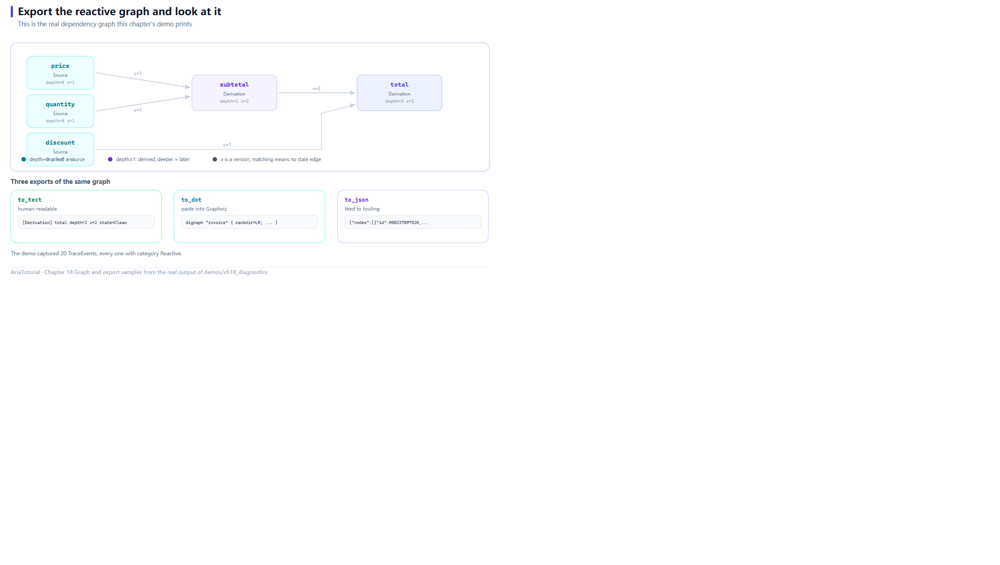

# Diagnostics: Exporting the Reactive Graph



*The real dependency graph this chapter's demo prints, and its three exports.*

The perennial problem with reactive systems is that they are **invisible**: why did this value not refresh? What exactly is the dependency graph? Who is triggering whom?

Aria ships a set of diagnostic interfaces that export the dependency graph as **text, Graphviz, or JSON** 🔍

---

## 📄 The complete program

```cpp
// ch18: 诊断 -- 把响应式图导出来看
#include "aria/aria.hpp"
#include "aria/reactive/inspector.hpp"

#include <iostream>
#include <string>
#include <vector>

using namespace aria;
using aria::reactive::GraphInspector;
using aria::reactive::Node;

int main() {
    std::cout << "== 1. 先给节点起名字 ==\n";
    Property<double> price{100.0};
    Property<int>    quantity{2};
    Property<double> discount{0.9};

    price.set_debug_name("price");
    quantity.set_debug_name("quantity");
    discount.set_debug_name("discount");

    Computed<double> subtotal{[&] { return price.get() * quantity.get(); }};
    subtotal.set_debug_name("subtotal");

    Computed<double> total{[&] { return subtotal.get() * discount.get(); }};
    total.set_debug_name("total");

    std::cout << "   total = " << total.get() << '\n';

    std::cout << "\n== 2. to_text: 人类可读的依赖图 ==\n";
    std::cout << GraphInspector::to_text({static_cast<const Node*>(&total)});

    std::cout << "\n== 3. to_dot: 粘进 Graphviz 就能画图 ==\n";
    std::cout << GraphInspector::to_dot({static_cast<const Node*>(&total)}, "invoice");

    std::cout << "\n== 4. to_json: 喂给工具链 ==\n";
    std::cout << GraphInspector::to_json({static_cast<const Node*>(&total)}) << '\n';

    std::cout << "\n== 5. TraceSink: 捕获事件流 ==\n";
    std::vector<TraceEvent> events;
    {
        ScopedTraceSink guard{[&events](const TraceEvent& ev) { events.push_back(ev); }};
        price = 200.0;
        quantity = 3;
    }

    std::cout << "   两次写入共捕获 " << events.size() << " 条事件\n";
    for (const auto& ev : events) {
        std::cout << "   category = " << ev.category_name() << '\n';
    }

    std::cout << "\n== 6. 没起名字的节点会回退成 <Kind>#<id> ==\n";
    Property<int> anonymous{0};
    Computed<int> also_anonymous{[&] { return anonymous.get() + 1; }};
    (void)also_anonymous.get();
    std::cout << GraphInspector::to_text({static_cast<const Node*>(&also_anonymous)});

    return 0;
}
```

**Actual output**:

```text
== 1. 先给节点起名字 ==
   total = 180

== 2. to_text: 人类可读的依赖图 ==
[Derivation] total  depth=2  v=2  state=Clean
[Derivation] subtotal  depth=1  v=2  state=Clean
[Source] price  depth=0  v=1  state=Clean
[Source] quantity  depth=0  v=1  state=Clean
[Source] discount  depth=0  v=1  state=Clean

== 3. to_dot: 粘进 Graphviz 就能画图 ==
digraph "invoice" {
  rankdir=LR;
  node [shape=box, style=rounded, fontname="monospace"];
  "900237097920" [label="Derivation\ntotal\nd=2 v=2 Clean", fillcolor="#ffe3b0", style="rounded,filled"];
  "900237098192" [label="Derivation\nsubtotal\nd=1 v=2 Clean", fillcolor="#ffe3b0", style="rounded,filled"];
  "900237097632" [label="Source\nprice\nd=0 v=1 Clean", fillcolor="#cde4ff", style="rounded,filled"];
  "900237097488" [label="Source\nquantity\nd=0 v=1 Clean", fillcolor="#cde4ff", style="rounded,filled"];
  "900237097776" [label="Source\ndiscount\nd=0 v=1 Clean", fillcolor="#cde4ff", style="rounded,filled"];
  "900237097776" -> "900237097920" [label="v=1"];
  "900237098192" -> "900237097920" [label="v=2"];
  "900237097488" -> "900237098192" [label="v=1"];
  "900237097632" -> "900237098192" [label="v=1"];
}

== 4. to_json: 喂给工具链 ==
{"nodes":[{"id":900237097920,"kind":"Derivation","state":"Clean","depth":2,"version":2,"name":"total"},{"id":900237098192,"kind":"Derivation","state":"Clean","depth":1,"version":2,"name":"subtotal"},{"id":900237097632,"kind":"Source","state":"Clean","depth":0,"version":1,"name":"price"},{"id":900237097488,"kind":"Source","state":"Clean","depth":0,"version":1,"name":"quantity"},{"id":900237097776,"kind":"Source","state":"Clean","depth":0,"version":1,"name":"discount"}],"edges":[{"from":900237097776,"to":900237097920,"observed_version":1},{"from":900237098192,"to":900237097920,"observed_version":2},{"from":900237097488,"to":900237098192,"observed_version":1},{"from":900237097632,"to":900237098192,"observed_version":1}]}

== 5. TraceSink: 捕获事件流 ==
   两次写入共捕获 20 条事件
   category = Reactive
   category = Reactive
   category = Reactive
   category = Reactive
   category = Reactive
   category = Reactive
   category = Reactive
   category = Reactive
   category = Reactive
   category = Reactive
   category = Reactive
   category = Reactive
   category = Reactive
   category = Reactive
   category = Reactive
   category = Reactive
   category = Reactive
   category = Reactive
   category = Reactive
   category = Reactive

== 6. 没起名字的节点会回退成 <Kind>#<id> ==
[Derivation] Derivation#7  depth=1  v=2  state=Clean
[Source] Source#6  depth=0  v=1  state=Clean
```

> ⚠️ The node ids in blocks 3 and 4 (e.g. `900237097920`) are **derived from runtime addresses and differ on every run**. The output above is from the run captured for this tutorial; ids on your machine will necessarily differ. That is expected.

---

## 1️⃣ Step one is always naming

```cpp
price.set_debug_name("price");
```

Export works without names, but the output is addresses:

```text
[Derivation] Derivation#7  depth=1  v=2  state=Clean
[Source] Source#6  depth=0  v=1  state=Clean
```

Block 6 shows the fallback format — `<Kind>#<id>`. So **name your key nodes before debugging**; that is worth putting in a team guideline ✅

---

## 2️⃣ to_text: the graph on one screen

```text
[Derivation] total  depth=2  v=2  state=Clean
[Derivation] subtotal  depth=1  v=2  state=Clean
[Source] price  depth=0  v=1  state=Clean
```

Four fields, each with meaning:

| Field | Meaning |
|---|---|
| `[Source]` / `[Derivation]` | Node kind: a source (`Property`) or a derivation (`Computed`) |
| `depth` | Distance from the seed. `total` is 2 because it depends on `subtotal`, which depends on `price` |
| `v` | Version number, incremented on every value change |
| `state` | `Clean` means the cached value is valid |

`depth` is especially useful: **it directly reflects how many layers the dependency chain has**. Seeing `depth=17` is a warning sign — every layer adds recomputation cost.

Note the listing order runs **downstream to upstream** (`total` → `subtotal` → the three sources), which matches the debugging instinct: "this value is wrong, so walk up its dependencies".

---

## 3️⃣ to_dot: draw it

```cpp
GraphInspector::to_dot({static_cast<const Node*>(&total)}, "invoice");
```

The output is standard DOT — paste it into [Graphviz Online](https://dreampuf.github.io/GraphvizOnline/) or run `dot -Tpng` locally:

```dot
digraph "invoice" {
  rankdir=LR;
  node [shape=box, style=rounded, fontname="monospace"];
  "900237097920" [label="Derivation\ntotal\nd=2 v=2 Clean", fillcolor="#ffe3b0", ...];
  ...
  "900237097776" -> "900237097920" [label="v=1"];
}
```

Note the arrow direction: **from dependency to dependent** (`discount → total`). In other words, arrows follow the direction data flows — walk along them to trace propagation.

Node colours distinguish kinds by fill, and each edge's `label` carries the observed version, useful for telling which version an edge has seen.

---

## 4️⃣ to_json: feed a toolchain

```json
{"nodes":[{"id":900237097920,"kind":"Derivation","state":"Clean","depth":2,"version":2,"name":"total"}, ...],
 "edges":[{"from":900237097776,"to":900237097920,"observed_version":1}, ...]}
```

JSON suits automation: pull the structure, count nodes, check for unexpected edges, or store snapshots for **regression comparison**.

---

## 5️⃣ TraceSink: capturing the event stream

The `to_*` family gives **structural snapshots**. To see **events during execution**, use `TraceSink`:

```cpp
std::vector<TraceEvent> events;
{
    ScopedTraceSink guard{[&events](const TraceEvent& ev) { events.push_back(ev); }};
    price = 200.0;
    quantity = 3;
}
```

`ScopedTraceSink` is RAII — it installs on construction and uninstalls on destruction, so you can open it only around the code you care about.

Output:

```text
   两次写入共捕获 20 条事件
   category = Reactive
   (20 lines)
```

Two writes produced 20 events — **ten per write on average**. That number is telling: it shows that one write sets off a whole chain reaction (`price` changes → `subtotal` invalidated and recomputed → `total` invalidated and recomputed), each step emitting events.

Events are grouped by category, reported by `TraceEvent::category_name()`:

| Category | Covers |
|---|---|
| `Reactive` | Graph invalidation and recomputation |
| `Async` | Coroutines and scheduling |
| `Binding` | Binding and dispatch |
| `Command` | Command execution |
| `Validation` | Validation |
| `List` | List changes |

In practice you filter by category — for example only `Binding` events, asking "why did this change never reach the UI".

---

## 🎯 Which interface to reach for

| You want to know | Use |
|---|---|
| What the dependency graph looks like | `GraphInspector::to_text()` |
| To draw it or archive it | `to_dot()` / `to_json()` |
| What happened while some code ran | `ScopedTraceSink` |
| Who a node is | `set_debug_name()` first |

---

## 📌 Summary

- 🏷️ **Name your nodes** (`set_debug_name`) or the output is all addresses;
- 📄 `to_text()` for humans: kind, depth, version, state at a glance;
- 🎨 `to_dot()` for Graphviz: arrow direction is data-flow direction;
- 🧰 `to_json()` for toolchains: enables graph snapshots and regression comparison;
- 📡 `ScopedTraceSink` captures runtime events, filtered by category;
- ⚠️ Node ids change every run — never assert on specific values.

---

**Previous chapter** 👈 [Chapter 17 — Coroutines, Concurrency, and Cancellation](17-coroutines-and-cancellation.en.md)
**Next chapter** 👉 [Chapter 19 — Testing: How to Know Your Reactive Code Is Correct](19-testing.en.md)

> 📂 Code from `demos/ch18_diagnostics/main.cpp`. Output is the program's real stdout on Windows / MSVC 19.51.
