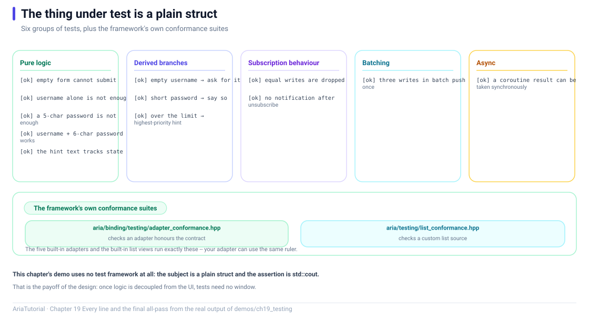

# Testing: How to Know Your Reactive Code Is Correct



*Six groups of tests plus the framework's two conformance suites, the same ones the built-in adapters run.*

The previous eighteen chapters were about *how to write*. This one answers a more practical question: **how do I know I wrote it correctly?** 🧪

The good news is that an Aria ViewModel is a plain C++ class — **no window, no event loop, no UI toolkit**. So the vast majority of logic can be tested from a command line.

---

## 📄 The complete program

```cpp
// ch19: 测试 -- ViewModel 是纯 C++, 测试不需要界面
//
// 这一章回答一个问题: 我怎么知道自己的响应式代码是对的?
// 核心优势在于: Aria 的 ViewModel 不依赖任何 UI 工具包, 所以
// 绝大部分逻辑可以在没有窗口、没有事件循环的情况下测完。
#include "aria/aria.hpp"
#include "aria/async/executor.hpp"
#include "aria/async/task.hpp"

#include <iostream>
#include <string>

using namespace aria;
using namespace aria::async;

// ---------------------------------------------------------------------------
// 被测对象: 登录表单
// ---------------------------------------------------------------------------
struct LoginViewModel {
    Property<std::string> user{""};
    Property<std::string> password{""};
    Property<int>         attempts{0};

    Computed<bool> can_submit{[&] {
        return !user.get().empty() && password.get().size() >= 6;
    }};

    Computed<std::string> hint{[&] {
        if (attempts.get() >= 3) return std::string("尝试次数过多");
        if (user.get().empty())   return std::string("请输入用户名");
        if (password.get().size() < 6) return std::string("密码至少 6 位");
        return std::string("可以提交");
    }};
};

// ---------------------------------------------------------------------------
// 极简断言: 教程里够用, 真实项目请用 doctest / Catch2 / GoogleTest
// ---------------------------------------------------------------------------
static int failures = 0;

static void check(bool ok, const char* what) {
    std::cout << (ok ? "   [ok]   " : "   [FAIL] ") << what << '\n';
    if (!ok) {
        ++failures;
    }
}

int main() {
    std::cout << "== 1. 纯逻辑: 没有窗口也能测 ==\n";
    {
        LoginViewModel vm;
        check(!vm.can_submit.get(), "空表单不能提交");

        vm.user = "aria";
        check(!vm.can_submit.get(), "只填用户名仍不能提交");

        vm.password = "12345";
        check(!vm.can_submit.get(), "密码 5 位不能提交");

        vm.password = "123456";
        check(vm.can_submit.get(), "用户名 + 6 位密码可以提交");

        check(vm.hint.get() == "可以提交", "提示文案随状态更新");
    }

    std::cout << "\n== 2. 派生的提示文案覆盖每条分支 ==\n";
    {
        LoginViewModel vm;
        check(vm.hint.get() == "请输入用户名", "空用户名 -> 提示输入用户名");

        vm.user = "aria";
        check(vm.hint.get() == "密码至少 6 位", "密码太短 -> 提示密码长度");

        vm.attempts = 3;
        check(vm.hint.get() == "尝试次数过多", "超过次数 -> 优先级最高的提示");
    }

    std::cout << "\n== 3. 订阅行为: 只在该通知的时候通知 ==\n";
    {
        Property<int> value{0};
        int notifications = 0;
        auto sub = value.on_changed([&](const int&) { ++notifications; });

        value = 1;
        value = 1;              // 等值写入, 不通知
        value = 2;
        check(notifications == 2, "等值写入被静默丢弃");

        sub.release();
        value = 3;
        check(notifications == 2, "退订后不再收到通知");
    }

    std::cout << "\n== 4. 批量修改只产生一次通知 ==\n";
    {
        Property<int> a{0};
        int notifications = 0;
        auto sub = a.on_changed([&](const int&) { ++notifications; });

        aria::batch([&] {
            a = 1;
            a = 2;
            a = 3;
        });
        check(notifications == 1, "batch 内三次写入只推一次");
    }

    std::cout << "\n== 5. 异步逻辑: blocking_get 把协程结果取出来 ==\n";
    {
        auto task = []() -> Task<int> {
            co_return 6 * 7;
        };

        check(task().blocking_get() == 42, "协程结果可以被同步取出");
    }

    std::cout << "\n== 6. 框架自带的一致性套件 ==\n";
    std::cout << "   自定义适配器可以拿框架的套件自查:\n";
    std::cout << "     aria/binding/testing/adapter_conformance.hpp\n";
    std::cout << "   自定义列表源可以跑:\n";
    std::cout << "     aria/testing/list_conformance.hpp\n";
    std::cout << "   这两套是内置适配器和内置列表视图自己也在跑的同一份测试。\n";

    std::cout << "\n------------------------------\n";
    if (failures == 0) {
        std::cout << "全部通过\n";
    } else {
        std::cout << failures << " 项失败\n";
    }
    return failures == 0 ? 0 : 1;
}
```

**Actual output**:

```text
== 1. 纯逻辑: 没有窗口也能测 ==
   [ok]   空表单不能提交
   [ok]   只填用户名仍不能提交
   [ok]   密码 5 位不能提交
   [ok]   用户名 + 6 位密码可以提交
   [ok]   提示文案随状态更新

== 2. 派生的提示文案覆盖每条分支 ==
   [ok]   空用户名 -> 提示输入用户名
   [ok]   密码太短 -> 提示密码长度
   [ok]   超过次数 -> 优先级最高的提示

== 3. 订阅行为: 只在该通知的时候通知 ==
   [ok]   等值写入被静默丢弃
   [ok]   退订后不再收到通知

== 4. 批量修改只产生一次通知 ==
   [ok]   batch 内三次写入只推一次

== 5. 异步逻辑: blocking_get 把协程结果取出来 ==
   [ok]   协程结果可以被同步取出

== 6. 框架自带的一致性套件 ==
   自定义适配器可以拿框架的套件自查:
     aria/binding/testing/adapter_conformance.hpp
   自定义列表源可以跑:
     aria/testing/list_conformance.hpp
   这两套是内置适配器和内置列表视图自己也在跑的同一份测试。

------------------------------
全部通过
```

---

## 1️⃣ The subject under test is a plain struct

```cpp
struct LoginViewModel {
    Property<std::string> user{""};
    Property<std::string> password{""};
    Property<int>         attempts{0};

    Computed<bool> can_submit{[&] { ... }};
    Computed<std::string> hint{[&] { ... }};
};
```

Note it **inherits nothing** — no virtuals, no injected interfaces. It is constructed directly inside a test scope:

```cpp
LoginViewModel vm;
check(!vm.can_submit.get(), "空表单不能提交");
```

This is what Chapter 1's promise of "unit-testable business logic" looks like in practice — not a slogan, but a runnable assertion 👌

---

## 2️⃣ Testing derived logic: walk every branch

`hint` has three priority tiers:

```cpp
if (attempts.get() >= 3)        return "尝试次数过多";
if (user.get().empty())         return "请输入用户名";
if (password.get().size() < 6)  return "密码至少 6 位";
return "可以提交";
```

Three assertions, **one per branch**:

```text
   [ok]   空用户名 -> 提示输入用户名
   [ok]   密码太短 -> 提示密码长度
   [ok]   超过次数 -> 优先级最高的提示
```

The last one matters most: it verifies **priority**, not just "this rule fires". With `attempts` at 3 and an empty `user`, the returned message is still "尝试次数过多" — proving the branch order is right.

> 💡 Testing derived values costs almost nothing: change an input, read a `Computed`, assert a string. Reproducing those three cases by hand in a UI means clicking into a field, editing a password, and clicking submit three times.

---

## 3️⃣ Testing behavioural contracts: the equality gate and release

Beyond "does it compute correctly" there is a subtler class: **does the framework's contract actually hold**.

```cpp
value = 1;
value = 1;              // equal write, no notification
value = 2;
check(notifications == 2, "等值写入被静默丢弃");
```

Three writes, two notifications — the middle one was swallowed. **That assertion protects a performance contract**: if anyone breaks the equality gate, the test goes red immediately ❌

```cpp
sub.release();
value = 3;
check(notifications == 2, "退订后不再收到通知");
```

That one protects the lifetime contract from Chapter 6. Far more reliable than "the code looks fine".

> 💡 A useful habit: **turn the framework behaviours you depend on into assertions.** The two above are contract tests — they pin down "I believe Aria behaves this way", so a regression surfaces in CI rather than as a mysterious production bug.

---

## 4️⃣ Testing batch semantics

```cpp
aria::batch([&] {
    a = 1;
    a = 2;
    a = 3;
});
check(notifications == 1, "batch 内三次写入只推一次");
```

This verifies Chapter 5's central promise. Its value shows up as **performance regression protection**: if `batch` ever stopped working, the UI would begin flashing intermediate states — a problem manual testing easily misses.

---

## 5️⃣ Testing async: the `blocking_get` boundary

```cpp
auto task = []() -> Task<int> {
    co_return 6 * 7;
};
check(task().blocking_get() == 42, "协程结果可以被同步取出");
```

⚠️ Note this is a **synchronous task body** (`co_return` directly, no `schedule_on`). Chapter 17's boundary applies here too:

| Task body | Test approach |
|---|---|
| Synchronous | `blocking_get()` directly |
| Genuinely async (with `schedule_on`) | `start_detached()` plus a completion wait |

There is also a great tool for async tests: `VirtualTimeExecutor` — it uses a virtual clock, so "wait 3 seconds for a timeout" runs instantly and deterministically (immune to machine load). Aria's own timeout tests are written that way.

---

## 6️⃣ The framework's own conformance suites

Finally: **your adapters and list views can be verified with the framework's suites.**

```cpp
#include "aria/binding/testing/adapter_conformance.hpp"   // adapter conformance
#include "aria/testing/list_conformance.hpp"              // list-source conformance
```

What makes these meaningful: **they are the very tests the built-in implementations run.** Your adapter is not "probably fine" — it meets the same acceptance criteria as the official ones ✅

---

## 🧭 Testing strategy at a glance

| What to test | How | Cost |
|---|---|---|
| Derived logic (`Computed`) | Change input → read `Computed` → assert | Very low |
| Branch coverage | Construct one input per branch | Low |
| Framework contracts (equality gate, batch, release) | Counter + assert notification count | Low |
| Async logic | `blocking_get` for sync bodies; virtual clock for real async | Medium |
| Custom adapters / list sources | Run the bundled conformance suites | Low |
| Visual appearance and interaction | Needs real UI testing | High (out of scope here) |

**The conclusion: in Aria, most logic falls into the first three rows.** What remains in the UI layer is thin enough that manual or UI testing is a reasonable way to cover it.

---

## 📌 Summary

- 🧪 A ViewModel is plain C++ — **tests need no window, event loop, or UI toolkit**;
- 🎯 Derived logic is nearly free to test: change input, read `Computed`, assert;
- 🔒 Turn framework contracts (equality gate, `batch`, release) into assertions — they are contract tests that catch performance and lifetime regressions;
- ⏱️ Distinguish synchronous bodies from genuinely async ones; a virtual clock makes timeout cases instant;
- 📦 Custom adapters and list sources can run the bundled conformance suites, holding them to the same bar as the official implementations.

---

**Previous chapter** 👈 [Chapter 18 — Diagnostics: Exporting the Reactive Graph](18-diagnostics.en.md)
**Next chapter** 👉 [Chapter 20 — Putting It Together: A Todo List Built with Aria](20-putting-it-together.en.md)

> 📂 Code from `demos/ch19_testing/main.cpp`. Output is the program's real stdout on Windows / MSVC 19.51.
