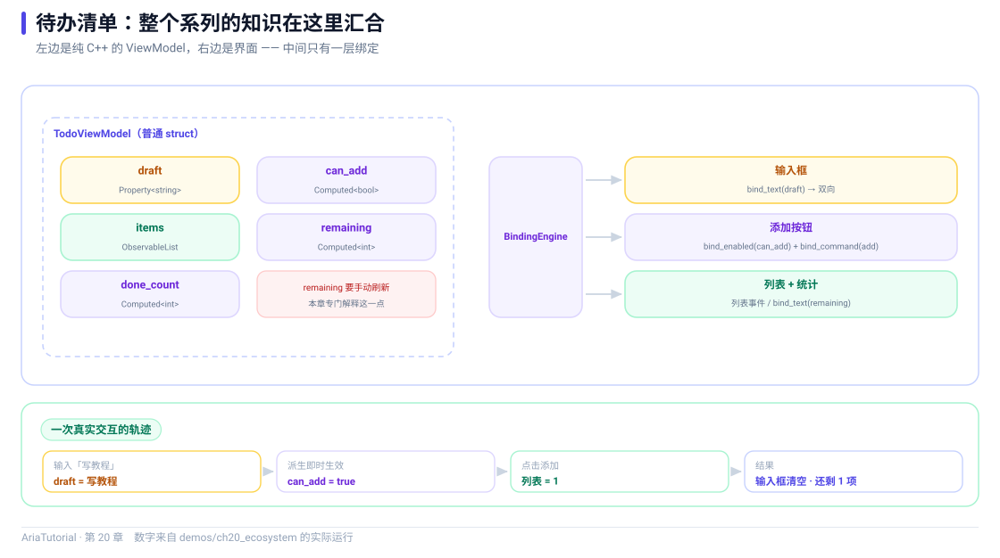

# 综合实战：用 Aria 写一个待办清单



*TodoViewModel 的全景数据流，以及一次真实交互的轨迹。*

前面 19 章把 Aria 的零件拆开讲了一遍。这一章把它们装回去：**一个完整的待办清单**，包含输入、按钮、列表、统计 🔨

目标只有一个：让你看清"ViewModel 里没有一行界面代码，界面侧没有一行业务逻辑"在真实代码里是什么样子。

---

## 📄 完整程序

```cpp
// ch20: 综合实战 -- 用 Aria 写一个待办清单
//
// 本章把前面 19 章的东西串起来:
//   Property / Computed / Command / ObservableList / BindingEngine / 内存适配器
// ViewModel 里没有一行界面代码, 界面侧没有一行业务逻辑。
#include "aria/aria.hpp"
#include "aria/binding/binding_engine.hpp"

#include "common/memory_adapter.hpp"

#include <iostream>
#include <memory>
#include <string>

using namespace aria;
using namespace aria::binding;
using tutorial::MemoryAdapter;
using tutorial::MemoryView;

struct Todo {
    Property<std::string> title;
    Property<bool>        done{false};

    explicit Todo(std::string t) : title{std::move(t)} {}
};

// ---------------------------------------------------------------------------
// ViewModel: 纯 C++, 可以脱离任何界面做单元测试
// ---------------------------------------------------------------------------
class TodoViewModel {
public:
    Property<std::string> draft{""};        // 输入框里的草稿
    ObservableList<Todo>  todos;            // 待办列表
    Property<int>         remaining{0};     // 未完成条数

    // 有内容才能添加。这个 Computed 会被绑到按钮的 enabled 上。
    Computed<bool> can_add{[&] { return !draft.get().empty(); }};

    Command<> add{[&] {
        auto item = std::make_shared<Todo>(draft.get());
        todos.push_back(std::move(item));
        draft = "";                          // 添加完清空输入框
        refresh_remaining();
    }};

    TodoViewModel() {
        // 列表本身不属于响应式图 (它是 ObservableList 而不是 Property),
        // 所以统计值要在事件回调里手动刷新。
        todos_sub_ = todos.observe([&](const ListChange<Todo>&) {
            refresh_remaining();
        });
    }

    void toggle(std::size_t index) {
        if (index >= todos.size()) {
            return;
        }
        auto item = todos.at(index);
        item->done = !item->done.get();
        refresh_remaining();
    }

    [[nodiscard]] int done_count() const {
        int n = 0;
        for (const auto& item : todos.snapshot()) {
            if (item->done.get()) {
                ++n;
            }
        }
        return n;
    }

private:
    void refresh_remaining() {
        int n = 0;
        for (const auto& item : todos.snapshot()) {
            if (!item->done.get()) {
                ++n;
            }
        }
        remaining = n;
    }

    Subscription todos_sub_;
};

int main() {
    auto adapter = std::make_shared<MemoryAdapter>();
    BindingEngine engine{adapter};

    TodoViewModel vm;

    // ---- 界面侧: 三个控件, 十几行接线 ----
    MemoryView input_view;
    MemoryView add_button;
    MemoryView stats_label;

    engine.bind_text(vm.draft, input_view);
    engine.bind_command(vm.add, add_button);            // 先绑命令 (会写一次 enabled)
    engine.bind_enabled(vm.can_add, add_button);        // 再绑有效状态, 后者权威
    engine.bind_text_projected(vm.remaining, stats_label, [](int n) {
        return "还剩 " + std::to_string(n) + " 项";
    });

    std::cout << "初始状态\n";
    std::cout << "   输入框     = \"" << input_view.text << "\"\n";
    std::cout << "   添加可点击 = " << (add_button.enabled ? "true" : "false") << '\n';
    std::cout << "   统计       = " << stats_label.text << '\n';

    std::cout << "\n-- 用户输入 \"写教程\" --\n";
    input_view.user_type("写教程");
    std::cout << "   VM.draft   = \"" << vm.draft.get() << "\"\n";
    std::cout << "   添加可点击 = " << (add_button.enabled ? "true" : "false") << '\n';

    std::cout << "\n-- 点击添加 --\n";
    add_button.user_click();
    std::cout << "   列表大小   = " << vm.todos.size() << '\n';
    std::cout << "   输入框清空 = \"" << input_view.text << "\"\n";
    std::cout << "   统计       = " << stats_label.text << '\n';
    std::cout << "   添加可点击 = " << (add_button.enabled ? "true" : "false") << '\n';

    std::cout << "\n-- 再添加两条 --\n";
    input_view.user_type("跑 demo");
    add_button.user_click();
    input_view.user_type("发 GitHub");
    add_button.user_click();
    std::cout << "   列表大小   = " << vm.todos.size() << '\n';
    std::cout << "   统计       = " << stats_label.text << '\n';

    std::cout << "\n-- 勾掉第一项 --\n";
    vm.toggle(0);
    std::cout << "   第一项完成 = " << (vm.todos.at(0)->done.get() ? "true" : "false") << '\n';
    std::cout << "   已完成     = " << vm.done_count() << " 项\n";
    std::cout << "   统计       = " << stats_label.text << '\n';

    std::cout << "\n-- 全部勾完 --\n";
    vm.toggle(1);
    vm.toggle(2);
    std::cout << "   统计       = " << stats_label.text << '\n';

    std::cout << "\n同一个 ViewModel 换成 Qt / UIKit / JNI / HTTP 适配器,\n";
    std::cout << "业务逻辑一行都不用改。\n";

    return 0;
}
```

**真实运行结果**：

```text
初始状态
   输入框     = ""
   添加可点击 = false
   统计       = 还剩 0 项

-- 用户输入 "写教程" --
   VM.draft   = "写教程"
   添加可点击 = true

-- 点击添加 --
   列表大小   = 1
   输入框清空 = ""
   统计       = 还剩 1 项
   添加可点击 = false

-- 再添加两条 --
   列表大小   = 3
   统计       = 还剩 3 项

-- 勾掉第一项 --
   第一项完成 = true
   已完成     = 1 项
   统计       = 还剩 2 项

-- 全部勾完 --
   统计       = 还剩 0 项

同一个 ViewModel 换成 Qt / UIKit / JNI / HTTP 适配器,
业务逻辑一行都不用改。
```

---

## 🧩 拆开看这个 ViewModel

### 三个状态 + 一个派生 + 一个动作

```cpp
Property<std::string> draft{""};        // 输入框草稿
ObservableList<Todo>  todos;            // 待办列表
Property<int>         remaining{0};     // 未完成条数

Computed<bool> can_add{[&] { return !draft.get().empty(); }};   // 派生

Command<> add{[&] { ... }};             // 动作
```

这五行就是整个应用的"业务模型"。注意它们**没有一行提到界面** —— 没有"输入框"、没有"按钮"、没有"标签"，只有草稿、列表、计数、能不能添加、添加这个动作。

### 添加动作里的连锁反应

```cpp
Command<> add{[&] {
    auto item = std::make_shared<Todo>(draft.get());
    todos.push_back(std::move(item));
    draft = "";                          // 添加完清空输入框
    refresh_remaining();
}};
```

一行 `draft = ""` 就完成了"清空输入框"。看输出里对应的部分：

```text
-- 点击添加 --
   列表大小   = 1
   输入框清空 = ""        ← 这一行不需要额外代码
   统计       = 还剩 1 项
   添加可点击 = false     ← can_add 重新求值的结果
```

**一个动作触发了四处联动**：列表长度、输入框内容、统计数据、按钮可用性。而 `add` 里只写了"把草稿变成一条待办、清空草稿"这两件事。

---

## 🔍 一个诚实的细节：`remaining` 为什么要手动刷新

这是本章最值得说的一处：

```cpp
TodoViewModel() {
    // 列表本身不属于响应式图 (它是 ObservableList 而不是 Property),
    // 所以统计值要在事件回调里手动刷新。
    todos_sub_ = todos.observe([&](const ListChange<Todo>&) {
        refresh_remaining();
    });
}
```

**`ObservableList` 不是 `Property`**，它不在响应式依赖图里。所以：

- 你不能写 `Computed<int> remaining{[&] { return count_undone(todos); }}` 指望它自动重算 —— 读列表不会登记依赖；
- 正确做法是**订阅列表事件，在回调里更新一个 `Property<int>`**。

这是一个刻意的分界：《Aria 把值抽象成 `Property`（进图）、把集合抽象成 `ObservableList`（事件流）》。两者用不同的机制通知，各自适配自己的使用模式。

> 💡 **实用建议**：当你想从列表派生出"统计类"的值（条数、总和、是否为空），用一个 `Property` 承接，在 `observe` 回调里更新。不要试图让 `Computed` 直接读列表。

另外注意构造函数里用了 `todos_sub_ = todos.observe(...)` —— 订阅被存成成员（第 6 章的形态），VM 析构时自动解除。

---

## 🔌 界面侧只有十几行

```cpp
engine.bind_text(vm.draft, input_view);
engine.bind_command(vm.add, add_button);            // 先绑命令
engine.bind_enabled(vm.can_add, add_button);        // 再绑有效状态
engine.bind_text_projected(vm.remaining, stats_label, [](int n) {
    return "还剩 " + std::to_string(n) + " 项";
});
```

四行，三个控件（输入框、按钮、标签）。

### 关于那两行的顺序

```cpp
engine.bind_command(vm.add, add_button);            // 会写一次 enabled
engine.bind_enabled(vm.can_add, add_button);        // 后者权威
```

第 14 章提过：`bind_command` 会顺带写一次控件的 `enabled`，而**后绑定的决定最终值**。这里先绑命令、再绑 `can_add`，所以按钮的可用性由 `can_add` 说了算。

看输出验证了这个顺序确实有效：

```text
初始状态      添加可点击 = false      ← can_add 为 false (草稿为空)
用户输入后    添加可点击 = true       ← can_add 变 true
点击添加后    添加可点击 = false      ← 草稿被清空, can_add 又变 false
```

这条"添加完自动禁用按钮"的行为，**没有一行代码专门写它** —— 它是 `draft = ""` 的副产品。

---

## 🌍 换成真实平台

本章用 `MemoryAdapter` 是为了能在命令行里跑。换成真实平台，改动只在 main 的开头两行：

**Qt6**

```cpp
auto adapter = std::make_shared<aria::adapters::qt6::QtAdapter>();
BindingEngine engine{adapter};

engine.bind_text(vm.draft, adapter->view_for(line_edit));
engine.bind_command(vm.add, adapter->view_for(add_button));
engine.bind_enabled(vm.can_add, adapter->view_for(add_button));
engine.bind_text_projected(vm.remaining, adapter->view_for(stats_label),
    [](int n) { return QString("还剩 %1 项").arg(n).toStdString(); });
```

**HTTP**

```cpp
auto http = std::make_shared<aria::adapters::http::HttpAdapter>(config);
BindingEngine engine{http, dispatcher, DispatchPolicy::SmartMarshal};

auto& input  = http->register_view("draft",    "text");
auto& button = http->register_view("add",      "button");
auto& stats  = http->register_view("stats",    "text");

engine.bind_text(vm.draft, input);
engine.bind_command(vm.add, button);
engine.bind_enabled(vm.can_add, button);
engine.bind_text_projected(vm.remaining, stats, [](int n) {
    return "还剩 " + std::to_string(n) + " 项";
});
```

**`TodoViewModel` 一个字都没改** ✅ 这就是全书从第 1 章讲到第 20 章的那件事。

---

## 🎓 这个 20 章里用到了什么

| 章节 | 用在哪里 |
|---|---|
| 第 3 章 `Property` | `draft` / `remaining` |
| 第 4 章 `Computed` | `can_add` |
| 第 6 章 `Subscription` | `todos_sub_` 成员 |
| 第 8 章 `Command` | `add` |
| 第 9 章 `ObservableList` | `todos` + `observe` |
| 第 14 章 `BindingEngine` | 四条 `bind_*` |
| 第 15 章 适配器 | `MemoryAdapter`，可换 Qt6 / HTTP |

**没有用到的**：`Effect`、派生视图、`reconcile`、`Validator`、`ViewModel` 基类、协程、诊断。那些是当你需要时才引入的工具，不是必须全部用上。

这本身就是一条值得记住的经验：**Aria 的核心 API 面很小，需求长什么样，就用多少。**

---

## 📌 小结

- 🧱 一个完整应用 = 几个 `Property` + 一个 `ObservableList` + 一两个 `Computed` + 一两个 `Command`；
- 🔗 一个动作可以触发多处联动，**不需要为每个联动单独写代码**；
- ⚠️ `ObservableList` 不在响应式图里，从列表派生的统计值要在 `observe` 回调里更新 `Property`；
- 🔌 界面侧只有十几行接线，`bind_command` 与 `bind_enabled` 的顺序决定 `enabled` 的最终归属；
- 🌍 换平台只改 adapter 的构造与 `view_for` / `register_view`，**ViewModel 零改动**。

---

**上一章** 👈 [第 19 章 测试：怎么验证响应式代码是对的](19-测试.md)

**系列完结** 🎉 20 章下来，你已经覆盖了 Aria 的响应式核心、绑定层、适配器层，以及异步、诊断、测试这些工程环节。

如果还想继续深入，`Aria` 仓库的 `docs/` 下有带编号的契约文档（`lifecycle.md` 的 `L-N`、`error-model.md` 的 `E-N`、`list-diff-contract.md` 的 `LD-N` 等），它们把每一个非平庸行为都钉成了可追溯的条款。

> 📂 本章代码来自本仓库 `demos/ch20_ecosystem/main.cpp`，输出为该程序在 Windows / MSVC 19.51 下的真实打印结果。
